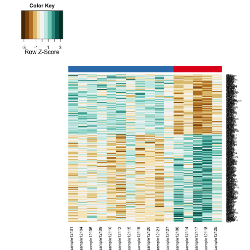
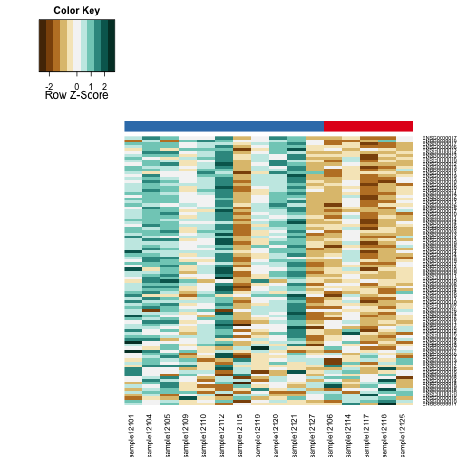

Analysis of Data for Cushings Patients by Heatmaps
=============================================================

Statistics
----------


This file was most recently processed on ``Tue Jun 17 11:31:28 2014``.  This uses the DESeq normalized data found in ../data/processed/RPKM_counts_Cushing_GRCh37.74.csv.


Differentially Expressed Genes
----------------------------------

To test the grouping of differentially expressed transcripts, we only examined genes with significantly different transcripts based on DESeq analysis.

  

```
## pdf 
##   3
```

```
## pdf 
##   2
```

Ribosomal Genes
---------------

  

```
## pdf 
##   3
```

```
## pdf 
##   2
```

 

```
## pdf 
##   3
```

References
-----------


Session Information
-------------------

```r
sessionInfo()
```

```
## R version 3.1.0 (2014-04-10)
## Platform: x86_64-apple-darwin13.1.0 (64-bit)
## 
## locale:
## [1] en_US.UTF-8/en_US.UTF-8/en_US.UTF-8/C/en_US.UTF-8/en_US.UTF-8
## 
## attached base packages:
## [1] stats     graphics  grDevices utils     datasets  methods   base     
## 
## other attached packages:
## [1] gdata_2.13.3        RColorBrewer_1.0-5  gplots_2.13.0      
## [4] knitcitations_0.6-2 RefManageR_0.8.2    bibtex_0.3-6       
## [7] knitr_1.6          
## 
## loaded via a namespace (and not attached):
##  [1] bitops_1.0-6       caTools_1.17       digest_0.6.4      
##  [4] evaluate_0.5.5     formatR_0.10       gtools_3.4.1      
##  [7] httr_0.3           KernSmooth_2.23-12 lubridate_1.3.3   
## [10] memoise_0.2.1      plyr_1.8.1         Rcpp_0.11.2       
## [13] RCurl_1.95-4.1     RJSONIO_1.2-0.2    stringr_0.6.2     
## [16] tools_3.1.0        XML_3.98-1.1       xtable_1.7-3
```
