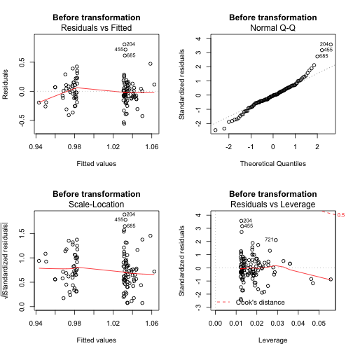
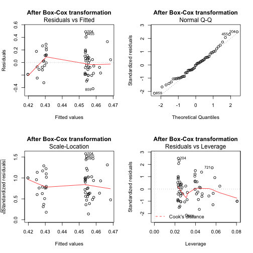
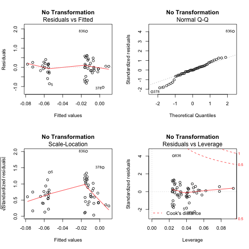
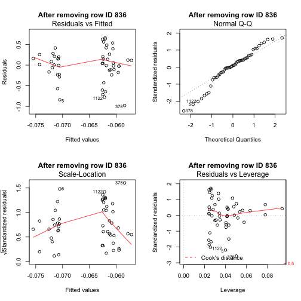
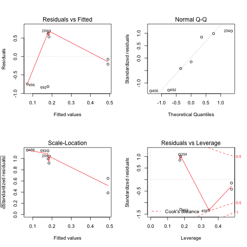
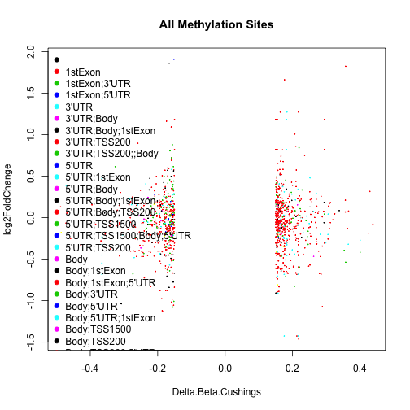

Analysis of Methylation Data from Cushing's Study
=============================================================

This file was last compiled on ``Tue Jun 24 08:34:40 2014``.


```
## Loading required package: rJava
## Loading required package: xlsxjars
```

The methylation is in ../data/raw/Summary Table of Cushings Relative Control Methylation Jan 6 2013.xlsx wherea se we used ../data/processed/Annotated Results GRCh37.74 - Cushing.csv for the relative expression.

Statistics
---------

Tested the predictive value on the delta-beta value on the fold change.


```
## 
## Call:
## lm(formula = 2^log2FoldChange ~ Delta.Beta.Cushings, data = combined.data[combined.data$UCSC_REFGENE_GROUP == 
##     "TSS1500", ])
## 
## Residuals:
##     Min      1Q  Median      3Q     Max 
## -0.5575 -0.1156 -0.0078  0.1142  0.8061 
## 
## Coefficients:
##                     Estimate Std. Error t value Pr(>|t|)    
## (Intercept)           1.0068     0.0221   45.55   <2e-16 ***
## Delta.Beta.Cushings  -0.1590     0.1120   -1.42     0.16    
## ---
## Signif. codes:  0 '***' 0.001 '**' 0.01 '*' 0.05 '.' 0.1 ' ' 1
## 
## Residual standard error: 0.227 on 108 degrees of freedom
##   (39 observations deleted due to missingness)
## Multiple R-squared:  0.0183,	Adjusted R-squared:  0.00923 
## F-statistic: 2.02 on 1 and 108 DF,  p-value: 0.159
```

 

```
## 
## 	Shapiro-Wilk normality test
## 
## data:  lm.fit.tss1500$residuals
## W = 0.9628, p-value = 0.003682
```

 

```
## 
## Call:
## lm(formula = log2FoldChange^lambda ~ Delta.Beta.Cushings, data = combined.data[combined.data$UCSC_REFGENE_GROUP == 
##     "TSS1500", ])
## 
## Residuals:
##    Min     1Q Median     3Q    Max 
## -0.417 -0.168 -0.005  0.112  0.487 
## 
## Coefficients:
##                     Estimate Std. Error t value Pr(>|t|)    
## (Intercept)           0.4420     0.0275   16.07   <2e-16 ***
## Delta.Beta.Cushings  -0.0754     0.1423   -0.53      0.6    
## ---
## Signif. codes:  0 '***' 0.001 '**' 0.01 '*' 0.05 '.' 0.1 ' ' 1
## 
## Residual standard error: 0.198 on 54 degrees of freedom
##   (93 observations deleted due to missingness)
## Multiple R-squared:  0.00517,	Adjusted R-squared:  -0.0133 
## F-statistic: 0.281 on 1 and 54 DF,  p-value: 0.599
```

 

```
## 
## 	Shapiro-Wilk normality test
## 
## data:  lm.fit.tss1500$residuals
## W = 0.9821, p-value = 0.569
```

```
## 
## Call:
## lm(formula = log2FoldChange ~ Delta.Beta.Cushings, data = combined.data[combined.data$UCSC_REFGENE_GROUP == 
##     "TSS200", ])
## 
## Residuals:
##     Min      1Q  Median      3Q     Max 
## -1.0410 -0.1905 -0.0027  0.2012  1.8749 
## 
## Coefficients:
##                     Estimate Std. Error t value Pr(>|t|)
## (Intercept)          -0.0353     0.0679   -0.52     0.61
## Delta.Beta.Cushings  -0.1262     0.3254   -0.39     0.70
## 
## Residual standard error: 0.471 on 50 degrees of freedom
##   (20 observations deleted due to missingness)
## Multiple R-squared:  0.003,	Adjusted R-squared:  -0.0169 
## F-statistic: 0.15 on 1 and 50 DF,  p-value: 0.7
```

 

```
## 
## 	Shapiro-Wilk normality test
## 
## data:  lm.fit.tss200$residuals
## W = 0.9166, p-value = 0.001402
```

```
## 
## Call:
## lm(formula = log2FoldChange ~ Delta.Beta.Cushings, data = subset_tss200)
## 
## Residuals:
##     Min      1Q  Median      3Q     Max 
## -0.9789 -0.1715  0.0399  0.2073  0.6608 
## 
## Coefficients:
##                     Estimate Std. Error t value Pr(>|t|)
## (Intercept)          -0.0666     0.0567   -1.17     0.25
## Delta.Beta.Cushings  -0.0263     0.2708   -0.10     0.92
## 
## Residual standard error: 0.391 on 49 degrees of freedom
##   (20 observations deleted due to missingness)
## Multiple R-squared:  0.000193,	Adjusted R-squared:  -0.0202 
## F-statistic: 0.00945 on 1 and 49 DF,  p-value: 0.923
```

 

```
## 
## 	Shapiro-Wilk normality test
## 
## data:  lm.fit.tss200.subset$residuals
## W = 0.9561, p-value = 0.05709
```

Test if differentially methlation predicts foldchange for differentially expressed genes.
-----------------------
To test this, we took a subset of genes that are differentially expressed from the differentially methylated set.

  

```
## 
## Call:
## lm(formula = log2FoldChange ~ Delta.Beta.Cushings, data = combined.data.DE[combined.data.DE$UCSC_REFGENE_GROUP == 
##     "TSS1500", ])
## 
## Residuals:
##     204     444     455     456     685     692     849 
##  0.6912 -0.0756  0.6259 -0.7481  0.5353 -0.8182 -0.2104 
## 
## Coefficients:
##                     Estimate Std. Error t value Pr(>|t|)
## (Intercept)            0.341      0.303    1.13     0.31
## Delta.Beta.Cushings    0.987      1.689    0.58     0.58
## 
## Residual standard error: 0.698 on 5 degrees of freedom
## Multiple R-squared:  0.0639,	Adjusted R-squared:  -0.123 
## F-statistic: 0.341 on 1 and 5 DF,  p-value: 0.584
```

 

```
## 
## 	Shapiro-Wilk normality test
## 
## data:  lm.fit.tss1500.DE$residuals
## W = 0.8779, p-value = 0.2171
```


Are Differentially Methylated Genes More Likely to Be Differentially Expressed?
---------------------------------------------------------------------------------

To test this, we asked whether the genes with a significantly different methylation pattern had a significantly different expression pattern.  We then compared this to a randomly sampled set of genes from the same expression set.  We then repeated this analysis 1000 times for each of the hypo and hyper expressed genes, and tested how often the chi-squared test led to a significant result.


```
## 
##  
##    Cell Contents
## |-------------------------|
## |                       N |
## | Chi-square contribution |
## |           N / Row Total |
## |           N / Col Total |
## |         N / Table Total |
## |-------------------------|
## 
##  
## Total Observations in Table:  22810 
## 
##  
##              | DMethyl 
##   DExpressed |       Yes |        No | Row Total | 
## -------------|-----------|-----------|-----------|
##          Yes |        26 |       447 |       473 | 
##              |     4.165 |     0.371 |           | 
##              |     0.055 |     0.945 |     0.021 | 
##              |     0.014 |     0.021 |           | 
##              |     0.001 |     0.020 |           | 
## -------------|-----------|-----------|-----------|
##           No |      1840 |     20497 |     22337 | 
##              |     0.088 |     0.008 |           | 
##              |     0.082 |     0.918 |     0.979 | 
##              |     0.986 |     0.979 |           | 
##              |     0.081 |     0.899 |           | 
## -------------|-----------|-----------|-----------|
## Column Total |      1866 |     20944 |     22810 | 
##              |     0.082 |     0.918 |           | 
## -------------|-----------|-----------|-----------|
## 
## 
```

```
## 
## 	Pearson's Chi-squared test with Yates' continuity correction
## 
## data:  contigency.table
## X-squared = 4.274, df = 1, p-value = 0.0387
```

```
##           DMethyl
## DExpressed   Yes    No
##        Yes    26   447
##        No   1840 20497
```

```
##           DMethyl
## DExpressed     Yes      No
##        Yes   38.69   434.3
##        No  1827.31 20509.7
```

```
## 
## FALSE  TRUE 
##   911    89
```

```
## 
## FALSE  TRUE 
##   938    62
```

Figures
----------

   

How Many Genes were Differentially Methylated
----------------------------------------------


There was 1035 that had differential methylation including 493 hypomethylated genes and 584 hypermethylated genes.  There was also 43 genes which were hypomethylated in one location and hypermethylated in another.  These genes are written to a files named ../data/processed/Cushings Hypomethylated Genes.txt and ../data/processed/Cushings Hypermethylated Genes.txt.

The 23 genes which were differentially methylated **and** differentially expressed were ABHD12, ANO10, ARL8B, ARNTL, C6orf106, CAPZB, CBX7, CCND1, FASN, GOLGA4, GPC1, GPIHBP1, HLA-C, HLA-DPA1, HMGA1, HOXB4, LHFP, MANEA, MTPN, MYO1D, PTBP1, RGMA, SGK1.


Session Information
-------------------

```r
sessionInfo()
```

```
## R version 3.1.0 (2014-04-10)
## Platform: x86_64-apple-darwin13.1.0 (64-bit)
## 
## locale:
## [1] en_US.UTF-8/en_US.UTF-8/en_US.UTF-8/C/en_US.UTF-8/en_US.UTF-8
## 
## attached base packages:
## [1] stats     graphics  grDevices utils     datasets  methods   base     
## 
## other attached packages:
## [1] gmodels_2.15.4.1 MASS_7.3-33      plyr_1.8.1       xlsx_0.5.5      
## [5] xlsxjars_0.6.0   rJava_0.9-6      knitr_1.6       
## 
## loaded via a namespace (and not attached):
## [1] evaluate_0.5.5 formatR_0.10   gdata_2.13.3   gtools_3.4.1  
## [5] Rcpp_0.11.2    stringr_0.6.2  tools_3.1.0
```
