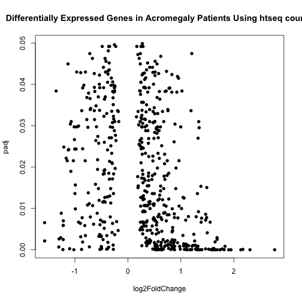
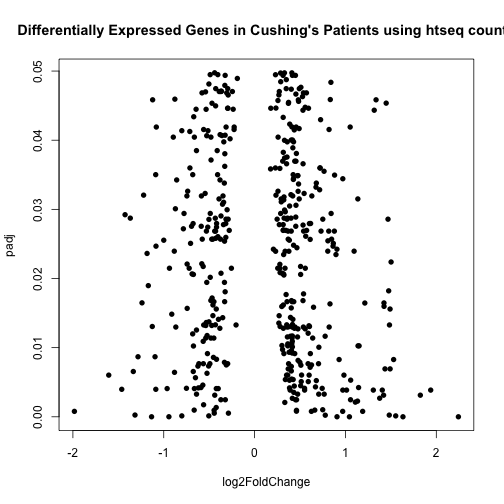

DESeq Analysis of Cushing and Acromegaly Patient Samples with Outlier Removed
===============================================================================


The counts tables were generated previously using  **HTseq.sh** shell script and **merge.command** on Hera.  It removes the outlier data point from the analysis, which was patient **29**.
<<<<<<< HEAD
This script requires a transcript counts table.  There is also a sample mapping file called **patient_sample_mapping.csv** which links the diagnosis the the samples.  This file was most recently processed on ``Wed Jun  4 13:59:19 2014``.
=======
This script requires a transcript counts table.  There is also a sample mapping file called **patient_sample_mapping.csv** which links the diagnosis the the samples.  This file was most recently processed on ``Wed Jun  4 17:18:35 2014``.
>>>>>>> 6b7dfeb1ae9f7cc6a355bc2ba40d0c1425e8ee40


```
## Error: there is no package called 'knitcitations'
```

```
## Error: could not find function "write.bibtex"
```

```
## Error: could not find function "read.bibtex"
```


This step gets the protein coding genes only.


```
## Error: could not find function "write.bibtex"
```

```
## Error: could not find function "read.bibtex"
```


These data were analysed in  by DESeq 

```

Error in eval(expr, envir, enclos) : could not find function "citep"

```

. We did not remove lower expressing genes because we pre-filtered the data to examine only one transcript per gene.  

Full Analysis
--------------

  


Count data transformations for visualization. This will output regularized transformation (RLD) counts and variance stabilized (VSD) counts for Cushing and Acromegaly in the **data/processed/** folder.

Counts transformations
-------------------


Annotation
-------------

This step annotates the data tables with the official gene symbols.


The data was annotated from Ensembl data, using the biomaRt package 

```

Error in eval(expr, envir, enclos) : could not find function "citep"

```

.

Differentially Expressed Genes
--------------------------------
  


### Acromegaly

There were **547** differentially expressed genes from the acromegaly patients, with **186** genes downregulated and **361** genes upregulated.

### Cushing's Disease

There were **473** differentially expressed genes from the cushings patients, with **192** genes downregulated and **281** genes upregulated.


Bibiography
------------

```
## Error: could not find function "bibliography"
```


Session Information
-------------------

For the R session, the package versions were:

```r
sessionInfo()
```

```
## R version 3.1.0 (2014-04-10)
## Platform: x86_64-apple-darwin10.8.0 (64-bit)
## 
## locale:
## [1] en_US.UTF-8/en_US.UTF-8/en_US.UTF-8/C/en_US.UTF-8/en_US.UTF-8
## 
## attached base packages:
## [1] parallel  stats     graphics  grDevices utils     datasets  methods  
## [8] base     
## 
## other attached packages:
## [1] biomaRt_2.20.0          DESeq2_1.4.5            RcppArmadillo_0.4.300.0
## [4] Rcpp_0.11.1             GenomicRanges_1.16.3    GenomeInfoDb_1.0.2     
## [7] IRanges_1.22.6          BiocGenerics_0.10.0     knitr_1.5              
## 
## loaded via a namespace (and not attached):
##  [1] annotate_1.42.0      AnnotationDbi_1.26.0 Biobase_2.24.0      
##  [4] DBI_0.2-7            evaluate_0.5.5       formatR_0.10        
##  [7] genefilter_1.46.1    geneplotter_1.42.0   grid_3.1.0          
## [10] lattice_0.20-29      locfit_1.5-9.1       RColorBrewer_1.0-5  
## [13] RCurl_1.95-4.1       RSQLite_0.11.4       splines_3.1.0       
## [16] stats4_3.1.0         stringr_0.6.2        survival_2.37-7     
## [19] tools_3.1.0          XML_3.98-1.1         xtable_1.7-3        
## [22] XVector_0.4.0
```

