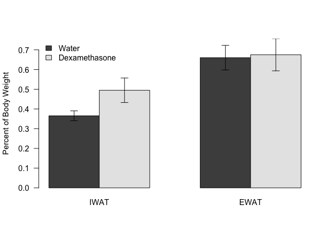

# Data Entry


Data was read from the file ../../data/raw/Fat Pad Weights.csv.  These data were most recently updated on Sun Sep 23 07:57:13 2018.

#Analysis


For IWAT, a shapiro test had a p-value of >0.578.  A Levene's test had a p-value of 0.624 so we did a Student's *t*-test which yielded a p-value of 0.041.

<!-- -->


# Session Information


```
## R version 3.5.0 (2018-04-23)
## Platform: x86_64-apple-darwin15.6.0 (64-bit)
## Running under: macOS High Sierra 10.13.6
## 
## Matrix products: default
## BLAS: /Library/Frameworks/R.framework/Versions/3.5/Resources/lib/libRblas.0.dylib
## LAPACK: /Library/Frameworks/R.framework/Versions/3.5/Resources/lib/libRlapack.dylib
## 
## locale:
## [1] en_US.UTF-8/en_US.UTF-8/en_US.UTF-8/C/en_US.UTF-8/en_US.UTF-8
## 
## attached base packages:
## [1] stats     graphics  grDevices utils     datasets  methods   base     
## 
## other attached packages:
## [1] bindrcpp_0.2.2 car_3.0-2      carData_3.0-1  dplyr_0.7.6   
## [5] tidyr_0.8.1    knitr_1.20    
## 
## loaded via a namespace (and not attached):
##  [1] zip_1.0.0         Rcpp_0.12.18      pillar_1.3.0     
##  [4] compiler_3.5.0    cellranger_1.1.0  bindr_0.1.1      
##  [7] forcats_0.3.0     tools_3.5.0       digest_0.6.16    
## [10] evaluate_0.11     tibble_1.4.2      pkgconfig_2.0.2  
## [13] rlang_0.2.2       openxlsx_4.1.0    curl_3.2         
## [16] yaml_2.2.0        haven_1.1.2       rio_0.5.10       
## [19] stringr_1.3.1     hms_0.4.2         rprojroot_1.3-2  
## [22] tidyselect_0.2.4  glue_1.3.0        data.table_1.11.4
## [25] R6_2.2.2          readxl_1.1.0      foreign_0.8-71   
## [28] rmarkdown_1.10    purrr_0.2.5       magrittr_1.5     
## [31] backports_1.1.2   htmltools_0.3.6   assertthat_0.2.0 
## [34] abind_1.4-5       stringi_1.2.4     crayon_1.3.4
```
