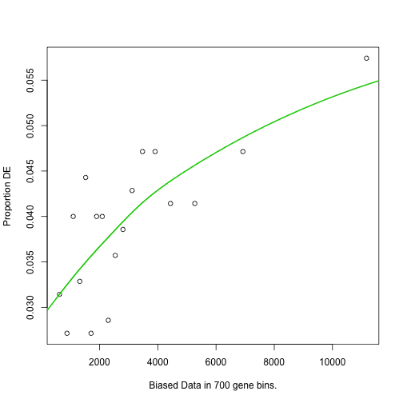
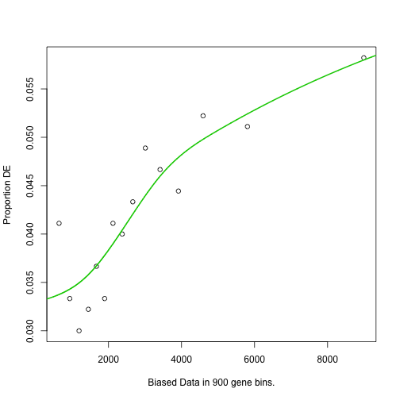

GOSeq of DESeq Data for Acromegaly and Cushing's Patients
=============================================================

This script was most recently run on Tue Mar 11 00:33:48 2014.  This script searches KEGG and GO for enriched categories and pathways.


To analyse these, we used the goseq package (<a href="">Young et al. 2010</a>), using the wallenius approximation to determine
significantly enriched GO (<a href="http://dx.doi.org/10.1038/75556">Botstein et al. 2000</a>) or KEGG (<a href="http://dx.doi.org/10.1093/nar/gkr988">Kanehisa et al. 2011</a>) terms.  

This analysis uses the GO database updated with the datestamp 20130907 downloaded from ftp://ftp.geneontology.org/pub/go/godatabase/archive/latest-lite/.  The KEGG database was downloaded from ftp://ftp.genome.jp/pub/kegg/genomes with a datestamp of 2011-Mar15.

This analysis included the 475 significant cushing transcripts (476 genes) and the 560 significant acromegaly transcripts (561 genes).  We did not separate upregulated genes from downregulated genes in this analysis.

  


Significantly different terms and pathways
----------------------------------------------

### Cushing Significant Processes

For cushing, we found 0 significantly different GO terms for molecular function, 0 significantly different GO terms for biological processes and 2 significantly different KEGG pathways.


```
## Warning: data length exceeds size of matrix
```

<!-- html table generated in R 3.0.2 by xtable 1.7-1 package -->
<!-- Tue Mar 11 00:35:26 2014 -->
<TABLE border=1>
<CAPTION ALIGN="bottom"> Biological Processes Enriched in Acromegaly Patients </CAPTION>
<TR> <TH>  </TH> <TH> category </TH> <TH> numDEInCat </TH> <TH> numInCat </TH> <TH> padj </TH> <TH> Term </TH>  </TR>
  </TABLE>

```
## Warning: data length exceeds size of matrix
```

<!-- html table generated in R 3.0.2 by xtable 1.7-1 package -->
<!-- Tue Mar 11 00:35:26 2014 -->
<TABLE border=1>
<CAPTION ALIGN="bottom"> Molecular Functions Enriched in Acromegaly Patients </CAPTION>
<TR> <TH>  </TH> <TH> category </TH> <TH> numDEInCat </TH> <TH> numInCat </TH> <TH> padj </TH> <TH> Term </TH>  </TR>
  </TABLE>
<!-- html table generated in R 3.0.2 by xtable 1.7-1 package -->
<!-- Tue Mar 11 00:35:26 2014 -->
<TABLE border=1>
<CAPTION ALIGN="bottom"> KEGG Pathways Enriched in Acromegaly Patients </CAPTION>
<TR> <TH>  </TH> <TH> category </TH> <TH> numDEInCat </TH> <TH> numInCat </TH> <TH> padj </TH> <TH> path_name </TH>  </TR>
  <TR> <TD align="right"> 1 </TD> <TD> 00010 </TD> <TD align="right"> 9 </TD> <TD align="right"> 41 </TD> <TD align="right"> 0.00311 </TD> <TD> Glycolysis / Gluconeogenesis </TD> </TR>
  <TR> <TD align="right"> 62 </TD> <TD> 00620 </TD> <TD align="right"> 7 </TD> <TD align="right"> 32 </TD> <TD align="right"> 0.01560 </TD> <TD> Pyruvate metabolism </TD> </TR>
   </TABLE>


### Acromegaly Significant Processes

For acromegaly, we found 0 significantly different GO terms for molecular function, 144 significantly different GO terms for biological processes and 0 significantly different KEGG pathways.

<!-- html table generated in R 3.0.2 by xtable 1.7-1 package -->
<!-- Tue Mar 11 00:35:26 2014 -->
<TABLE border=1>
<CAPTION ALIGN="bottom"> Biological Processes Enriched in Acromegaly Patients </CAPTION>
<TR> <TH>  </TH> <TH> category </TH> <TH> numDEInCat </TH> <TH> numInCat </TH> <TH> padj </TH> <TH> Term </TH>  </TR>
  <TR> <TD align="right"> 10547 </TD> <TD> GO:0032502 </TD> <TD align="right"> 209 </TD> <TD align="right"> 3363 </TD> <TD align="right"> 0.00000 </TD> <TD> developmental process </TD> </TR>
  <TR> <TD align="right"> 15558 </TD> <TD> GO:0044707 </TD> <TD align="right"> 231 </TD> <TD align="right"> 3894 </TD> <TD align="right"> 0.00000 </TD> <TD> single-multicellular organism process </TD> </TR>
  <TR> <TD align="right"> 10545 </TD> <TD> GO:0032501 </TD> <TD align="right"> 235 </TD> <TD align="right"> 4011 </TD> <TD align="right"> 0.00000 </TD> <TD> multicellular organismal process </TD> </TR>
  <TR> <TD align="right"> 4671 </TD> <TD> GO:0007275 </TD> <TD align="right"> 185 </TD> <TD align="right"> 2950 </TD> <TD align="right"> 0.00000 </TD> <TD> multicellular organismal development </TD> </TR>
  <TR> <TD align="right"> 19297 </TD> <TD> GO:0048731 </TD> <TD align="right"> 164 </TD> <TD align="right"> 2555 </TD> <TD align="right"> 0.00001 </TD> <TD> system development </TD> </TR>
  <TR> <TD align="right"> 15552 </TD> <TD> GO:0044699 </TD> <TD align="right"> 397 </TD> <TD align="right"> 8062 </TD> <TD align="right"> 0.00002 </TD> <TD> single-organism process </TD> </TR>
  <TR> <TD align="right"> 15575 </TD> <TD> GO:0044767 </TD> <TD align="right"> 168 </TD> <TD align="right"> 2708 </TD> <TD align="right"> 0.00003 </TD> <TD> single-organism developmental process </TD> </TR>
  <TR> <TD align="right"> 15571 </TD> <TD> GO:0044763 </TD> <TD align="right"> 371 </TD> <TD align="right"> 7438 </TD> <TD align="right"> 0.00004 </TD> <TD> single-organism cellular process </TD> </TR>
  <TR> <TD align="right"> 3503 </TD> <TD> GO:0006629 </TD> <TD align="right"> 70 </TD> <TD align="right"> 895 </TD> <TD align="right"> 0.00007 </TD> <TD> lipid metabolic process </TD> </TR>
  <TR> <TD align="right"> 19015 </TD> <TD> GO:0048513 </TD> <TD align="right"> 120 </TD> <TD align="right"> 1795 </TD> <TD align="right"> 0.00008 </TD> <TD> organ development </TD> </TR>
  <TR> <TD align="right"> 4399 </TD> <TD> GO:0007154 </TD> <TD align="right"> 210 </TD> <TD align="right"> 3712 </TD> <TD align="right"> 0.00009 </TD> <TD> cell communication </TD> </TR>
  <TR> <TD align="right"> 5882 </TD> <TD> GO:0009719 </TD> <TD align="right"> 70 </TD> <TD align="right"> 883 </TD> <TD align="right"> 0.00009 </TD> <TD> response to endogenous stimulus </TD> </TR>
  <TR> <TD align="right"> 8516 </TD> <TD> GO:0030154 </TD> <TD align="right"> 132 </TD> <TD align="right"> 2027 </TD> <TD align="right"> 0.00009 </TD> <TD> cell differentiation </TD> </TR>
  <TR> <TD align="right"> 19380 </TD> <TD> GO:0048856 </TD> <TD align="right"> 178 </TD> <TD align="right"> 2986 </TD> <TD align="right"> 0.00009 </TD> <TD> anatomical structure development </TD> </TR>
  <TR> <TD align="right"> 8431 </TD> <TD> GO:0023052 </TD> <TD align="right"> 206 </TD> <TD align="right"> 3631 </TD> <TD align="right"> 0.00009 </TD> <TD> signaling </TD> </TR>
  <TR> <TD align="right"> 15553 </TD> <TD> GO:0044700 </TD> <TD align="right"> 206 </TD> <TD align="right"> 3631 </TD> <TD align="right"> 0.00009 </TD> <TD> single organism signaling </TD> </TR>
  <TR> <TD align="right"> 21562 </TD> <TD> GO:0051716 </TD> <TD align="right"> 225 </TD> <TD align="right"> 4068 </TD> <TD align="right"> 0.00009 </TD> <TD> cellular response to stimulus </TD> </TR>
  <TR> <TD align="right"> 19966 </TD> <TD> GO:0050896 </TD> <TD align="right"> 267 </TD> <TD align="right"> 5044 </TD> <TD align="right"> 0.00010 </TD> <TD> response to stimulus </TD> </TR>
  <TR> <TD align="right"> 19390 </TD> <TD> GO:0048869 </TD> <TD align="right"> 139 </TD> <TD align="right"> 2190 </TD> <TD align="right"> 0.00010 </TD> <TD> cellular developmental process </TD> </TR>
  <TR> <TD align="right"> 11153 </TD> <TD> GO:0032879 </TD> <TD align="right"> 84 </TD> <TD align="right"> 1152 </TD> <TD align="right"> 0.00013 </TD> <TD> regulation of localization </TD> </TR>
  <TR> <TD align="right"> 4420 </TD> <TD> GO:0007165 </TD> <TD align="right"> 190 </TD> <TD align="right"> 3317 </TD> <TD align="right"> 0.00013 </TD> <TD> signal transduction </TD> </TR>
  <TR> <TD align="right"> 5081 </TD> <TD> GO:0008610 </TD> <TD align="right"> 43 </TD> <TD align="right"> 458 </TD> <TD align="right"> 0.00014 </TD> <TD> lipid biosynthetic process </TD> </TR>
  <TR> <TD align="right"> 27639 </TD> <TD> GO:1901700 </TD> <TD align="right"> 64 </TD> <TD align="right"> 809 </TD> <TD align="right"> 0.00014 </TD> <TD> response to oxygen-containing compound </TD> </TR>
  <TR> <TD align="right"> 3922 </TD> <TD> GO:0006793 </TD> <TD align="right"> 130 </TD> <TD align="right"> 2083 </TD> <TD align="right"> 0.00014 </TD> <TD> phosphorus metabolic process </TD> </TR>
  <TR> <TD align="right"> 19728 </TD> <TD> GO:0050793 </TD> <TD align="right"> 86 </TD> <TD align="right"> 1200 </TD> <TD align="right"> 0.00019 </TD> <TD> regulation of developmental process </TD> </TR>
  <TR> <TD align="right"> 23234 </TD> <TD> GO:0065008 </TD> <TD align="right"> 136 </TD> <TD align="right"> 2215 </TD> <TD align="right"> 0.00022 </TD> <TD> regulation of biological quality </TD> </TR>
  <TR> <TD align="right"> 15560 </TD> <TD> GO:0044710 </TD> <TD align="right"> 145 </TD> <TD align="right"> 2485 </TD> <TD align="right"> 0.00026 </TD> <TD> single-organism metabolic process </TD> </TR>
  <TR> <TD align="right"> 927 </TD> <TD> GO:0001944 </TD> <TD align="right"> 43 </TD> <TD align="right"> 458 </TD> <TD align="right"> 0.00061 </TD> <TD> vasculature development </TD> </TR>
  <TR> <TD align="right"> 3923 </TD> <TD> GO:0006796 </TD> <TD align="right"> 126 </TD> <TD align="right"> 2043 </TD> <TD align="right"> 0.00068 </TD> <TD> phosphate-containing compound metabolic process </TD> </TR>
  <TR> <TD align="right"> 24233 </TD> <TD> GO:0071495 </TD> <TD align="right"> 53 </TD> <TD align="right"> 633 </TD> <TD align="right"> 0.00077 </TD> <TD> cellular response to endogenous stimulus </TD> </TR>
  <TR> <TD align="right"> 4956 </TD> <TD> GO:0008283 </TD> <TD align="right"> 83 </TD> <TD align="right"> 1207 </TD> <TD align="right"> 0.00088 </TD> <TD> cell proliferation </TD> </TR>
  <TR> <TD align="right"> 522 </TD> <TD> GO:0001568 </TD> <TD align="right"> 41 </TD> <TD align="right"> 436 </TD> <TD align="right"> 0.00094 </TD> <TD> blood vessel development </TD> </TR>
  <TR> <TD align="right"> 13245 </TD> <TD> GO:0040007 </TD> <TD align="right"> 51 </TD> <TD align="right"> 615 </TD> <TD align="right"> 0.00095 </TD> <TD> growth </TD> </TR>
  <TR> <TD align="right"> 15431 </TD> <TD> GO:0044255 </TD> <TD align="right"> 54 </TD> <TD align="right"> 689 </TD> <TD align="right"> 0.00100 </TD> <TD> cellular lipid metabolic process </TD> </TR>
  <TR> <TD align="right"> 24788 </TD> <TD> GO:0072358 </TD> <TD align="right"> 55 </TD> <TD align="right"> 668 </TD> <TD align="right"> 0.00100 </TD> <TD> cardiovascular system development </TD> </TR>
  <TR> <TD align="right"> 24789 </TD> <TD> GO:0072359 </TD> <TD align="right"> 55 </TD> <TD align="right"> 668 </TD> <TD align="right"> 0.00100 </TD> <TD> circulatory system development </TD> </TR>
  <TR> <TD align="right"> 27637 </TD> <TD> GO:1901698 </TD> <TD align="right"> 45 </TD> <TD align="right"> 516 </TD> <TD align="right"> 0.00100 </TD> <TD> response to nitrogen compound </TD> </TR>
  <TR> <TD align="right"> 6471 </TD> <TD> GO:0010876 </TD> <TD align="right"> 23 </TD> <TD align="right"> 187 </TD> <TD align="right"> 0.00122 </TD> <TD> lipid localization </TD> </TR>
  <TR> <TD align="right"> 3636 </TD> <TD> GO:0006694 </TD> <TD align="right"> 16 </TD> <TD align="right"> 105 </TD> <TD align="right"> 0.00126 </TD> <TD> steroid biosynthetic process </TD> </TR>
  <TR> <TD align="right"> 3166 </TD> <TD> GO:0006468 </TD> <TD align="right"> 70 </TD> <TD align="right"> 955 </TD> <TD align="right"> 0.00135 </TD> <TD> protein phosphorylation </TD> </TR>
  <TR> <TD align="right"> 4924 </TD> <TD> GO:0008202 </TD> <TD align="right"> 22 </TD> <TD align="right"> 183 </TD> <TD align="right"> 0.00135 </TD> <TD> steroid metabolic process </TD> </TR>
  <TR> <TD align="right"> 20383 </TD> <TD> GO:0051128 </TD> <TD align="right"> 79 </TD> <TD align="right"> 1132 </TD> <TD align="right"> 0.00135 </TD> <TD> regulation of cellular component organization </TD> </TR>
  <TR> <TD align="right"> 4428 </TD> <TD> GO:0007167 </TD> <TD align="right"> 59 </TD> <TD align="right"> 751 </TD> <TD align="right"> 0.00143 </TD> <TD> enzyme linked receptor protein signaling pathway </TD> </TR>
  <TR> <TD align="right"> 5871 </TD> <TD> GO:0009653 </TD> <TD align="right"> 105 </TD> <TD align="right"> 1609 </TD> <TD align="right"> 0.00176 </TD> <TD> anatomical structure morphogenesis </TD> </TR>
  <TR> <TD align="right"> 6146 </TD> <TD> GO:0010243 </TD> <TD align="right"> 42 </TD> <TD align="right"> 483 </TD> <TD align="right"> 0.00176 </TD> <TD> response to organonitrogen compound </TD> </TR>
  <TR> <TD align="right"> 15480 </TD> <TD> GO:0044283 </TD> <TD align="right"> 33 </TD> <TD align="right"> 357 </TD> <TD align="right"> 0.00176 </TD> <TD> small molecule biosynthetic process </TD> </TR>
  <TR> <TD align="right"> 547 </TD> <TD> GO:0001649 </TD> <TD align="right"> 17 </TD> <TD align="right"> 117 </TD> <TD align="right"> 0.00191 </TD> <TD> osteoblast differentiation </TD> </TR>
  <TR> <TD align="right"> 15478 </TD> <TD> GO:0044281 </TD> <TD align="right"> 122 </TD> <TD align="right"> 2083 </TD> <TD align="right"> 0.00207 </TD> <TD> small molecule metabolic process </TD> </TR>
  <TR> <TD align="right"> 15561 </TD> <TD> GO:0044711 </TD> <TD align="right"> 33 </TD> <TD align="right"> 363 </TD> <TD align="right"> 0.00221 </TD> <TD> single-organism biosynthetic process </TD> </TR>
  <TR> <TD align="right"> 27640 </TD> <TD> GO:1901701 </TD> <TD align="right"> 45 </TD> <TD align="right"> 539 </TD> <TD align="right"> 0.00221 </TD> <TD> cellular response to oxygen-containing compound </TD> </TR>
  <TR> <TD align="right"> 7017 </TD> <TD> GO:0016049 </TD> <TD align="right"> 30 </TD> <TD align="right"> 303 </TD> <TD align="right"> 0.00239 </TD> <TD> cell growth </TD> </TR>
  <TR> <TD align="right"> 13537 </TD> <TD> GO:0042221 </TD> <TD align="right"> 132 </TD> <TD align="right"> 2236 </TD> <TD align="right"> 0.00247 </TD> <TD> response to chemical stimulus </TD> </TR>
  <TR> <TD align="right"> 23233 </TD> <TD> GO:0065007 </TD> <TD align="right"> 335 </TD> <TD align="right"> 6842 </TD> <TD align="right"> 0.00255 </TD> <TD> biological regulation </TD> </TR>
  <TR> <TD align="right"> 13248 </TD> <TD> GO:0040008 </TD> <TD align="right"> 37 </TD> <TD align="right"> 418 </TD> <TD align="right"> 0.00299 </TD> <TD> regulation of growth </TD> </TR>
  <TR> <TD align="right"> 17785 </TD> <TD> GO:0046165 </TD> <TD align="right"> 16 </TD> <TD align="right"> 114 </TD> <TD align="right"> 0.00299 </TD> <TD> alcohol biosynthetic process </TD> </TR>
  <TR> <TD align="right"> 19019 </TD> <TD> GO:0048518 </TD> <TD align="right"> 163 </TD> <TD align="right"> 2905 </TD> <TD align="right"> 0.00299 </TD> <TD> positive regulation of biological process </TD> </TR>
  <TR> <TD align="right"> 6082 </TD> <TD> GO:0010033 </TD> <TD align="right"> 102 </TD> <TD align="right"> 1641 </TD> <TD align="right"> 0.00319 </TD> <TD> response to organic substance </TD> </TR>
  <TR> <TD align="right"> 23888 </TD> <TD> GO:0070887 </TD> <TD align="right"> 97 </TD> <TD align="right"> 1537 </TD> <TD align="right"> 0.00327 </TD> <TD> cellular response to chemical stimulus </TD> </TR>
  <TR> <TD align="right"> 4621 </TD> <TD> GO:0007243 </TD> <TD align="right"> 56 </TD> <TD align="right"> 751 </TD> <TD align="right"> 0.00353 </TD> <TD> intracellular protein kinase cascade </TD> </TR>
  <TR> <TD align="right"> 3641 </TD> <TD> GO:0006695 </TD> <TD align="right"> 9 </TD> <TD align="right"> 39 </TD> <TD align="right"> 0.00370 </TD> <TD> cholesterol biosynthetic process </TD> </TR>
  <TR> <TD align="right"> 7191 </TD> <TD> GO:0016310 </TD> <TD align="right"> 74 </TD> <TD align="right"> 1083 </TD> <TD align="right"> 0.00417 </TD> <TD> phosphorylation </TD> </TR>
  <TR> <TD align="right"> 20336 </TD> <TD> GO:0051094 </TD> <TD align="right"> 45 </TD> <TD align="right"> 560 </TD> <TD align="right"> 0.00451 </TD> <TD> positive regulation of developmental process </TD> </TR>
  <TR> <TD align="right"> 2542 </TD> <TD> GO:0006066 </TD> <TD align="right"> 27 </TD> <TD align="right"> 273 </TD> <TD align="right"> 0.00452 </TD> <TD> alcohol metabolic process </TD> </TR>
  <TR> <TD align="right"> 9445 </TD> <TD> GO:0031214 </TD> <TD align="right"> 13 </TD> <TD align="right"> 81 </TD> <TD align="right"> 0.00525 </TD> <TD> biomineral tissue development </TD> </TR>
  <TR> <TD align="right"> 27484 </TD> <TD> GO:1901617 </TD> <TD align="right"> 17 </TD> <TD align="right"> 133 </TD> <TD align="right"> 0.00535 </TD> <TD> organic hydroxy compound biosynthetic process </TD> </TR>
  <TR> <TD align="right"> 24081 </TD> <TD> GO:0071310 </TD> <TD align="right"> 82 </TD> <TD align="right"> 1257 </TD> <TD align="right"> 0.00607 </TD> <TD> cellular response to organic substance </TD> </TR>
  <TR> <TD align="right"> 4004 </TD> <TD> GO:0006869 </TD> <TD align="right"> 19 </TD> <TD align="right"> 158 </TD> <TD align="right"> 0.00709 </TD> <TD> lipid transport </TD> </TR>
  <TR> <TD align="right"> 5888 </TD> <TD> GO:0009743 </TD> <TD align="right"> 15 </TD> <TD align="right"> 109 </TD> <TD align="right"> 0.00719 </TD> <TD> response to carbohydrate stimulus </TD> </TR>
  <TR> <TD align="right"> 19729 </TD> <TD> GO:0050794 </TD> <TD align="right"> 304 </TD> <TD align="right"> 6169 </TD> <TD align="right"> 0.00753 </TD> <TD> regulation of cellular process </TD> </TR>
  <TR> <TD align="right"> 27480 </TD> <TD> GO:1901615 </TD> <TD align="right"> 30 </TD> <TD align="right"> 330 </TD> <TD align="right"> 0.00753 </TD> <TD> organic hydroxy compound metabolic process </TD> </TR>
  <TR> <TD align="right"> 9373 </TD> <TD> GO:0031099 </TD> <TD align="right"> 12 </TD> <TD align="right"> 76 </TD> <TD align="right"> 0.00833 </TD> <TD> regeneration </TD> </TR>
  <TR> <TD align="right"> 7122 </TD> <TD> GO:0016126 </TD> <TD align="right"> 9 </TD> <TD align="right"> 45 </TD> <TD align="right"> 0.00946 </TD> <TD> sterol biosynthetic process </TD> </TR>
  <TR> <TD align="right"> 20651 </TD> <TD> GO:0051246 </TD> <TD align="right"> 82 </TD> <TD align="right"> 1298 </TD> <TD align="right"> 0.00946 </TD> <TD> regulation of protein metabolic process </TD> </TR>
  <TR> <TD align="right"> 24132 </TD> <TD> GO:0071363 </TD> <TD align="right"> 41 </TD> <TD align="right"> 503 </TD> <TD align="right"> 0.00978 </TD> <TD> cellular response to growth factor stimulus </TD> </TR>
  <TR> <TD align="right"> 5985 </TD> <TD> GO:0009893 </TD> <TD align="right"> 102 </TD> <TD align="right"> 1684 </TD> <TD align="right"> 0.00991 </TD> <TD> positive regulation of metabolic process </TD> </TR>
  <TR> <TD align="right"> 7587 </TD> <TD> GO:0019216 </TD> <TD align="right"> 20 </TD> <TD align="right"> 181 </TD> <TD align="right"> 0.01042 </TD> <TD> regulation of lipid metabolic process </TD> </TR>
  <TR> <TD align="right"> 551 </TD> <TD> GO:0001657 </TD> <TD align="right"> 12 </TD> <TD align="right"> 74 </TD> <TD align="right"> 0.01074 </TD> <TD> ureteric bud development </TD> </TR>
  <TR> <TD align="right"> 507 </TD> <TD> GO:0001558 </TD> <TD align="right"> 24 </TD> <TD align="right"> 242 </TD> <TD align="right"> 0.01097 </TD> <TD> regulation of cell growth </TD> </TR>
  <TR> <TD align="right"> 6292 </TD> <TD> GO:0010647 </TD> <TD align="right"> 53 </TD> <TD align="right"> 734 </TD> <TD align="right"> 0.01164 </TD> <TD> positive regulation of cell communication </TD> </TR>
  <TR> <TD align="right"> 23842 </TD> <TD> GO:0070848 </TD> <TD align="right"> 41 </TD> <TD align="right"> 510 </TD> <TD align="right"> 0.01193 </TD> <TD> response to growth factor stimulus </TD> </TR>
  <TR> <TD align="right"> 24191 </TD> <TD> GO:0071462 </TD> <TD align="right"> 3 </TD> <TD align="right"> 3 </TD> <TD align="right"> 0.01193 </TD> <TD> cellular response to water stimulus </TD> </TR>
  <TR> <TD align="right"> 28772 </TD> <TD> GO:2000026 </TD> <TD align="right"> 63 </TD> <TD align="right"> 913 </TD> <TD align="right"> 0.01233 </TD> <TD> regulation of multicellular organismal development </TD> </TR>
  <TR> <TD align="right"> 901 </TD> <TD> GO:0001932 </TD> <TD align="right"> 51 </TD> <TD align="right"> 700 </TD> <TD align="right"> 0.01245 </TD> <TD> regulation of protein phosphorylation </TD> </TR>
  <TR> <TD align="right"> 19723 </TD> <TD> GO:0050789 </TD> <TD align="right"> 314 </TD> <TD align="right"> 6463 </TD> <TD align="right"> 0.01245 </TD> <TD> regulation of biological process </TD> </TR>
  <TR> <TD align="right"> 474 </TD> <TD> GO:0001503 </TD> <TD align="right"> 23 </TD> <TD align="right"> 227 </TD> <TD align="right"> 0.01262 </TD> <TD> ossification </TD> </TR>
  <TR> <TD align="right"> 16411 </TD> <TD> GO:0045595 </TD> <TD align="right"> 59 </TD> <TD align="right"> 839 </TD> <TD align="right"> 0.01262 </TD> <TD> regulation of cell differentiation </TD> </TR>
  <TR> <TD align="right"> 4425 </TD> <TD> GO:0007166 </TD> <TD align="right"> 111 </TD> <TD align="right"> 1879 </TD> <TD align="right"> 0.01461 </TD> <TD> cell surface receptor signaling pathway </TD> </TR>
  <TR> <TD align="right"> 19400 </TD> <TD> GO:0048878 </TD> <TD align="right"> 39 </TD> <TD align="right"> 500 </TD> <TD align="right"> 0.01620 </TD> <TD> chemical homeostasis </TD> </TR>
  <TR> <TD align="right"> 19041 </TD> <TD> GO:0048522 </TD> <TD align="right"> 143 </TD> <TD align="right"> 2585 </TD> <TD align="right"> 0.01624 </TD> <TD> positive regulation of cellular process </TD> </TR>
  <TR> <TD align="right"> 4925 </TD> <TD> GO:0008203 </TD> <TD align="right"> 13 </TD> <TD align="right"> 95 </TD> <TD align="right"> 0.01718 </TD> <TD> cholesterol metabolic process </TD> </TR>
  <TR> <TD align="right"> 8436 </TD> <TD> GO:0023056 </TD> <TD align="right"> 52 </TD> <TD align="right"> 730 </TD> <TD align="right"> 0.01718 </TD> <TD> positive regulation of signaling </TD> </TR>
  <TR> <TD align="right"> 5957 </TD> <TD> GO:0009888 </TD> <TD align="right"> 68 </TD> <TD align="right"> 1021 </TD> <TD align="right"> 0.02142 </TD> <TD> tissue development </TD> </TR>
  <TR> <TD align="right"> 27531 </TD> <TD> GO:1901652 </TD> <TD align="right"> 26 </TD> <TD align="right"> 285 </TD> <TD align="right"> 0.02323 </TD> <TD> response to peptide </TD> </TR>
  <TR> <TD align="right"> 7590 </TD> <TD> GO:0019218 </TD> <TD align="right"> 9 </TD> <TD align="right"> 51 </TD> <TD align="right"> 0.02338 </TD> <TD> regulation of steroid metabolic process </TD> </TR>
  <TR> <TD align="right"> 10182 </TD> <TD> GO:0032268 </TD> <TD align="right"> 73 </TD> <TD align="right"> 1161 </TD> <TD align="right"> 0.02338 </TD> <TD> regulation of cellular protein metabolic process </TD> </TR>
  <TR> <TD align="right"> 2612 </TD> <TD> GO:0006112 </TD> <TD align="right"> 16 </TD> <TD align="right"> 132 </TD> <TD align="right"> 0.02373 </TD> <TD> energy reserve metabolic process </TD> </TR>
  <TR> <TD align="right"> 7593 </TD> <TD> GO:0019220 </TD> <TD align="right"> 68 </TD> <TD align="right"> 1041 </TD> <TD align="right"> 0.02373 </TD> <TD> regulation of phosphate metabolic process </TD> </TR>
  <TR> <TD align="right"> 13452 </TD> <TD> GO:0042127 </TD> <TD align="right"> 61 </TD> <TD align="right"> 923 </TD> <TD align="right"> 0.02382 </TD> <TD> regulation of cell proliferation </TD> </TR>
  <TR> <TD align="right"> 19197 </TD> <TD> GO:0048660 </TD> <TD align="right"> 9 </TD> <TD align="right"> 53 </TD> <TD align="right"> 0.02382 </TD> <TD> regulation of smooth muscle cell proliferation </TD> </TR>
  <TR> <TD align="right"> 20641 </TD> <TD> GO:0051239 </TD> <TD align="right"> 90 </TD> <TD align="right"> 1477 </TD> <TD align="right"> 0.02382 </TD> <TD> regulation of multicellular organismal process </TD> </TR>
  <TR> <TD align="right"> 5839 </TD> <TD> GO:0009611 </TD> <TD align="right"> 57 </TD> <TD align="right"> 847 </TD> <TD align="right"> 0.02644 </TD> <TD> response to wounding </TD> </TR>
  <TR> <TD align="right"> 16416 </TD> <TD> GO:0045597 </TD> <TD align="right"> 33 </TD> <TD align="right"> 404 </TD> <TD align="right"> 0.02644 </TD> <TD> positive regulation of cell differentiation </TD> </TR>
  <TR> <TD align="right"> 12120 </TD> <TD> GO:0034405 </TD> <TD align="right"> 6 </TD> <TD align="right"> 22 </TD> <TD align="right"> 0.02653 </TD> <TD> response to fluid shear stress </TD> </TR>
  <TR> <TD align="right"> 24775 </TD> <TD> GO:0072330 </TD> <TD align="right"> 16 </TD> <TD align="right"> 143 </TD> <TD align="right"> 0.02653 </TD> <TD> monocarboxylic acid biosynthetic process </TD> </TR>
  <TR> <TD align="right"> 6995 </TD> <TD> GO:0016043 </TD> <TD align="right"> 189 </TD> <TD align="right"> 3611 </TD> <TD align="right"> 0.02787 </TD> <TD> cellular component organization </TD> </TR>
  <TR> <TD align="right"> 3519 </TD> <TD> GO:0006639 </TD> <TD align="right"> 12 </TD> <TD align="right"> 89 </TD> <TD align="right"> 0.02871 </TD> <TD> acylglycerol metabolic process </TD> </TR>
  <TR> <TD align="right"> 15061 </TD> <TD> GO:0043434 </TD> <TD align="right"> 25 </TD> <TD align="right"> 276 </TD> <TD align="right"> 0.02885 </TD> <TD> response to peptide hormone stimulus </TD> </TR>
  <TR> <TD align="right"> 29889 </TD> <TD> GO:2001237 </TD> <TD align="right"> 8 </TD> <TD align="right"> 41 </TD> <TD align="right"> 0.02885 </TD> <TD> negative regulation of extrinsic apoptotic signaling pathway </TD> </TR>
  <TR> <TD align="right"> 5741 </TD> <TD> GO:0009415 </TD> <TD align="right"> 3 </TD> <TD align="right"> 4 </TD> <TD align="right"> 0.02929 </TD> <TD> response to water stimulus </TD> </TR>
  <TR> <TD align="right"> 20531 </TD> <TD> GO:0051174 </TD> <TD align="right"> 68 </TD> <TD align="right"> 1054 </TD> <TD align="right"> 0.02963 </TD> <TD> regulation of phosphorus metabolic process </TD> </TR>
  <TR> <TD align="right"> 3518 </TD> <TD> GO:0006638 </TD> <TD align="right"> 12 </TD> <TD align="right"> 90 </TD> <TD align="right"> 0.02987 </TD> <TD> neutral lipid metabolic process </TD> </TR>
  <TR> <TD align="right"> 6229 </TD> <TD> GO:0010562 </TD> <TD align="right"> 41 </TD> <TD align="right"> 550 </TD> <TD align="right"> 0.02987 </TD> <TD> positive regulation of phosphorus metabolic process </TD> </TR>
  <TR> <TD align="right"> 6291 </TD> <TD> GO:0010646 </TD> <TD align="right"> 103 </TD> <TD align="right"> 1750 </TD> <TD align="right"> 0.02987 </TD> <TD> regulation of cell communication </TD> </TR>
  <TR> <TD align="right"> 7844 </TD> <TD> GO:0019538 </TD> <TD align="right"> 169 </TD> <TD align="right"> 3249 </TD> <TD align="right"> 0.02987 </TD> <TD> protein metabolic process </TD> </TR>
  <TR> <TD align="right"> 17399 </TD> <TD> GO:0045937 </TD> <TD align="right"> 41 </TD> <TD align="right"> 550 </TD> <TD align="right"> 0.02987 </TD> <TD> positive regulation of phosphate metabolic process </TD> </TR>
  <TR> <TD align="right"> 19017 </TD> <TD> GO:0048514 </TD> <TD align="right"> 32 </TD> <TD align="right"> 384 </TD> <TD align="right"> 0.02987 </TD> <TD> blood vessel morphogenesis </TD> </TR>
  <TR> <TD align="right"> 20261 </TD> <TD> GO:0051049 </TD> <TD align="right"> 55 </TD> <TD align="right"> 815 </TD> <TD align="right"> 0.02987 </TD> <TD> regulation of transport </TD> </TR>
  <TR> <TD align="right"> 22577 </TD> <TD> GO:0060341 </TD> <TD align="right"> 42 </TD> <TD align="right"> 578 </TD> <TD align="right"> 0.02987 </TD> <TD> regulation of cellular localization </TD> </TR>
  <TR> <TD align="right"> 2136 </TD> <TD> GO:0003008 </TD> <TD align="right"> 69 </TD> <TD align="right"> 1074 </TD> <TD align="right"> 0.02992 </TD> <TD> system process </TD> </TR>
  <TR> <TD align="right"> 3505 </TD> <TD> GO:0006633 </TD> <TD align="right"> 13 </TD> <TD align="right"> 105 </TD> <TD align="right"> 0.02992 </TD> <TD> fatty acid biosynthetic process </TD> </TR>
  <TR> <TD align="right"> 7121 </TD> <TD> GO:0016125 </TD> <TD align="right"> 13 </TD> <TD align="right"> 104 </TD> <TD align="right"> 0.02992 </TD> <TD> sterol metabolic process </TD> </TR>
  <TR> <TD align="right"> 19196 </TD> <TD> GO:0048659 </TD> <TD align="right"> 9 </TD> <TD align="right"> 56 </TD> <TD align="right"> 0.02992 </TD> <TD> smooth muscle cell proliferation </TD> </TR>
  <TR> <TD align="right"> 15350 </TD> <TD> GO:0044057 </TD> <TD align="right"> 28 </TD> <TD align="right"> 329 </TD> <TD align="right"> 0.02995 </TD> <TD> regulation of system process </TD> </TR>
  <TR> <TD align="right"> 9375 </TD> <TD> GO:0031102 </TD> <TD align="right"> 6 </TD> <TD align="right"> 23 </TD> <TD align="right"> 0.03002 </TD> <TD> neuron projection regeneration </TD> </TR>
  <TR> <TD align="right"> 145 </TD> <TD> GO:0000165 </TD> <TD align="right"> 35 </TD> <TD align="right"> 448 </TD> <TD align="right"> 0.03113 </TD> <TD> MAPK cascade </TD> </TR>
  <TR> <TD align="right"> 10948 </TD> <TD> GO:0032787 </TD> <TD align="right"> 28 </TD> <TD align="right"> 343 </TD> <TD align="right"> 0.03113 </TD> <TD> monocarboxylic acid metabolic process </TD> </TR>
  <TR> <TD align="right"> 19122 </TD> <TD> GO:0048584 </TD> <TD align="right"> 66 </TD> <TD align="right"> 1038 </TD> <TD align="right"> 0.03113 </TD> <TD> positive regulation of response to stimulus </TD> </TR>
  <TR> <TD align="right"> 24668 </TD> <TD> GO:0072163 </TD> <TD align="right"> 4 </TD> <TD align="right"> 9 </TD> <TD align="right"> 0.03113 </TD> <TD> mesonephric epithelium development </TD> </TR>
  <TR> <TD align="right"> 19048 </TD> <TD> GO:0048523 </TD> <TD align="right"> 131 </TD> <TD align="right"> 2385 </TD> <TD align="right"> 0.03143 </TD> <TD> negative regulation of cellular process </TD> </TR>
  <TR> <TD align="right"> 6030 </TD> <TD> GO:0009967 </TD> <TD align="right"> 49 </TD> <TD align="right"> 704 </TD> <TD align="right"> 0.03153 </TD> <TD> positive regulation of signal transduction </TD> </TR>
  <TR> <TD align="right"> 24235 </TD> <TD> GO:0071498 </TD> <TD align="right"> 4 </TD> <TD align="right"> 9 </TD> <TD align="right"> 0.03341 </TD> <TD> cellular response to fluid shear stress </TD> </TR>
  <TR> <TD align="right"> 4460 </TD> <TD> GO:0007178 </TD> <TD align="right"> 21 </TD> <TD align="right"> 216 </TD> <TD align="right"> 0.03350 </TD> <TD> transmembrane receptor protein serine/threonine kinase signaling pathway </TD> </TR>
  <TR> <TD align="right"> 6273 </TD> <TD> GO:0010627 </TD> <TD align="right"> 43 </TD> <TD align="right"> 602 </TD> <TD align="right"> 0.03593 </TD> <TD> regulation of intracellular protein kinase cascade </TD> </TR>
  <TR> <TD align="right"> 13668 </TD> <TD> GO:0042325 </TD> <TD align="right"> 51 </TD> <TD align="right"> 747 </TD> <TD align="right"> 0.03761 </TD> <TD> regulation of phosphorylation </TD> </TR>
  <TR> <TD align="right"> 4794 </TD> <TD> GO:0007568 </TD> <TD align="right"> 17 </TD> <TD align="right"> 163 </TD> <TD align="right"> 0.04006 </TD> <TD> aging </TD> </TR>
  <TR> <TD align="right"> 12966 </TD> <TD> GO:0036109 </TD> <TD align="right"> 4 </TD> <TD align="right"> 10 </TD> <TD align="right"> 0.04332 </TD> <TD> alpha-linolenic acid metabolic process </TD> </TR>
  <TR> <TD align="right"> 4728 </TD> <TD> GO:0007399 </TD> <TD align="right"> 81 </TD> <TD align="right"> 1303 </TD> <TD align="right"> 0.04361 </TD> <TD> nervous system development </TD> </TR>
  <TR> <TD align="right"> 12431 </TD> <TD> GO:0035270 </TD> <TD align="right"> 10 </TD> <TD align="right"> 69 </TD> <TD align="right"> 0.04679 </TD> <TD> endocrine system development </TD> </TR>
  <TR> <TD align="right"> 5884 </TD> <TD> GO:0009725 </TD> <TD align="right"> 37 </TD> <TD align="right"> 503 </TD> <TD align="right"> 0.04716 </TD> <TD> response to hormone stimulus </TD> </TR>
  <TR> <TD align="right"> 8686 </TD> <TD> GO:0030282 </TD> <TD align="right"> 10 </TD> <TD align="right"> 69 </TD> <TD align="right"> 0.04716 </TD> <TD> bone mineralization </TD> </TR>
  <TR> <TD align="right"> 19026 </TD> <TD> GO:0048519 </TD> <TD align="right"> 140 </TD> <TD align="right"> 2606 </TD> <TD align="right"> 0.04716 </TD> <TD> negative regulation of biological process </TD> </TR>
  <TR> <TD align="right"> 27638 </TD> <TD> GO:1901699 </TD> <TD align="right"> 28 </TD> <TD align="right"> 332 </TD> <TD align="right"> 0.04856 </TD> <TD> cellular response to nitrogen compound </TD> </TR>
  <TR> <TD align="right"> 17639 </TD> <TD> GO:0046058 </TD> <TD align="right"> 11 </TD> <TD align="right"> 80 </TD> <TD align="right"> 0.04942 </TD> <TD> cAMP metabolic process </TD> </TR>
  <TR> <TD align="right"> 10384 </TD> <TD> GO:0032386 </TD> <TD align="right"> 24 </TD> <TD align="right"> 280 </TD> <TD align="right"> 0.04998 </TD> <TD> regulation of intracellular transport </TD> </TR>
   </TABLE>

```
## Warning: data length exceeds size of matrix
```

<!-- html table generated in R 3.0.2 by xtable 1.7-1 package -->
<!-- Tue Mar 11 00:35:26 2014 -->
<TABLE border=1>
<CAPTION ALIGN="bottom"> Molecular Functions Enriched in Acromegaly Patients </CAPTION>
<TR> <TH>  </TH> <TH> category </TH> <TH> numDEInCat </TH> <TH> numInCat </TH> <TH> padj </TH> <TH> Term </TH>  </TR>
  </TABLE>

```
## Warning: data length exceeds size of matrix
```

<!-- html table generated in R 3.0.2 by xtable 1.7-1 package -->
<!-- Tue Mar 11 00:35:26 2014 -->
<TABLE border=1>
<CAPTION ALIGN="bottom"> KEGG Pathways Enriched in Acromegaly Patients </CAPTION>
<TR> <TH>  </TH> <TH> category </TH> <TH> numDEInCat </TH> <TH> numInCat </TH> <TH> padj </TH> <TH> path_name </TH>  </TR>
  </TABLE>


Bibiography
------------

- David Botstein, J. Michael Cherry, Michael Ashburner, Catherine A. Ball, Judith A. Blake, Heather Butler, Allan P. Davis, Kara Dolinski, Selina S. Dwight, Janan T. Eppig, Midori A. Harris, David P. Hill, Laurie Issel-Tarver, Andrew Kasarskis, Suzanna Lewis, John C. Matese, Joel E. Richardson, Martin Ringwald, Gerald M. Rubin, Gavin Sherlock,   (2000) Unknown.  <em>Nature Genetics</em>  <strong>25</strong>  25-29  <a href="http://dx.doi.org/10.1038/75556">10.1038/75556</a>
- Matthew Young, Matthew Wakefield, Gordon Smyth, Alicia Oshlack,   (2010) Gene ontology analysis for RNA-seq: accounting for selection bias.  <em>Genome Biology</em>  <strong>11</strong>  R14-NA
- M. Kanehisa, S. Goto, Y. Sato, M. Furumichi, M. Tanabe,   (2011) Kegg For Integration And Interpretation of Large-Scale Molecular Data Sets.  <em>Nucleic Acids Research</em>  <strong>40</strong>  D109-D114  <a href="http://dx.doi.org/10.1093/nar/gkr988">10.1093/nar/gkr988</a>


Session Information
-------------------

For the R session, the package versions were:

```r
sessionInfo()
```

```
## R version 3.0.2 (2013-09-25)
## Platform: x86_64-apple-darwin10.8.0 (64-bit)
## 
## locale:
## [1] en_US.UTF-8/en_US.UTF-8/en_US.UTF-8/C/en_US.UTF-8/en_US.UTF-8
## 
## attached base packages:
## [1] parallel  stats     graphics  grDevices utils     datasets  methods  
## [8] base     
## 
## other attached packages:
##  [1] xtable_1.7-1            org.Hs.eg.db_2.10.1    
##  [3] KEGG.db_2.10.1          GO.db_2.10.1           
##  [5] RSQLite_0.11.4          DBI_0.2-7              
##  [7] AnnotationDbi_1.24.0    Biobase_2.22.0         
##  [9] BiocGenerics_0.8.0      goseq_1.14.0           
## [11] geneLenDataBase_0.99.12 BiasedUrn_1.06.1       
## [13] knitcitations_0.5-0     bibtex_0.3-6           
## [15] knitr_1.5              
## 
## loaded via a namespace (and not attached):
##  [1] biomaRt_2.18.0         Biostrings_2.30.1      bitops_1.0-6          
##  [4] BSgenome_1.30.0        digest_0.6.4           evaluate_0.5.1        
##  [7] formatR_0.10           GenomicFeatures_1.14.3 GenomicRanges_1.14.4  
## [10] grid_3.0.2             httr_0.2               IRanges_1.20.6        
## [13] lattice_0.20-27        Matrix_1.1-2           mgcv_1.7-28           
## [16] nlme_3.1-113           RCurl_1.95-4.1         Rsamtools_1.14.3      
## [19] rtracklayer_1.22.4     stats4_3.0.2           stringr_0.6.2         
## [22] tools_3.0.2            XML_3.95-0.2           XVector_0.2.0         
## [25] zlibbioc_1.8.0
```

