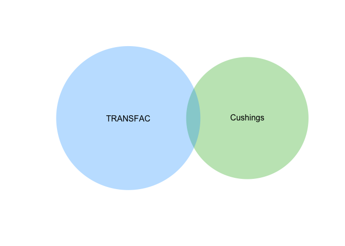
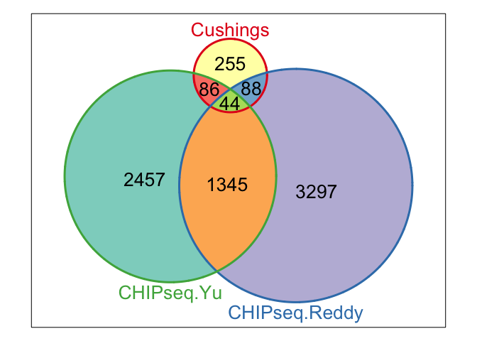

# Co-ordination Between Differentially Expressed Cushing's Genes and GRE Containing Genes
Innocence Harvey and Dave Bridges  
February 23, 2015  


There are datasets for genes which contain GRE's and datasets for genes which are associated with our Cushing's dataset.  We want to know which ones overlap, to get a sense of hich ones are direct targets.

# Data#


We used the data from our Cushing's patients found in the ../data/processed/Annotated Results GRCh37.74 - Cushing.csv file for our significant genes.  The data is obtained from the MSigDB collection for the following gene sets on Thu Mar 12 11:50:40 2015.  These data are saved in:

* **Predicted TFBS** from the TRANSFAC database.  ../data/raw/c3.tft.v4.0.symbols.gmt.
* **Experimental TFBS**  from the Reddy *et al.*.  ../data/processed/Annotated GR Peaks.csv.  See *gre_annotation.Rmd* to see how this file was generated from the raw data.  This was from A549 Cells
* **Experimental TFBS** from the Yu *et al.*.  ../data/raw/Yu CHIPseq Data.xlsx.  This was generated from 3T3-L1 cells.


This is shown in the following venn diagram.  

 

There were 473 genes differentially expressed in our Cushing's patients adipose tissue, 664 genes with GRE's and 18 which overlapped. This much overlap is not significantly more than is expected (Fisher's Exact Test; p=0.5128475) based on the contingency table shown below:

<!-- html table generated in R 3.1.2 by xtable 1.7-4 package -->
<!-- Thu Mar 12 11:50:42 2015 -->
<table border=1>
<caption align="bottom"> Contingency table for overlap between GRE's and Cushing's Dependent Differentially Expressed Genes </caption>
<tr> <th>  </th> <th> GRE </th> <th> Total </th> <th> Percent </th>  </tr>
  <tr> <td align="right"> Cushings </td> <td align="right"> 18 </td> <td align="right"> 473 </td> <td align="right"> 3.81 </td> </tr>
  <tr> <td align="right"> Total </td> <td align="right"> 664 </td> <td align="right"> 20389 </td> <td align="right"> 3.26 </td> </tr>
   <a name=tab:overlap-contingency></a>
</table>

The differentially expressed genes which contain TRANSFAC GREs are YARS, LUC7L3, GBE1, RBM23, PDE2A, KCND2, TSSK3, SCARB2, LTBP3, EFNA1, DHX29, SEMA4C, ME1, HOXB3, PCBP4, GEN1, CPEB4, CPB1.

# Experimental Data

## Reddy et al (A549 Cells)

Based on the data in Reddy *et al.*, we identified 4774 genes associated with GR CHIP peaks in A549 cells.  We found that 132 of these genes overlapped with the Cushings's differentially expressed genes.  These genes are shown in the Table below. 


There were 473 genes differentially expressed in our Cushing's patients adipose tissue, 4774 genes with CHIPseq peaks and 132 which overlapped. This much overlap is not significantly more than is expected (Fisher's Exact Test; p=0.0836268) based on the contingency table shown below:

<!-- html table generated in R 3.1.2 by xtable 1.7-4 package -->
<!-- Thu Mar 12 11:50:42 2015 -->
<table border=1>
<caption align="bottom"> Contingency table for overlap between CHIPseq peaks from Reddy et al and Cushing's Dependent Differentially Expressed Genes </caption>
<tr> <th>  </th> <th> GRE </th> <th> Total </th> <th> Percent </th>  </tr>
  <tr> <td align="right"> Cushings </td> <td align="right"> 132 </td> <td align="right"> 473 </td> <td align="right"> 27.91 </td> </tr>
  <tr> <td align="right"> Total </td> <td align="right"> 4774 </td> <td align="right"> 20389 </td> <td align="right"> 23.41 </td> </tr>
   <a name=tab:overlap-contingency></a>
</table>

## Yu et al (3T3-L1)


Among our Cushing's data, which is human we found  485 genes which had identifiable mouse homologs.  Within those genes, 135 had CHIPseq peaks out of a total of 4725 peaks identified by Yu *et al.*.  This contingency table is shown below and showed enrichment of our genes in their data set (p=0.0362323).


<!-- html table generated in R 3.1.2 by xtable 1.7-4 package -->
<!-- Thu Mar 12 11:50:52 2015 -->
<table border=1>
<caption align="bottom"> Contingency table for overlap between CHIPseq peaks from Yu et al and Cushing's Dependent Differentially Expressed Genes </caption>
<tr> <th>  </th> <th> GRE </th> <th> Total </th> <th> Percent </th>  </tr>
  <tr> <td align="right"> Cushings </td> <td align="right"> 135 </td> <td align="right"> 485 </td> <td align="right"> 27.84 </td> </tr>
  <tr> <td align="right"> Total </td> <td align="right"> 4725 </td> <td align="right"> 20926 </td> <td align="right"> 22.58 </td> </tr>
   </table>


# Overall Summary

 

<!-- html table generated in R 3.1.2 by xtable 1.7-4 package -->
<!-- Thu Mar 12 11:50:57 2015 -->
<table border=1>
<caption align="bottom"> Table Differentially Expressed Genes with CHIP Peaks Identified by each Paper </caption>
<tr> <th>  </th> <th> Reddy </th> <th> Yu </th>  </tr>
  <tr> <td align="right"> ABCD3 </td> <td> TRUE </td> <td> FALSE </td> </tr>
  <tr> <td align="right"> ACSL1 </td> <td> TRUE </td> <td> TRUE </td> </tr>
  <tr> <td align="right"> ACSS1 </td> <td> TRUE </td> <td> TRUE </td> </tr>
  <tr> <td align="right"> ACTR2 </td> <td> TRUE </td> <td> FALSE </td> </tr>
  <tr> <td align="right"> ACYP2 </td> <td> FALSE </td> <td> TRUE </td> </tr>
  <tr> <td align="right"> ADAM9 </td> <td> TRUE </td> <td> FALSE </td> </tr>
  <tr> <td align="right"> ADAMTS12 </td> <td> FALSE </td> <td> TRUE </td> </tr>
  <tr> <td align="right"> AGTR1 </td> <td> TRUE </td> <td> FALSE </td> </tr>
  <tr> <td align="right"> AKAP10 </td> <td> TRUE </td> <td> FALSE </td> </tr>
  <tr> <td align="right"> AKR1C1 </td> <td> TRUE </td> <td> TRUE </td> </tr>
  <tr> <td align="right"> ALCAM </td> <td> TRUE </td> <td> FALSE </td> </tr>
  <tr> <td align="right"> ANKRD10 </td> <td> FALSE </td> <td> TRUE </td> </tr>
  <tr> <td align="right"> ANXA1 </td> <td> TRUE </td> <td> FALSE </td> </tr>
  <tr> <td align="right"> AOX1 </td> <td> TRUE </td> <td> TRUE </td> </tr>
  <tr> <td align="right"> AP2S1 </td> <td> TRUE </td> <td> TRUE </td> </tr>
  <tr> <td align="right"> APBB1IP </td> <td> TRUE </td> <td> TRUE </td> </tr>
  <tr> <td align="right"> APLP2 </td> <td> FALSE </td> <td> TRUE </td> </tr>
  <tr> <td align="right"> APOB </td> <td> FALSE </td> <td> TRUE </td> </tr>
  <tr> <td align="right"> AR </td> <td> TRUE </td> <td> FALSE </td> </tr>
  <tr> <td align="right"> ARFGEF2 </td> <td> TRUE </td> <td> FALSE </td> </tr>
  <tr> <td align="right"> ARGLU1 </td> <td> FALSE </td> <td> TRUE </td> </tr>
  <tr> <td align="right"> ARHGAP27 </td> <td> FALSE </td> <td> TRUE </td> </tr>
  <tr> <td align="right"> ARHGEF1 </td> <td> FALSE </td> <td> TRUE </td> </tr>
  <tr> <td align="right"> ARHGEF4 </td> <td> TRUE </td> <td> FALSE </td> </tr>
  <tr> <td align="right"> ARL8B </td> <td> TRUE </td> <td> FALSE </td> </tr>
  <tr> <td align="right"> ARNTL </td> <td> FALSE </td> <td> TRUE </td> </tr>
  <tr> <td align="right"> BCAT1 </td> <td> TRUE </td> <td> TRUE </td> </tr>
  <tr> <td align="right"> BST2 </td> <td> FALSE </td> <td> TRUE </td> </tr>
  <tr> <td align="right"> BTBD1 </td> <td> TRUE </td> <td> FALSE </td> </tr>
  <tr> <td align="right"> C1orf21 </td> <td> FALSE </td> <td> TRUE </td> </tr>
  <tr> <td align="right"> CAPN10 </td> <td> TRUE </td> <td> FALSE </td> </tr>
  <tr> <td align="right"> CAPZA1 </td> <td> FALSE </td> <td> TRUE </td> </tr>
  <tr> <td align="right"> CAPZB </td> <td> FALSE </td> <td> TRUE </td> </tr>
  <tr> <td align="right"> CARHSP1 </td> <td> FALSE </td> <td> TRUE </td> </tr>
  <tr> <td align="right"> CBFA2T3 </td> <td> TRUE </td> <td> FALSE </td> </tr>
  <tr> <td align="right"> CCDC69 </td> <td> FALSE </td> <td> TRUE </td> </tr>
  <tr> <td align="right"> CCND1 </td> <td> TRUE </td> <td> TRUE </td> </tr>
  <tr> <td align="right"> CDIP1 </td> <td> FALSE </td> <td> TRUE </td> </tr>
  <tr> <td align="right"> CDK5RAP3 </td> <td> TRUE </td> <td> FALSE </td> </tr>
  <tr> <td align="right"> CDKN2B </td> <td> FALSE </td> <td> TRUE </td> </tr>
  <tr> <td align="right"> CFD </td> <td> TRUE </td> <td> FALSE </td> </tr>
  <tr> <td align="right"> CIDEA </td> <td> TRUE </td> <td> TRUE </td> </tr>
  <tr> <td align="right"> CIRBP </td> <td> TRUE </td> <td> FALSE </td> </tr>
  <tr> <td align="right"> CLMN </td> <td> TRUE </td> <td> TRUE </td> </tr>
  <tr> <td align="right"> CLPTM1L </td> <td> TRUE </td> <td> FALSE </td> </tr>
  <tr> <td align="right"> COL5A3 </td> <td> FALSE </td> <td> TRUE </td> </tr>
  <tr> <td align="right"> CPEB4 </td> <td> TRUE </td> <td> TRUE </td> </tr>
  <tr> <td align="right"> CPPED1 </td> <td> TRUE </td> <td> FALSE </td> </tr>
  <tr> <td align="right"> CSNK1A1 </td> <td> TRUE </td> <td> FALSE </td> </tr>
  <tr> <td align="right"> CYTH3 </td> <td> TRUE </td> <td> TRUE </td> </tr>
  <tr> <td align="right"> DBI </td> <td> FALSE </td> <td> TRUE </td> </tr>
  <tr> <td align="right"> DBP </td> <td> TRUE </td> <td> FALSE </td> </tr>
  <tr> <td align="right"> DDX17 </td> <td> FALSE </td> <td> TRUE </td> </tr>
  <tr> <td align="right"> DHCR24 </td> <td> TRUE </td> <td> FALSE </td> </tr>
  <tr> <td align="right"> DHDDS </td> <td> FALSE </td> <td> TRUE </td> </tr>
  <tr> <td align="right"> DUSP22 </td> <td> FALSE </td> <td> TRUE </td> </tr>
  <tr> <td align="right"> E2F1 </td> <td> TRUE </td> <td> FALSE </td> </tr>
  <tr> <td align="right"> EEF1D </td> <td> FALSE </td> <td> TRUE </td> </tr>
  <tr> <td align="right"> EFCAB4A </td> <td> TRUE </td> <td> FALSE </td> </tr>
  <tr> <td align="right"> EFR3A </td> <td> TRUE </td> <td> FALSE </td> </tr>
  <tr> <td align="right"> EGFL7 </td> <td> FALSE </td> <td> TRUE </td> </tr>
  <tr> <td align="right"> EIF5 </td> <td> FALSE </td> <td> TRUE </td> </tr>
  <tr> <td align="right"> ELOVL5 </td> <td> FALSE </td> <td> TRUE </td> </tr>
  <tr> <td align="right"> ENO1 </td> <td> TRUE </td> <td> FALSE </td> </tr>
  <tr> <td align="right"> F5 </td> <td> TRUE </td> <td> FALSE </td> </tr>
  <tr> <td align="right"> FASN </td> <td> TRUE </td> <td> TRUE </td> </tr>
  <tr> <td align="right"> FCGBP </td> <td> TRUE </td> <td> FALSE </td> </tr>
  <tr> <td align="right"> FHOD3 </td> <td> FALSE </td> <td> TRUE </td> </tr>
  <tr> <td align="right"> FMO2 </td> <td> FALSE </td> <td> TRUE </td> </tr>
  <tr> <td align="right"> FMO3 </td> <td> FALSE </td> <td> TRUE </td> </tr>
  <tr> <td align="right"> GAS6 </td> <td> TRUE </td> <td> TRUE </td> </tr>
  <tr> <td align="right"> GBE1 </td> <td> TRUE </td> <td> TRUE </td> </tr>
  <tr> <td align="right"> GCLC </td> <td> FALSE </td> <td> TRUE </td> </tr>
  <tr> <td align="right"> GHITM </td> <td> FALSE </td> <td> TRUE </td> </tr>
  <tr> <td align="right"> GLRX3 </td> <td> FALSE </td> <td> TRUE </td> </tr>
  <tr> <td align="right"> GLTSCR2 </td> <td> TRUE </td> <td> FALSE </td> </tr>
  <tr> <td align="right"> GNLY </td> <td> TRUE </td> <td> FALSE </td> </tr>
  <tr> <td align="right"> GOLGA7B </td> <td> TRUE </td> <td> FALSE </td> </tr>
  <tr> <td align="right"> GPAM </td> <td> TRUE </td> <td> TRUE </td> </tr>
  <tr> <td align="right"> GPC1 </td> <td> TRUE </td> <td> FALSE </td> </tr>
  <tr> <td align="right"> GPC6 </td> <td> FALSE </td> <td> TRUE </td> </tr>
  <tr> <td align="right"> GPIHBP1 </td> <td> TRUE </td> <td> FALSE </td> </tr>
  <tr> <td align="right"> GPRC5B </td> <td> TRUE </td> <td> TRUE </td> </tr>
  <tr> <td align="right"> GPX1 </td> <td> FALSE </td> <td> TRUE </td> </tr>
  <tr> <td align="right"> GSDMD </td> <td> TRUE </td> <td> FALSE </td> </tr>
  <tr> <td align="right"> GTF3C6 </td> <td> TRUE </td> <td> FALSE </td> </tr>
  <tr> <td align="right"> GYS2 </td> <td> TRUE </td> <td> TRUE </td> </tr>
  <tr> <td align="right"> HAS3 </td> <td> TRUE </td> <td> FALSE </td> </tr>
  <tr> <td align="right"> HDAC7 </td> <td> TRUE </td> <td> TRUE </td> </tr>
  <tr> <td align="right"> HMGA1 </td> <td> FALSE </td> <td> TRUE </td> </tr>
  <tr> <td align="right"> HMGCS1 </td> <td> TRUE </td> <td> FALSE </td> </tr>
  <tr> <td align="right"> HSD17B4 </td> <td> TRUE </td> <td> FALSE </td> </tr>
  <tr> <td align="right"> HTT </td> <td> TRUE </td> <td> FALSE </td> </tr>
  <tr> <td align="right"> ID3 </td> <td> TRUE </td> <td> TRUE </td> </tr>
  <tr> <td align="right"> IDH1 </td> <td> TRUE </td> <td> TRUE </td> </tr>
  <tr> <td align="right"> IDI1 </td> <td> TRUE </td> <td> FALSE </td> </tr>
  <tr> <td align="right"> IFITM2 </td> <td> FALSE </td> <td> TRUE </td> </tr>
  <tr> <td align="right"> IL32 </td> <td> TRUE </td> <td> FALSE </td> </tr>
  <tr> <td align="right"> INSIG1 </td> <td> FALSE </td> <td> TRUE </td> </tr>
  <tr> <td align="right"> ITM2C </td> <td> TRUE </td> <td> FALSE </td> </tr>
  <tr> <td align="right"> KCMF1 </td> <td> TRUE </td> <td> FALSE </td> </tr>
  <tr> <td align="right"> KCND2 </td> <td> FALSE </td> <td> TRUE </td> </tr>
  <tr> <td align="right"> KIAA1033 </td> <td> TRUE </td> <td> FALSE </td> </tr>
  <tr> <td align="right"> KPNA3 </td> <td> TRUE </td> <td> FALSE </td> </tr>
  <tr> <td align="right"> KPNA4 </td> <td> TRUE </td> <td> FALSE </td> </tr>
  <tr> <td align="right"> LACTB </td> <td> TRUE </td> <td> FALSE </td> </tr>
  <tr> <td align="right"> LAMA2 </td> <td> FALSE </td> <td> TRUE </td> </tr>
  <tr> <td align="right"> LAMB3 </td> <td> FALSE </td> <td> TRUE </td> </tr>
  <tr> <td align="right"> LDHA </td> <td> TRUE </td> <td> FALSE </td> </tr>
  <tr> <td align="right"> LDHB </td> <td> TRUE </td> <td> FALSE </td> </tr>
  <tr> <td align="right"> LEP </td> <td> FALSE </td> <td> TRUE </td> </tr>
  <tr> <td align="right"> LEPREL1 </td> <td> TRUE </td> <td> TRUE </td> </tr>
  <tr> <td align="right"> LHFP </td> <td> FALSE </td> <td> TRUE </td> </tr>
  <tr> <td align="right"> LOXL2 </td> <td> FALSE </td> <td> TRUE </td> </tr>
  <tr> <td align="right"> MAFK </td> <td> FALSE </td> <td> TRUE </td> </tr>
  <tr> <td align="right"> MBNL3 </td> <td> FALSE </td> <td> TRUE </td> </tr>
  <tr> <td align="right"> MDFIC </td> <td> TRUE </td> <td> FALSE </td> </tr>
  <tr> <td align="right"> MEGF9 </td> <td> TRUE </td> <td> TRUE </td> </tr>
  <tr> <td align="right"> MFAP4 </td> <td> TRUE </td> <td> FALSE </td> </tr>
  <tr> <td align="right"> MFGE8 </td> <td> TRUE </td> <td> TRUE </td> </tr>
  <tr> <td align="right"> MLEC </td> <td> TRUE </td> <td> FALSE </td> </tr>
  <tr> <td align="right"> MLLT6 </td> <td> TRUE </td> <td> FALSE </td> </tr>
  <tr> <td align="right"> MME </td> <td> TRUE </td> <td> TRUE </td> </tr>
  <tr> <td align="right"> MPC2 </td> <td> FALSE </td> <td> TRUE </td> </tr>
  <tr> <td align="right"> MRPL19 </td> <td> FALSE </td> <td> TRUE </td> </tr>
  <tr> <td align="right"> MRPS10 </td> <td> TRUE </td> <td> FALSE </td> </tr>
  <tr> <td align="right"> NAALAD2 </td> <td> TRUE </td> <td> FALSE </td> </tr>
  <tr> <td align="right"> NISCH </td> <td> FALSE </td> <td> TRUE </td> </tr>
  <tr> <td align="right"> NNT </td> <td> FALSE </td> <td> TRUE </td> </tr>
  <tr> <td align="right"> NPC1 </td> <td> FALSE </td> <td> TRUE </td> </tr>
  <tr> <td align="right"> NRCAM </td> <td> TRUE </td> <td> FALSE </td> </tr>
  <tr> <td align="right"> NUDT5 </td> <td> TRUE </td> <td> FALSE </td> </tr>
  <tr> <td align="right"> OSTM1 </td> <td> FALSE </td> <td> TRUE </td> </tr>
  <tr> <td align="right"> PDCD4 </td> <td> TRUE </td> <td> TRUE </td> </tr>
  <tr> <td align="right"> PDE4DIP </td> <td> FALSE </td> <td> TRUE </td> </tr>
  <tr> <td align="right"> PERP </td> <td> TRUE </td> <td> TRUE </td> </tr>
  <tr> <td align="right"> PLCE1 </td> <td> TRUE </td> <td> TRUE </td> </tr>
  <tr> <td align="right"> PLOD2 </td> <td> TRUE </td> <td> TRUE </td> </tr>
  <tr> <td align="right"> PNPLA3 </td> <td> TRUE </td> <td> FALSE </td> </tr>
  <tr> <td align="right"> PODN </td> <td> FALSE </td> <td> TRUE </td> </tr>
  <tr> <td align="right"> POGZ </td> <td> TRUE </td> <td> FALSE </td> </tr>
  <tr> <td align="right"> PSMD1 </td> <td> TRUE </td> <td> FALSE </td> </tr>
  <tr> <td align="right"> PSMD14 </td> <td> TRUE </td> <td> FALSE </td> </tr>
  <tr> <td align="right"> PTBP1 </td> <td> TRUE </td> <td> FALSE </td> </tr>
  <tr> <td align="right"> PTGDS </td> <td> FALSE </td> <td> TRUE </td> </tr>
  <tr> <td align="right"> PTGER3 </td> <td> FALSE </td> <td> TRUE </td> </tr>
  <tr> <td align="right"> PTP4A2 </td> <td> FALSE </td> <td> TRUE </td> </tr>
  <tr> <td align="right"> PTP4A3 </td> <td> TRUE </td> <td> FALSE </td> </tr>
  <tr> <td align="right"> PTPRG </td> <td> TRUE </td> <td> FALSE </td> </tr>
  <tr> <td align="right"> QSOX1 </td> <td> TRUE </td> <td> TRUE </td> </tr>
  <tr> <td align="right"> RAB1A </td> <td> FALSE </td> <td> TRUE </td> </tr>
  <tr> <td align="right"> RALGDS </td> <td> TRUE </td> <td> TRUE </td> </tr>
  <tr> <td align="right"> RAPGEF3 </td> <td> TRUE </td> <td> TRUE </td> </tr>
  <tr> <td align="right"> RASGEF1B </td> <td> TRUE </td> <td> FALSE </td> </tr>
  <tr> <td align="right"> RET </td> <td> FALSE </td> <td> TRUE </td> </tr>
  <tr> <td align="right"> RGCC </td> <td> FALSE </td> <td> TRUE </td> </tr>
  <tr> <td align="right"> RGMA </td> <td> TRUE </td> <td> TRUE </td> </tr>
  <tr> <td align="right"> RHOU </td> <td> TRUE </td> <td> TRUE </td> </tr>
  <tr> <td align="right"> RNF11 </td> <td> FALSE </td> <td> TRUE </td> </tr>
  <tr> <td align="right"> RNF144A </td> <td> TRUE </td> <td> TRUE </td> </tr>
  <tr> <td align="right"> ROBO3 </td> <td> FALSE </td> <td> TRUE </td> </tr>
  <tr> <td align="right"> RPS21 </td> <td> TRUE </td> <td> FALSE </td> </tr>
  <tr> <td align="right"> RRM2B </td> <td> FALSE </td> <td> TRUE </td> </tr>
  <tr> <td align="right"> RSPO3 </td> <td> TRUE </td> <td> FALSE </td> </tr>
  <tr> <td align="right"> SCARB2 </td> <td> FALSE </td> <td> TRUE </td> </tr>
  <tr> <td align="right"> SCD </td> <td> TRUE </td> <td> TRUE </td> </tr>
  <tr> <td align="right"> SEC62 </td> <td> FALSE </td> <td> TRUE </td> </tr>
  <tr> <td align="right"> SEL1L </td> <td> TRUE </td> <td> FALSE </td> </tr>
  <tr> <td align="right"> SERHL2 </td> <td> TRUE </td> <td> FALSE </td> </tr>
  <tr> <td align="right"> SERPINA5 </td> <td> TRUE </td> <td> TRUE </td> </tr>
  <tr> <td align="right"> SFRP1 </td> <td> FALSE </td> <td> TRUE </td> </tr>
  <tr> <td align="right"> SGK1 </td> <td> FALSE </td> <td> TRUE </td> </tr>
  <tr> <td align="right"> SGSM2 </td> <td> FALSE </td> <td> TRUE </td> </tr>
  <tr> <td align="right"> SH3GLB1 </td> <td> FALSE </td> <td> TRUE </td> </tr>
  <tr> <td align="right"> SLC12A7 </td> <td> TRUE </td> <td> FALSE </td> </tr>
  <tr> <td align="right"> SLC1A7 </td> <td> FALSE </td> <td> TRUE </td> </tr>
  <tr> <td align="right"> SLC25A29 </td> <td> FALSE </td> <td> TRUE </td> </tr>
  <tr> <td align="right"> SLC25A51 </td> <td> FALSE </td> <td> TRUE </td> </tr>
  <tr> <td align="right"> SLC36A4 </td> <td> TRUE </td> <td> FALSE </td> </tr>
  <tr> <td align="right"> SLC39A11 </td> <td> TRUE </td> <td> TRUE </td> </tr>
  <tr> <td align="right"> SLC39A8 </td> <td> FALSE </td> <td> TRUE </td> </tr>
  <tr> <td align="right"> SLC41A3 </td> <td> TRUE </td> <td> FALSE </td> </tr>
  <tr> <td align="right"> SLFN5 </td> <td> TRUE </td> <td> FALSE </td> </tr>
  <tr> <td align="right"> SORT1 </td> <td> FALSE </td> <td> TRUE </td> </tr>
  <tr> <td align="right"> SOS1 </td> <td> TRUE </td> <td> FALSE </td> </tr>
  <tr> <td align="right"> SRRM1 </td> <td> FALSE </td> <td> TRUE </td> </tr>
  <tr> <td align="right"> SRRT </td> <td> FALSE </td> <td> TRUE </td> </tr>
  <tr> <td align="right"> STK39 </td> <td> TRUE </td> <td> TRUE </td> </tr>
  <tr> <td align="right"> SYPL1 </td> <td> TRUE </td> <td> TRUE </td> </tr>
  <tr> <td align="right"> SYT7 </td> <td> TRUE </td> <td> FALSE </td> </tr>
  <tr> <td align="right"> TBC1D23 </td> <td> FALSE </td> <td> TRUE </td> </tr>
  <tr> <td align="right"> TCEA3 </td> <td> TRUE </td> <td> FALSE </td> </tr>
  <tr> <td align="right"> TFCP2L1 </td> <td> TRUE </td> <td> TRUE </td> </tr>
  <tr> <td align="right"> TMEM135 </td> <td> FALSE </td> <td> TRUE </td> </tr>
  <tr> <td align="right"> TMEM184A </td> <td> FALSE </td> <td> TRUE </td> </tr>
  <tr> <td align="right"> TMEM204 </td> <td> TRUE </td> <td> FALSE </td> </tr>
  <tr> <td align="right"> TMEM30A </td> <td> TRUE </td> <td> FALSE </td> </tr>
  <tr> <td align="right"> TNFRSF14 </td> <td> FALSE </td> <td> TRUE </td> </tr>
  <tr> <td align="right"> TNPO1 </td> <td> TRUE </td> <td> FALSE </td> </tr>
  <tr> <td align="right"> TPCN2 </td> <td> TRUE </td> <td> TRUE </td> </tr>
  <tr> <td align="right"> TPO </td> <td> TRUE </td> <td> FALSE </td> </tr>
  <tr> <td align="right"> TPX2 </td> <td> FALSE </td> <td> TRUE </td> </tr>
  <tr> <td align="right"> TSPAN4 </td> <td> FALSE </td> <td> TRUE </td> </tr>
  <tr> <td align="right"> TUBGCP6 </td> <td> TRUE </td> <td> FALSE </td> </tr>
  <tr> <td align="right"> UBQLN1 </td> <td> FALSE </td> <td> TRUE </td> </tr>
  <tr> <td align="right"> UGP2 </td> <td> TRUE </td> <td> FALSE </td> </tr>
  <tr> <td align="right"> USP47 </td> <td> TRUE </td> <td> TRUE </td> </tr>
  <tr> <td align="right"> VDAC1 </td> <td> TRUE </td> <td> FALSE </td> </tr>
  <tr> <td align="right"> YBX1 </td> <td> TRUE </td> <td> FALSE </td> </tr>
  <tr> <td align="right"> ZBED3 </td> <td> TRUE </td> <td> FALSE </td> </tr>
  <tr> <td align="right"> ZBTB17 </td> <td> FALSE </td> <td> TRUE </td> </tr>
  <tr> <td align="right"> ZBTB7B </td> <td> TRUE </td> <td> FALSE </td> </tr>
  <tr> <td align="right"> ZFAT </td> <td> TRUE </td> <td> TRUE </td> </tr>
  <tr> <td align="right"> ZHX1 </td> <td> FALSE </td> <td> TRUE </td> </tr>
  <tr> <td align="right"> ZNF106 </td> <td> FALSE </td> <td> TRUE </td> </tr>
  <tr> <td align="right"> ZNF251 </td> <td> TRUE </td> <td> FALSE </td> </tr>
  <tr> <td align="right"> ZNF385A </td> <td> FALSE </td> <td> TRUE </td> </tr>
  <tr> <td align="right"> ZNF664 </td> <td> TRUE </td> <td> FALSE </td> </tr>
   </table>


# Session Information

```
## R version 3.1.2 (2014-10-31)
## Platform: x86_64-apple-darwin13.4.0 (64-bit)
## 
## locale:
## [1] en_US.UTF-8/en_US.UTF-8/en_US.UTF-8/C/en_US.UTF-8/en_US.UTF-8
## 
## attached base packages:
## [1] grid      stats     graphics  grDevices utils     datasets  methods  
## [8] base     
## 
## other attached packages:
##  [1] Vennerable_3.0     gtools_3.4.1       reshape_0.8.5     
##  [4] RColorBrewer_1.1-2 lattice_0.20-29    RBGL_1.40.1       
##  [7] graph_1.42.0       biomaRt_2.20.0     xtable_1.7-4      
## [10] venneuler_1.1-0    stringr_0.6.2      xlsx_0.5.7        
## [13] xlsxjars_0.6.1     rJava_0.9-6        knitr_1.9         
## 
## loaded via a namespace (and not attached):
##  [1] AnnotationDbi_1.26.1 Biobase_2.24.0       BiocGenerics_0.10.0 
##  [4] bitops_1.0-6         DBI_0.3.1            digest_0.6.8        
##  [7] evaluate_0.5.5       formatR_1.0          GenomeInfoDb_1.0.2  
## [10] htmltools_0.2.6      IRanges_1.22.10      parallel_3.1.2      
## [13] plyr_1.8.1           Rcpp_0.11.4          RCurl_1.95-4.5      
## [16] rmarkdown_0.5.1      RSQLite_1.0.0        stats4_3.1.2        
## [19] tools_3.1.2          XML_3.98-1.1         yaml_2.1.13
```
