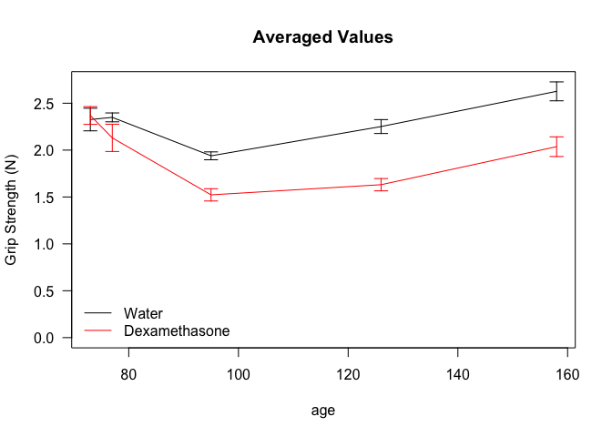
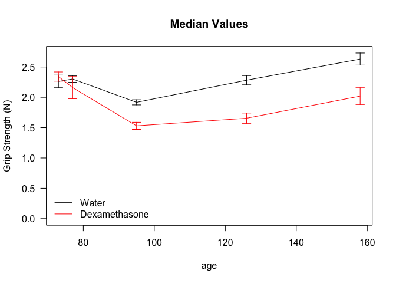

# Data Entry
This was from one cohort of C57BL6/J mice which were tested at week 3 for grip strength (4 paw).


Data was read from the file ../../data/raw/Grip Data.csv.  These data are saved in /Users/davebrid/Documents/GitHub/CushingAcromegalyStudy/scripts/scripts-cushing and acromegaly.

# Grip Strength Analysis


<!-- -->


Based on Shapiro Wilk Tests  we can assume the data are normally distributed (p>0.021.  To test for equal variance we did a Levene's test (p=0.86 for mean and p=0.977 for median grip), so in both cases we can assume equal variance.

We therefore did Student's *t*-Tests and found that in the case of mean grip, at the end of the experiment we saw a 22.465% reduction in grip strength (p=6.131&times; 10^-8^) and for median grip, we saw a 23.22% reduction in grip strength (p=2.161&times; 10^-7^).

<!-- -->

# Session Information

```
## R version 3.5.0 (2018-04-23)
## Platform: x86_64-apple-darwin15.6.0 (64-bit)
## Running under: macOS High Sierra 10.13.6
## 
## Matrix products: default
## BLAS: /Library/Frameworks/R.framework/Versions/3.5/Resources/lib/libRblas.0.dylib
## LAPACK: /Library/Frameworks/R.framework/Versions/3.5/Resources/lib/libRlapack.dylib
## 
## locale:
## [1] en_US.UTF-8/en_US.UTF-8/en_US.UTF-8/C/en_US.UTF-8/en_US.UTF-8
## 
## attached base packages:
## [1] stats     graphics  grDevices utils     datasets  methods   base     
## 
## other attached packages:
## [1] bindrcpp_0.2.2 car_3.0-2      carData_3.0-1  dplyr_0.7.6   
## [5] plyr_1.8.4     knitr_1.20    
## 
## loaded via a namespace (and not attached):
##  [1] zip_1.0.0         Rcpp_0.12.18      pillar_1.3.0     
##  [4] compiler_3.5.0    cellranger_1.1.0  bindr_0.1.1      
##  [7] forcats_0.3.0     tools_3.5.0       digest_0.6.16    
## [10] evaluate_0.11     tibble_1.4.2      pkgconfig_2.0.2  
## [13] rlang_0.2.2       openxlsx_4.1.0    curl_3.2         
## [16] yaml_2.2.0        haven_1.1.2       rio_0.5.10       
## [19] stringr_1.3.1     hms_0.4.2         rprojroot_1.3-2  
## [22] tidyselect_0.2.4  glue_1.3.0        data.table_1.11.4
## [25] R6_2.2.2          readxl_1.1.0      foreign_0.8-71   
## [28] rmarkdown_1.10    purrr_0.2.5       magrittr_1.5     
## [31] backports_1.1.2   htmltools_0.3.6   assertthat_0.2.0 
## [34] abind_1.4-5       stringi_1.2.4     crayon_1.3.4
```
