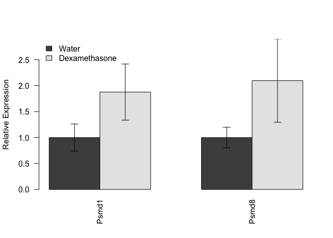

# Data Entry


Data was read from the file ../..//data/raw/iWAT qPCR Summary.csv.  These data were most recently updated on Mon Sep 24 10:45:37 2018.

#Analysis


<!-- html table generated in R 3.5.0 by xtable 1.8-3 package -->
<!-- Mon Sep 24 10:45:37 2018 -->
<table border=1>
<caption align="bottom"> Pairwise statistics summary, p-values adjusted by BH </caption>
<tr> <th>  </th> <th> shapiro-water </th> <th> shapiro-dex </th> <th> levene </th> <th> Test </th> <th> pval </th> <th> padj </th> <th> Significant </th>  </tr>
  <tr> <td align="right"> Acaca </td> <td align="right"> 0.004 </td> <td align="right"> 0.970 </td> <td align="right"> 0.471 </td> <td> Wilcoxon </td> <td align="right"> 0.018 </td> <td align="right"> 0.070 </td> <td> FALSE </td> </tr>
  <tr> <td align="right"> Aco1 </td> <td align="right"> 0.253 </td> <td align="right"> 0.152 </td> <td align="right"> 0.073 </td> <td> Student </td> <td align="right"> 0.195 </td> <td align="right"> 0.260 </td> <td> FALSE </td> </tr>
  <tr> <td align="right"> Acsl1 </td> <td align="right"> 0.068 </td> <td align="right"> 0.306 </td> <td align="right"> 0.006 </td> <td> Welchs </td> <td align="right"> 0.129 </td> <td align="right"> 0.193 </td> <td> FALSE </td> </tr>
  <tr> <td align="right"> Acss2 </td> <td align="right"> 0.018 </td> <td align="right"> 0.131 </td> <td align="right"> 0.304 </td> <td> Wilcoxon </td> <td align="right"> 0.412 </td> <td align="right"> 0.449 </td> <td> FALSE </td> </tr>
  <tr> <td align="right"> Agpat2 </td> <td align="right"> 0.664 </td> <td align="right"> 0.054 </td> <td align="right"> 0.652 </td> <td> Student </td> <td align="right"> 0.059 </td> <td align="right"> 0.133 </td> <td> FALSE </td> </tr>
  <tr> <td align="right"> Dgat2 </td> <td align="right"> 0.818 </td> <td align="right"> 0.550 </td> <td align="right"> 0.331 </td> <td> Student </td> <td align="right"> 0.031 </td> <td align="right"> 0.094 </td> <td> FALSE </td> </tr>
  <tr> <td align="right"> Dhcr24 </td> <td align="right"> 0.000 </td> <td align="right"> 0.087 </td> <td align="right"> 0.138 </td> <td> Wilcoxon </td> <td align="right"> 0.003 </td> <td align="right"> 0.047 </td> <td> TRUE </td> </tr>
  <tr> <td align="right"> Dhcr7 </td> <td align="right"> 0.003 </td> <td align="right"> 0.513 </td> <td align="right"> 0.423 </td> <td> Wilcoxon </td> <td align="right"> 0.018 </td> <td align="right"> 0.070 </td> <td> FALSE </td> </tr>
  <tr> <td align="right"> Fasn </td> <td align="right"> 0.002 </td> <td align="right"> 0.190 </td> <td align="right"> 0.707 </td> <td> Wilcoxon </td> <td align="right"> 0.226 </td> <td align="right"> 0.285 </td> <td> FALSE </td> </tr>
  <tr> <td align="right"> Gpam </td> <td align="right"> 0.053 </td> <td align="right"> 0.353 </td> <td align="right"> 0.587 </td> <td> Student </td> <td align="right"> 0.005 </td> <td align="right"> 0.047 </td> <td> TRUE </td> </tr>
  <tr> <td align="right"> Gpd1 </td> <td align="right"> 0.001 </td> <td align="right"> 0.123 </td> <td align="right"> 0.437 </td> <td> Wilcoxon </td> <td align="right"> 0.006 </td> <td align="right"> 0.047 </td> <td> TRUE </td> </tr>
  <tr> <td align="right"> Idh1 </td> <td align="right"> 0.207 </td> <td align="right"> 0.144 </td> <td align="right"> 0.024 </td> <td> Welchs </td> <td align="right"> 0.083 </td> <td align="right"> 0.133 </td> <td> FALSE </td> </tr>
  <tr> <td align="right"> Ldhb </td> <td align="right"> 0.064 </td> <td align="right"> 0.087 </td> <td align="right"> 0.868 </td> <td> Student </td> <td align="right"> 0.009 </td> <td align="right"> 0.057 </td> <td> FALSE </td> </tr>
  <tr> <td align="right"> Mdh1 </td> <td align="right"> 0.080 </td> <td align="right"> 0.889 </td> <td align="right"> 0.164 </td> <td> Student </td> <td align="right"> 0.076 </td> <td align="right"> 0.133 </td> <td> FALSE </td> </tr>
  <tr> <td align="right"> Me1 </td> <td align="right"> 0.024 </td> <td align="right"> 0.162 </td> <td align="right"> 0.696 </td> <td> Wilcoxon </td> <td align="right"> 0.078 </td> <td align="right"> 0.133 </td> <td> FALSE </td> </tr>
  <tr> <td align="right"> Nr3c1 </td> <td align="right"> 0.311 </td> <td align="right"> 0.359 </td> <td align="right"> 0.363 </td> <td> Student </td> <td align="right"> 0.403 </td> <td align="right"> 0.449 </td> <td> FALSE </td> </tr>
  <tr> <td align="right"> Psmd1 </td> <td align="right"> 0.011 </td> <td align="right"> 0.117 </td> <td align="right"> 0.786 </td> <td> Wilcoxon </td> <td align="right"> 0.078 </td> <td align="right"> 0.133 </td> <td> FALSE </td> </tr>
  <tr> <td align="right"> Psmd8 </td> <td align="right"> 0.085 </td> <td align="right"> 0.030 </td> <td align="right"> 0.461 </td> <td> Student </td> <td align="right"> 0.073 </td> <td align="right"> 0.133 </td> <td> FALSE </td> </tr>
  <tr> <td align="right"> Rplp0 </td> <td align="right"> 0.053 </td> <td align="right"> 0.016 </td> <td align="right"> 0.191 </td> <td> Student </td> <td align="right"> 0.036 </td> <td align="right"> 0.096 </td> <td> FALSE </td> </tr>
  <tr> <td align="right"> Rplp13a </td> <td align="right"> 0.381 </td> <td align="right"> 0.863 </td> <td align="right"> 0.957 </td> <td> Student </td> <td align="right"> 0.542 </td> <td align="right"> 0.565 </td> <td> FALSE </td> </tr>
  <tr> <td align="right"> Scd1 </td> <td align="right"> 0.005 </td> <td align="right"> 0.021 </td> <td align="right"> 0.208 </td> <td> Wilcoxon </td> <td align="right"> 0.191 </td> <td align="right"> 0.260 </td> <td> FALSE </td> </tr>
  <tr> <td align="right"> Scd2 </td> <td align="right"> 0.000 </td> <td align="right"> 0.534 </td> <td align="right"> 0.749 </td> <td> Wilcoxon </td> <td align="right"> 0.026 </td> <td align="right"> 0.090 </td> <td> FALSE </td> </tr>
  <tr> <td align="right"> Scd3 </td> <td align="right"> 0.019 </td> <td align="right"> 0.004 </td> <td align="right"> 0.338 </td> <td> Wilcoxon </td> <td align="right"> 0.851 </td> <td align="right"> 0.851 </td> <td> FALSE </td> </tr>
  <tr> <td align="right"> Scd4 </td> <td align="right"> 0.000 </td> <td align="right"> 0.087 </td> <td align="right"> 0.547 </td> <td> Wilcoxon </td> <td align="right"> 0.412 </td> <td align="right"> 0.449 </td> <td> FALSE </td> </tr>
   </table>

## Lipogenic Genes

<!-- -->

# Proteasome Genes

<!-- -->

# TCA Cycle Genes
<!-- -->

# Glucocorticoid Receptor
<!-- -->

# Session Information

```
## R version 3.5.0 (2018-04-23)
## Platform: x86_64-apple-darwin15.6.0 (64-bit)
## Running under: macOS High Sierra 10.13.6
## 
## Matrix products: default
## BLAS: /Library/Frameworks/R.framework/Versions/3.5/Resources/lib/libRblas.0.dylib
## LAPACK: /Library/Frameworks/R.framework/Versions/3.5/Resources/lib/libRlapack.dylib
## 
## locale:
## [1] en_US.UTF-8/en_US.UTF-8/en_US.UTF-8/C/en_US.UTF-8/en_US.UTF-8
## 
## attached base packages:
## [1] stats     graphics  grDevices utils     datasets  methods   base     
## 
## other attached packages:
## [1] reshape2_1.4.3 xtable_1.8-3   car_3.0-2      carData_3.0-1 
## [5] bindrcpp_0.2.2 dplyr_0.7.6    knitr_1.20    
## 
## loaded via a namespace (and not attached):
##  [1] zip_1.0.0         Rcpp_0.12.18      plyr_1.8.4       
##  [4] pillar_1.3.0      compiler_3.5.0    cellranger_1.1.0 
##  [7] bindr_0.1.1       forcats_0.3.0     tools_3.5.0      
## [10] digest_0.6.16     evaluate_0.11     tibble_1.4.2     
## [13] pkgconfig_2.0.2   rlang_0.2.2       openxlsx_4.1.0   
## [16] curl_3.2          yaml_2.2.0        haven_1.1.2      
## [19] rio_0.5.10        stringr_1.3.1     hms_0.4.2        
## [22] rprojroot_1.3-2   tidyselect_0.2.4  glue_1.3.0       
## [25] data.table_1.11.4 R6_2.2.2          readxl_1.1.0     
## [28] foreign_0.8-71    rmarkdown_1.10    purrr_0.2.5      
## [31] magrittr_1.5      backports_1.1.2   htmltools_0.3.6  
## [34] assertthat_0.2.0  abind_1.4-5       stringi_1.2.4    
## [37] crayon_1.3.4
```
