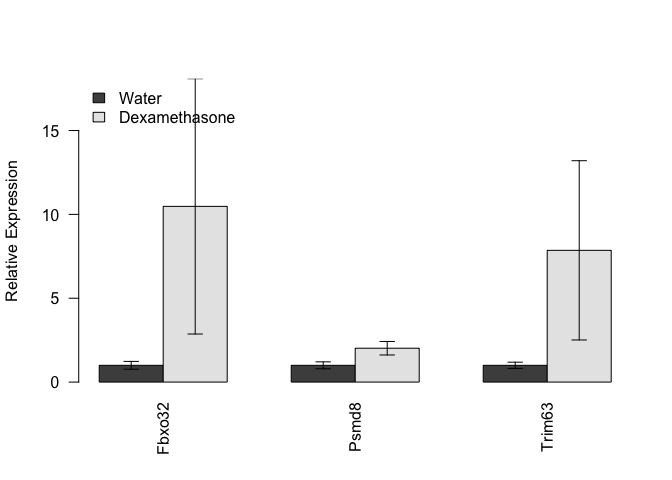
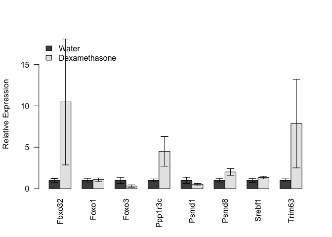

# Analysis of Gastroc mRNA Transcripts
Innocence Harvey and Dave Bridges  
February 25, 2015  


# Data Entry


Data was read from the file ../data/raw/Gastroc qPCR Summary.csv.  These data were most recently updated on Fri Feb 27 12:46:10 2015.

#Analysis


<!-- html table generated in R 3.1.2 by xtable 1.7-4 package -->
<!-- Fri Feb 27 12:46:13 2015 -->
<table border=1>
<caption align="bottom"> Pairwise statistics summary, p-values adjusted by BH </caption>
<tr> <th>  </th> <th> shapiro-water </th> <th> shapiro-dex </th> <th> levene </th> <th> Test </th> <th> pval </th> <th> padj </th> <th> Significant </th>  </tr>
  <tr> <td align="right"> Fbxo32 </td> <td align="right"> 0.541 </td> <td align="right"> 0.021 </td> <td align="right"> 0.302 </td> <td> Wilcoxon </td> <td align="right"> 0.200 </td> <td align="right"> 0.247 </td> <td> FALSE </td> </tr>
  <tr> <td align="right"> Trim63 </td> <td align="right"> 0.766 </td> <td align="right"> 0.079 </td> <td align="right"> 0.227 </td> <td> Student </td> <td align="right"> 0.247 </td> <td align="right"> 0.247 </td> <td> FALSE </td> </tr>
  <tr> <td align="right"> Psmd8 </td> <td align="right"> 0.683 </td> <td align="right"> 0.969 </td> <td align="right"> 0.214 </td> <td> Student </td> <td align="right"> 0.065 </td> <td align="right"> 0.196 </td> <td> FALSE </td> </tr>
   </table>

## Proteasomal Genes

 

# All Genes

 

# Session Information


```
## R version 3.1.2 (2014-10-31)
## Platform: x86_64-apple-darwin13.4.0 (64-bit)
## 
## locale:
## [1] en_US.UTF-8/en_US.UTF-8/en_US.UTF-8/C/en_US.UTF-8/en_US.UTF-8
## 
## attached base packages:
## [1] stats     graphics  grDevices utils     datasets  methods   base     
## 
## other attached packages:
## [1] reshape2_1.4.1 xtable_1.7-4   car_2.0-24     dplyr_0.4.1   
## [5] knitr_1.9     
## 
## loaded via a namespace (and not attached):
##  [1] assertthat_0.1  DBI_0.3.1       digest_0.6.8    evaluate_0.5.5 
##  [5] formatR_1.0     grid_3.1.2      htmltools_0.2.6 lattice_0.20-29
##  [9] lazyeval_0.1.10 lme4_1.1-7      magrittr_1.5    MASS_7.3-37    
## [13] Matrix_1.1-5    mgcv_1.8-4      minqa_1.2.4     nlme_3.1-119   
## [17] nloptr_1.0.4    nnet_7.3-8      parallel_3.1.2  pbkrtest_0.4-2 
## [21] plyr_1.8.1      quantreg_5.11   Rcpp_0.11.4     rmarkdown_0.5.1
## [25] SparseM_1.6     splines_3.1.2   stringr_0.6.2   tools_3.1.2    
## [29] yaml_2.1.13
```
