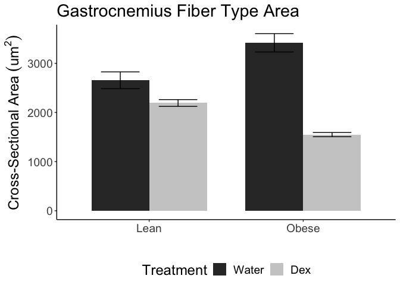

# Purpose

# Experimental Details

Link to the protocol used (permalink preferred) for the experiment and include any notes relevant to your analysis.  This might include specifics not in the general protocol such as cell lines, treatment doses etc.

# Raw Data

Describe your raw data files, including what the columns mean (and what units they are in).


These data can be found in **/Users/davebrid/Documents/GitHub/CushingAcromegalyStudy/scripts/scripts-muscle** in a file named **no file found**.  This script was most recently updated on **Tue Jan 21 15:03:50 2020**.

# Analysis

## 2x2 ANOVA with Interaction


Table: Two-Way ANOVA with Interaction

term              df     sumsq    meansq   statistic   p.value
---------------  ---  --------  --------  ----------  --------
Treatment          1   4073506   4073506      76.814     0.000
Diet               1     10749     10749       0.203     0.665
Treatment:Diet     1   1482737   1482737      27.960     0.001
Residuals          8    424248     53031          NA        NA

## Boxplots

<!-- -->

Table: Cross-Sectional Area

term              df     sumsq    meansq   statistic   p.value
---------------  ---  --------  --------  ----------  --------
Diet               1     10749     10749       0.203     0.665
Treatment          1   4073506   4073506      76.814     0.000
Diet:Treatment     1   1482737   1482737      27.960     0.001
Residuals          8    424248     53031          NA        NA


## Barplots


Table: Summary statistics

Treatment   Diet    Mean   Error    N   Shapiro
----------  -----  -----  ------  ---  --------
Water       NCD     2655   171.1    3     0.312
Water       HFD     3418   186.7    3     0.195
Dex         NCD     2193    69.0    3     0.806
Dex         HFD     1550    42.8    3     0.949

<!-- -->

Table: Cross-Sectional Area

term              df     sumsq    meansq   statistic   p.value
---------------  ---  --------  --------  ----------  --------
Diet               1     10749     10749       0.203     0.665
Treatment          1   4073506   4073506      76.814     0.000
Diet:Treatment     1   1482737   1482737      27.960     0.001
Residuals          8    424248     53031          NA        NA

# Interpretation

There was a **17.41%** reduction in fiber CSA in NCD animals and a **54.662%** reduction in fiber CSA in HFD fed animals.

# Session Information


```r
sessionInfo()
```

```
## R version 3.6.2 (2019-12-12)
## Platform: x86_64-apple-darwin15.6.0 (64-bit)
## Running under: macOS Catalina 10.15.2
## 
## Matrix products: default
## BLAS:   /Library/Frameworks/R.framework/Versions/3.6/Resources/lib/libRblas.0.dylib
## LAPACK: /Library/Frameworks/R.framework/Versions/3.6/Resources/lib/libRlapack.dylib
## 
## locale:
## [1] en_US.UTF-8/en_US.UTF-8/en_US.UTF-8/C/en_US.UTF-8/en_US.UTF-8
## 
## attached base packages:
## [1] stats     graphics  grDevices utils     datasets  methods   base     
## 
## other attached packages:
## [1] ggplot2_3.2.1 broom_0.5.3   readxl_1.3.1  dplyr_0.8.3   tidyr_1.0.0  
## [6] knitr_1.26   
## 
## loaded via a namespace (and not attached):
##  [1] Rcpp_1.0.3       pillar_1.4.3     compiler_3.6.2   cellranger_1.1.0
##  [5] plyr_1.8.5       highr_0.8        tools_3.6.2      zeallot_0.1.0   
##  [9] digest_0.6.23    evaluate_0.14    lifecycle_0.1.0  tibble_2.1.3    
## [13] nlme_3.1-142     gtable_0.3.0     lattice_0.20-38  pkgconfig_2.0.3 
## [17] rlang_0.4.2      yaml_2.2.0       xfun_0.12        withr_2.1.2     
## [21] stringr_1.4.0    generics_0.0.2   vctrs_0.2.1      grid_3.6.2      
## [25] tidyselect_0.2.5 glue_1.3.1       R6_2.4.1         rmarkdown_2.0   
## [29] farver_2.0.1     purrr_0.3.3      magrittr_1.5     backports_1.1.5 
## [33] scales_1.1.0     htmltools_0.4.0  assertthat_0.2.1 colorspace_1.4-1
## [37] labeling_0.3     stringi_1.4.5    lazyeval_0.2.2   munsell_0.5.0   
## [41] crayon_1.3.4
```
