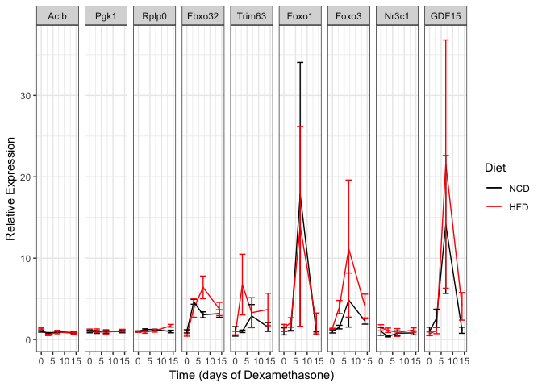

# Purpose
to examine the molecular effects of dexamethasone at varying lengths of treatment on obese and non-obese mice 


# Experimental Details


The relevant protocols used were:

* RNA Purification, a modified version of http://bridgeslab.sph.umich.edu/protocols/index.php?title=Preparation_of_RNA_Samples_from_Mouse_Tissues&oldid=1359
* cDNA Synthesis, used 2 ug then diluted cDNA 5X prior to qPCR: http://bridgeslab.sph.umich.edu/protocols/index.php?title=First_Strand_cDNA_Synthesis_(AB_Kit)&oldid=1242
* qPCR: http://bridgeslab.sph.umich.edu/protocols/index.php?title=QPCR&oldid=1252


# Raw Data


The sample mapping is found in sample-key.csv and the qPCR data can be found in Well Results New.csv.  This analysis can be found in /Users/davebrid/Documents/GitHub/CushingAcromegalyStudy/scripts/scripts-muscle and was most recently run on Thu Apr  4 09:29:53 2019.


We removed the samples 2625,2618,2636,2642 from the dataset because they did not amplify.  We removed wells J1,J6,J7,J9,J11,J12,G7,D13,D16,A15,C24,C17,J10,B21 in the first experiment and P6,G5,G7,G4,G1,G2,G8,G3,J10,O21 in the second experiment because they were outliers relative to the other technical replicates. 

# Analysis


All mRNA levels were adjusted to **Pgk1**, then normalized to **NCD** at time **0**.  Summarized data was written out to Analysed Control Gene Data.csv.

# Foxo1 versus Foxo3a


Table: Relative amplification of Foxo1 and Foxo3

Target Name      Ct     DCt   Quant
------------  -----  ------  ------
Foxo1          24.4    0.00       1
Foxo3          22.9   -1.59       3

# Plots of changes in gene expression

<!-- -->

<!-- -->

<!-- -->

## Statistics

### Baseline Effects of Diet

First tested if there was an effect at baseline for expression of *Trim63* and *Fbxo32*.  


Table: Pairwise statistics for baseline effects of diet.

Target Name    HFD.Effect   Shapiro.p   Levene.p   Wilcox.p   Welch.p   Student.p
------------  -----------  ----------  ---------  ---------  --------  ----------
Fbxo32              0.487       0.115      0.549      0.057     0.073       0.088
Trim63              0.678       0.348      0.168      0.857     0.388       0.434
Foxo1               1.415       0.088      0.989      0.229     0.565       0.560
Foxo3               1.417       0.464      0.058      0.142     0.089       0.115
Nr3c1               1.264       0.279      0.516      0.400     0.315       0.359
GDF15               0.860       0.002      0.690      0.662     0.737       0.760

### Effects of Dexamethasone Over Time

First did pairwise tests at each time point.


Table: Pairwise statistics for effects of diet in dexamethasone treated animals.

 Time  Target Name    HFD.Effect   Shapiro.p.HFD   Shaprio.p.NCD   Shapiro.p   Levene.p   Wilcox.p   Welch.p   Student.p
-----  ------------  -----------  --------------  --------------  ----------  ---------  ---------  --------  ----------
    3  Fbxo32              0.833           0.336           0.758       0.336      0.396      0.400     0.551       0.595
    3  Trim63              2.319           0.043           0.860       0.043      0.312      0.400     0.302       0.342
    3  Foxo3               2.616           0.009           0.340       0.009      0.288      0.001     0.018       0.025
    3  Nr3c1               1.279           0.906           0.645       0.645      0.055      0.229     0.095       0.108
    7  Fbxo32              1.988           0.625           0.669       0.625      0.267      0.200     0.203       0.148
    7  Trim63              1.803           0.080           0.394       0.080      0.482      0.100     0.170       0.116
    7  Foxo3               2.139           0.634           0.486       0.486      0.474      0.065     0.041       0.037
    7  Nr3c1               1.467           0.804           0.137       0.137      0.275      0.400     0.261       0.215
   14  Fbxo32              1.177           0.880           0.883       0.880      0.302      0.886     0.573       0.568
   14  Trim63              1.658           0.041           0.726       0.041      0.423      0.343     0.347       0.316
   14  Foxo3               1.793           0.001           0.508       0.001      0.373      0.505     0.283       0.268
   14  Nr3c1               1.140           0.999           0.693       0.693      0.790      0.343     0.332       0.329

Also analysed this with a linear model with diet and time as covariates, allowing for an interaction.  


Table: Linear model for effects of time and diet on Fbxo32

term            estimate   std.error   statistic   p.value
-------------  ---------  ----------  ----------  --------
(Intercept)        2.224       0.776       2.865     0.009
DietHFD            0.217       1.119       0.194     0.848
Time               0.091       0.094       0.972     0.341
DietHFD:Time       0.069       0.135       0.513     0.613


Table: Linear model for effects of time and diet on Trim63

term            estimate   std.error   statistic   p.value
-------------  ---------  ----------  ----------  --------
(Intercept)        1.550       0.926       1.675     0.107
DietHFD            1.583       1.336       1.185     0.248
Time               0.041       0.112       0.365     0.718
DietHFD:Time       0.004       0.161       0.024     0.981


Table: Linear model for effects of time and diet on Nr3c1

term            estimate   std.error   statistic   p.value
-------------  ---------  ----------  ----------  --------
(Intercept)        0.895       0.101       8.862     0.000
DietHFD            0.258       0.146       1.774     0.089
Time               0.004       0.012       0.323     0.750
DietHFD:Time      -0.005       0.018      -0.282     0.781


Table: Linear model for effects of time and diet on Foxo1

term            estimate   std.error   statistic   p.value
-------------  ---------  ----------  ----------  --------
(Intercept)        1.170       0.483       2.424     0.023
DietHFD            0.510       0.696       0.732     0.471
Time              -0.016       0.058      -0.270     0.790
DietHFD:Time       0.037       0.084       0.439     0.665


Table: Linear model for effects of time and diet on Foxo3

term            estimate   std.error   statistic   p.value
-------------  ---------  ----------  ----------  --------
(Intercept)        1.045       0.565       1.848     0.070
DietHFD            1.415       0.815       1.735     0.089
Time               0.083       0.068       1.220     0.228
DietHFD:Time       0.039       0.098       0.401     0.690

# Interpretation

None of these time courses have a significant interaction between time and diet


# Session Information


```r
sessionInfo()
```

```
## R version 3.5.0 (2018-04-23)
## Platform: x86_64-apple-darwin15.6.0 (64-bit)
## Running under: macOS  10.14.2
## 
## Matrix products: default
## BLAS: /Library/Frameworks/R.framework/Versions/3.5/Resources/lib/libRblas.0.dylib
## LAPACK: /Library/Frameworks/R.framework/Versions/3.5/Resources/lib/libRlapack.dylib
## 
## locale:
## [1] en_US.UTF-8/en_US.UTF-8/en_US.UTF-8/C/en_US.UTF-8/en_US.UTF-8
## 
## attached base packages:
## [1] stats     graphics  grDevices utils     datasets  methods   base     
## 
## other attached packages:
## [1] broom_0.5.1    car_3.0-2      carData_3.0-2  bindrcpp_0.2.2
## [5] readr_1.3.1    ggplot2_3.1.0  dplyr_0.7.8    tidyr_0.8.2   
## [9] knitr_1.21    
## 
## loaded via a namespace (and not attached):
##  [1] tidyselect_0.2.5  xfun_0.4          reshape2_1.4.3   
##  [4] purrr_0.2.5       haven_2.0.0       lattice_0.20-38  
##  [7] colorspace_1.3-2  generics_0.0.2    htmltools_0.3.6  
## [10] yaml_2.2.0        rlang_0.3.1       pillar_1.3.1     
## [13] foreign_0.8-71    glue_1.3.0        withr_2.1.2      
## [16] readxl_1.2.0      bindr_0.1.1       plyr_1.8.4       
## [19] stringr_1.3.1     munsell_0.5.0     gtable_0.2.0     
## [22] cellranger_1.1.0  zip_1.0.0         evaluate_0.12    
## [25] labeling_0.3      rio_0.5.16        forcats_0.3.0    
## [28] curl_3.2          highr_0.7         Rcpp_1.0.0       
## [31] scales_1.0.0      backports_1.1.3   abind_1.4-5      
## [34] hms_0.4.2         digest_0.6.18     stringi_1.2.4    
## [37] openxlsx_4.1.0    grid_3.5.0        tools_3.5.0      
## [40] magrittr_1.5      lazyeval_0.2.1    tibble_2.0.0     
## [43] crayon_1.3.4      pkgconfig_2.0.2   data.table_1.11.8
## [46] assertthat_0.2.0  rmarkdown_1.11    R6_2.3.0         
## [49] nlme_3.1-137      compiler_3.5.0
```
