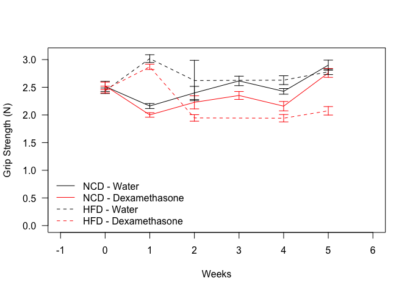
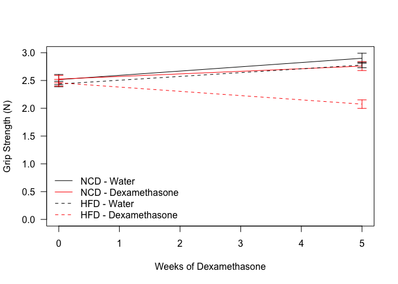

---
title: "Analysis of Dexaethasone Treated Mice for Grip Strength for HFD Animals"
author: "Innocence Harvey and Dave Bridges"
date: "April 17, 2015"
output:
  html_document:
    highlight: tango
    keep_md: yes
    number_sections: yes
    toc: yes
  pdf_document:
    highlight: tango
    keep_tex: yes
    number_sections: yes
    toc: yes
---


# Data Entry 
This was from one cohort of C57BL6/J mice which were tested at week 3 for grip strength (4 paw).


Data was read from the file../../data/raw/NCD Grip Data.csv and ../../data/raw/HFD Grip Data.csv and re-exported as ../../data/processed/Combined Grip Data.csv.  These data are saved in /Users/davebrid/Documents/GitHub/CushingAcromegalyStudy/scripts/scripts-muscle.


# Grip Strength Analysis


<!-- --><!-- -->


Table: Summarized Values for Grip Strength

 Weeks  Treatment       Diet    Average   Average.sd   Average.se   Median   Median.sd   Median.se    n   Average.shapiro   Median.shapiro
------  --------------  -----  --------  -----------  -----------  -------  ----------  ----------  ---  ----------------  ---------------
     0  Water           HFD        2.44        0.172        0.050     2.49       0.193       0.056   12             0.614            0.480
     0  Water           NCD        2.52        0.319        0.092     2.57       0.339       0.098   12             0.103            0.198
     0  Dexamethasone   HFD        2.46        0.213        0.061     2.50       0.240       0.069   12             0.027            0.010
     0  Dexamethasone   NCD        2.53        0.233        0.067     2.48       0.320       0.092   12             0.568            0.605
     1  Water           HFD        3.02        0.243        0.070     3.02       0.203       0.059   12             0.203            0.054
     1  Water           NCD        2.16        0.155        0.045     2.18       0.171       0.050   12             0.995            0.590
     1  Dexamethasone   HFD        2.87        0.159        0.048     2.90       0.149       0.045   11             0.710            0.953
     1  Dexamethasone   NCD        2.00        0.140        0.040     2.03       0.151       0.043   12             0.745            0.481
     2  Water           HFD        2.62        1.264        0.365     2.31       0.431       0.124   12             0.000            0.832
     2  Water           NCD        2.40        0.410        0.118     2.43       0.421       0.122   12             0.046            0.229
     2  Dexamethasone   HFD        1.95        0.204        0.059     1.97       0.230       0.066   12             0.435            0.535
     2  Dexamethasone   NCD        2.23        0.410        0.118     2.23       0.438       0.126   12             0.189            0.210
     3  Water           NCD        2.62        0.296        0.085     2.62       0.269       0.078   12             0.993            0.995
     3  Dexamethasone   NCD        2.35        0.247        0.071     2.38       0.235       0.068   12             0.515            0.334
     4  Water           HFD        2.63        0.277        0.080     2.64       0.253       0.073   12             0.995            0.751
     4  Water           NCD        2.43        0.177        0.051     2.38       0.215       0.062   12             0.555            0.514
     4  Dexamethasone   HFD        1.94        0.232        0.067     1.94       0.254       0.073   12             0.508            0.667
     4  Dexamethasone   NCD        2.16        0.292        0.084     2.14       0.269       0.078   12             0.237            0.629
     5  Water           HFD        2.78        0.171        0.049     2.79       0.189       0.055   12             0.104            0.738
     5  Water           NCD        2.90        0.315        0.091     2.90       0.368       0.106   12             0.165            0.940
     5  Dexamethasone   HFD        2.08        0.187        0.076     2.10       0.188       0.077    6             0.953            0.975
     5  Dexamethasone   NCD        2.76        0.276        0.080     2.74       0.296       0.086   12             0.624            0.883


Table: ANOVA for Grip strength after 3 weeks of treatment

term              df   sumsq   meansq   statistic   p.value
---------------  ---  ------  -------  ----------  --------
Diet               1   0.838    0.838        13.1     0.001
Treatment          1   1.341    1.341        21.0     0.000
Diet:Treatment     1   0.760    0.760        11.9     0.001
Residuals         38   2.428    0.064          NA        NA


```
## R version 3.6.2 (2019-12-12)
## Platform: x86_64-apple-darwin15.6.0 (64-bit)
## Running under: macOS Catalina 10.15.2
## 
## Matrix products: default
## BLAS:   /Library/Frameworks/R.framework/Versions/3.6/Resources/lib/libRblas.0.dylib
## LAPACK: /Library/Frameworks/R.framework/Versions/3.6/Resources/lib/libRlapack.dylib
## 
## locale:
## [1] en_US.UTF-8/en_US.UTF-8/en_US.UTF-8/C/en_US.UTF-8/en_US.UTF-8
## 
## attached base packages:
## [1] stats     graphics  grDevices utils     datasets  methods   base     
## 
## other attached packages:
## [1] broom_0.5.3   car_3.0-6     carData_3.0-3 plyr_1.8.5    readr_1.3.1  
## [6] dplyr_0.8.3   tidyr_1.0.0   knitr_1.26   
## 
## loaded via a namespace (and not attached):
##  [1] zip_2.0.4         Rcpp_1.0.3        highr_0.8         cellranger_1.1.0 
##  [5] pillar_1.4.3      compiler_3.6.2    forcats_0.4.0     tools_3.6.2      
##  [9] zeallot_0.1.0     digest_0.6.23     lattice_0.20-38   nlme_3.1-142     
## [13] evaluate_0.14     lifecycle_0.1.0   tibble_2.1.3      pkgconfig_2.0.3  
## [17] rlang_0.4.2       openxlsx_4.1.4    curl_4.3          yaml_2.2.0       
## [21] haven_2.2.0       xfun_0.12         rio_0.5.16        stringr_1.4.0    
## [25] generics_0.0.2    vctrs_0.2.1       hms_0.5.3         grid_3.6.2       
## [29] tidyselect_0.2.5  glue_1.3.1        data.table_1.12.8 R6_2.4.1         
## [33] readxl_1.3.1      foreign_0.8-74    rmarkdown_2.0     purrr_0.3.3      
## [37] magrittr_1.5      backports_1.1.5   htmltools_0.4.0   abind_1.4-5      
## [41] assertthat_0.2.1  stringi_1.4.5     crayon_1.3.4
```
