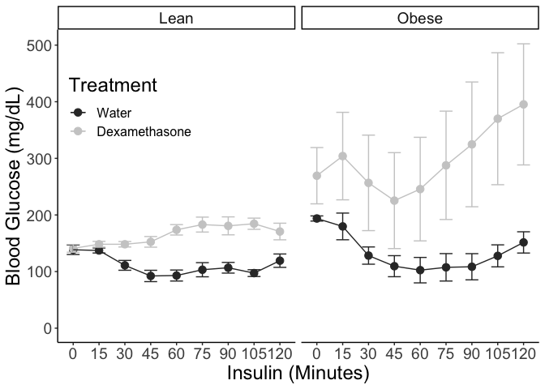

# Insulin Tolerance Test

## Raw Values

<!-- -->

### ITT Statistics (Raw Values)


Table: Chi squared test for effects of dexamethasone on NCD for absolute values

term                    df   AIC   BIC   logLik   deviance   statistic   Chi.Df    p.value
---------------------  ---  ----  ----  -------  ---------  ----------  -------  ---------
glucose.null.lme.ncd    11   683   708     -330        661          NA       NA         NA
glucose.trt.lme.ncd     20   630   675     -295        590        71.2        9   8.81e-12


Table: ANOVA table for NCD absolute values

                             Sum Sq   Mean Sq   NumDF   DenDF   F value     Pr(>F)
--------------------------  -------  --------  ------  ------  --------  ---------
as.factor(time)                3821       478       8      48      2.14   4.98e-02
Treatment                      6489      6489       1       6     29.07   1.68e-03
as.factor(time):Treatment     15422      1928       8      48      8.64   3.31e-07


Table: Chi squared test for effects of dexamethasone on HFD for absolute values

term                    df   AIC   BIC   logLik   deviance   statistic   Chi.Df    p.value
---------------------  ---  ----  ----  -------  ---------  ----------  -------  ---------
glucose.null.lme.hfd    11   700   723     -339        678          NA       NA         NA
glucose.trt.lme.hfd     20   672   715     -316        632        45.4        9   7.66e-07


Table: ANOVA table for HFD absolute values

                             Sum Sq   Mean Sq   NumDF   DenDF   F value       Pr(>F)
--------------------------  -------  --------  ------  ------  --------  -----------
as.factor(time)               70626      8828       8      40      7.69   0.00000353
Treatment                      5120      5120       1       5      4.46   0.08844096
as.factor(time):Treatment     49530      6191       8      40      5.39   0.00012509

### ITT Slope Calculations

Using only the first 45 minutes to see initial insulin sensitivity

<!-- -->

## Normalized Values
  
<!-- -->
    
 
# Fasting Blood Glucose

<!-- -->

Table: ANOVA of FBG

term               df    sumsq   meansq   statistic   p.value
---------------  ----  -------  -------  ----------  --------
diet                1   148455   148455        29.4         0
Treatment           1   363930   363930        72.1         0
diet:Treatment      1    99594    99594        19.7         0
Residuals         131   661587     5050          NA        NA


```
## 
## 	Shapiro-Wilk normality test
## 
## data:  .
## W = 1, p-value = 0.2
```

```
## 
## 	Shapiro-Wilk normality test
## 
## data:  .
## W = 0.9, p-value = 0.07
```

```
## 
## 	Shapiro-Wilk normality test
## 
## data:  .
## W = 0.8, p-value = 6e-07
```

```
## 
## 	Wilcoxon rank sum test with continuity correction
## 
## data:  glucose by diet
## W = 1524, p-value = 0.001
## alternative hypothesis: true location shift is not equal to 0
```

```
## [1] 0.0000125
```


Table: ANOVA

term                df   AIC   BIC   logLik   deviance   statistic   Chi.Df   p.value
-----------------  ---  ----  ----  -------  ---------  ----------  -------  --------
glucose.null.lme    11   650   675     -314        628          NA       NA        NA
glucose.diet.lme    20   641   687     -301        601        26.9        9     0.001


Table: Chi squared test for effects of dexamethasone on NCD for normalized values

term                df   AIC   BIC   logLik   deviance   statistic   Chi.Df   p.value
-----------------  ---  ----  ----  -------  ---------  ----------  -------  --------
glucose.null.lme    11   683   708     -330        661          NA       NA        NA
glucose.trt.lme     20   630   675     -295        590        71.2        9         0


Table: Chi squared test for effects of dexamethasone on HFD for normalized values

term                df   AIC   BIC   logLik   deviance   statistic   Chi.Df   p.value
-----------------  ---  ----  ----  -------  ---------  ----------  -------  --------
glucose.null.lme    11   700   723     -339        678          NA       NA        NA
glucose.trt.lme     20   672   715     -316        632        45.4        9         0

```
## [1] 15
```


Table: ANOVA for normalized data

term                  df   AIC   BIC   logLik   deviance   statistic   Chi.Df   p.value
-------------------  ---  ----  ----  -------  ---------  ----------  -------  --------
glucose.null.lme.n    11   572   597     -275        550          NA       NA        NA
glucose.diet.lme.n    20   576   621     -268        536        13.6        9     0.136

```
## 
## 	Shapiro-Wilk normality test
## 
## data:  .
## W = 0.9, p-value = 0.5
```

```
## 
## 	Shapiro-Wilk normality test
## 
## data:  .
## W = 0.7, p-value = 0.002
```

```
## [1] 0.0000125
```
