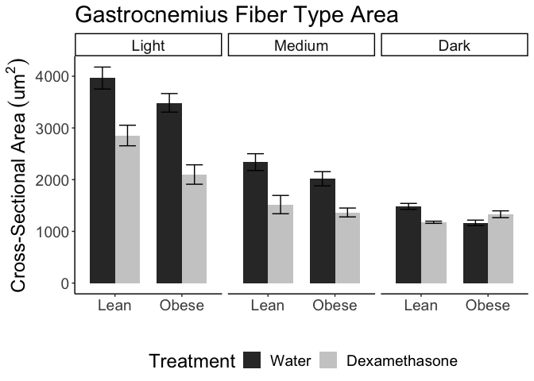

These data can be found in **/Users/davebrid/Documents/GitHub/CushingAcromegalyStudy/scripts/scripts-muscle** in a file named **NADH NBT CSA Data.csv**.  This script was most recently updated on **Thu Apr  4 09:07:00 2019**.

# Analysis

First created averages per animal


Table: Summarized data accross animals

Diet   Treatment   Color      CSA   CSA.se    n   Shapiro
-----  ----------  -------  -----  -------  ---  --------
NCD    Water       Light     3965    212.6    3     0.936
NCD    Water       Medium    2339    162.5    3     0.638
NCD    Water       Dark      1483     57.5    3     0.181
NCD    Dex         Light     2854    198.7    3     0.993
NCD    Dex         Medium    1518    177.0    3     0.648
NCD    Dex         Dark      1176     20.9    3     0.502
HFD    Water       Light     3485    179.9    3     0.367
HFD    Water       Medium    2017    137.3    3     0.344
HFD    Water       Dark      1165     52.1    3     0.141
HFD    Dex         Light     2099    187.7    3     0.428
HFD    Dex         Medium    1365     85.9    3     0.138
HFD    Dex         Dark      1330     66.4    3     0.416

## Cross-Sectional Area




## Percent of Fibers


# Statistics

First pairwise hypothesis testing was done to look at reductions in fiber size due to dexamethasone treatment.


Table: Pairwise statistical tests for effects of dex treatment in each group

Color    Diet    Levene   Student   Welch
-------  -----  -------  --------  ------
Light    NCD      0.929     0.019   0.019
Light    HFD      0.960     0.006   0.006
Medium   NCD      0.920     0.027   0.027
Medium   HFD      0.679     0.016   0.022
Dark     NCD      0.526     0.007   0.023
Dark     HFD      0.798     0.122   0.126

## Mixed linear models

Overall and fiber-type specific mixed linear models were generated using the animal as the random effect and looking at hte interaction between diet and treatment.


Table: Coefficient table for mixed linear model.

                                    Estimate   Std. Error        df   t value   Pr(>|t|)
---------------------------------  ---------  -----------  --------  --------  ---------
(Intercept)                             3965        134.9      9.23     29.40      0.000
ColorMedium                            -1630         68.1   1337.15    -23.94      0.000
ColorDark                              -2540         84.4   1337.16    -30.08      0.000
TreatmentDex                           -1106        190.7      9.23     -5.80      0.000
DietHFD                                 -462        191.6      9.41     -2.41      0.038
ColorMedium:TreatmentDex                 290         95.7   1336.63      3.03      0.003
ColorDark:TreatmentDex                   863        115.7   1337.31      7.46      0.000
ColorMedium:DietHFD                      150         96.6   1336.98      1.56      0.120
ColorDark:DietHFD                        195        112.6   1336.72      1.73      0.084
TreatmentDex:DietHFD                    -293        270.2      9.30     -1.08      0.306
ColorMedium:TreatmentDex:DietHFD         451        133.9   1336.60      3.36      0.001
ColorDark:TreatmentDex:DietHFD           638        156.5   1337.22      4.07      0.000


Table: Coefficient table for mixed linear model.

                        Estimate   Std. Error      df   t value   Pr(>|t|)
---------------------  ---------  -----------  ------  --------  ---------
(Intercept)                 1475         56.3   10.63     26.22      0.000
TreatmentDex                -305         77.1    9.22     -3.96      0.003
DietHFD                     -306         73.7    8.09     -4.16      0.003
TreatmentDex:DietHFD         455        103.6    7.54      4.40      0.003


Table: Coefficient table for mixed linear model of medium stained muscle fibers.

                        Estimate   Std. Error     df   t value   Pr(>|t|)
---------------------  ---------  -----------  -----  --------  ---------
(Intercept)                 2336          145   8.10    16.087      0.000
TreatmentDex                -818          205   8.06    -3.987      0.004
DietHFD                     -318          205   8.02    -1.554      0.159
TreatmentDex:DietHFD         165          289   7.97     0.572      0.583


Table: Coefficient table for mixed linear model of light stained muscle fibers.

                        Estimate   Std. Error     df   t value   Pr(>|t|)
---------------------  ---------  -----------  -----  --------  ---------
(Intercept)                 3965          195   7.94    20.360      0.000
TreatmentDex               -1110          275   7.95    -4.029      0.004
DietHFD                     -476          276   8.06    -1.722      0.123
TreatmentDex:DietHFD        -279          390   8.00    -0.716      0.494


# Interpretation

## Dark Fibers

There was a **20.719%** reduction in fiber CSA in NCD animals and a **-14.188%** reduction in fiber CSA in HFD fed animals.  

## Medium Fibers

There was a **35.124%** reduction in fiber CSA in NCD animals and a **32.326%** reduction in fiber CSA in HFD fed animals.

## Light Fibers

There was a **28.021%** reduction in fiber CSA in NCD animals and a **39.775%** reduction in fiber CSA in HFD fed animals.

# Session Information


```r
sessionInfo()
```

```
## R version 3.5.0 (2018-04-23)
## Platform: x86_64-apple-darwin15.6.0 (64-bit)
## Running under: macOS  10.14.2
## 
## Matrix products: default
## BLAS: /Library/Frameworks/R.framework/Versions/3.5/Resources/lib/libRblas.0.dylib
## LAPACK: /Library/Frameworks/R.framework/Versions/3.5/Resources/lib/libRlapack.dylib
## 
## locale:
## [1] en_US.UTF-8/en_US.UTF-8/en_US.UTF-8/C/en_US.UTF-8/en_US.UTF-8
## 
## attached base packages:
## [1] stats     graphics  grDevices utils     datasets  methods   base     
## 
## other attached packages:
##  [1] lmerTest_3.0-1 lme4_1.1-19    Matrix_1.2-15  car_3.0-2     
##  [5] carData_3.0-2  ggplot2_3.1.0  bindrcpp_0.2.2 readr_1.3.1   
##  [9] dplyr_0.7.8    tidyr_0.8.2    knitr_1.21    
## 
## loaded via a namespace (and not attached):
##  [1] tidyselect_0.2.5  xfun_0.4          reshape2_1.4.3   
##  [4] purrr_0.2.5       splines_3.5.0     haven_2.0.0      
##  [7] lattice_0.20-38   colorspace_1.3-2  htmltools_0.3.6  
## [10] yaml_2.2.0        rlang_0.3.1       nloptr_1.2.1     
## [13] pillar_1.3.1      foreign_0.8-71    glue_1.3.0       
## [16] withr_2.1.2       readxl_1.2.0      bindr_0.1.1      
## [19] plyr_1.8.4        stringr_1.3.1     munsell_0.5.0    
## [22] gtable_0.2.0      cellranger_1.1.0  zip_1.0.0        
## [25] evaluate_0.12     labeling_0.3      rio_0.5.16       
## [28] forcats_0.3.0     curl_3.2          highr_0.7        
## [31] Rcpp_1.0.0        scales_1.0.0      abind_1.4-5      
## [34] hms_0.4.2         digest_0.6.18     stringi_1.2.4    
## [37] openxlsx_4.1.0    numDeriv_2016.8-1 grid_3.5.0       
## [40] tools_3.5.0       magrittr_1.5      lazyeval_0.2.1   
## [43] tibble_2.0.0      crayon_1.3.4      pkgconfig_2.0.2  
## [46] MASS_7.3-51.1     data.table_1.11.8 minqa_1.2.4      
## [49] assertthat_0.2.0  rmarkdown_1.11    R6_2.3.0         
## [52] nlme_3.1-137      compiler_3.5.0
```
