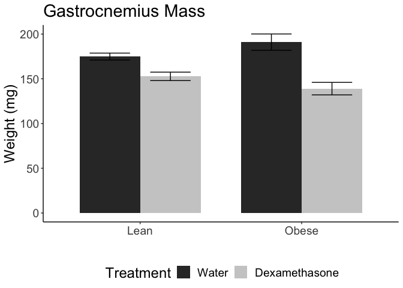
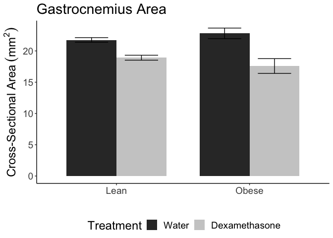
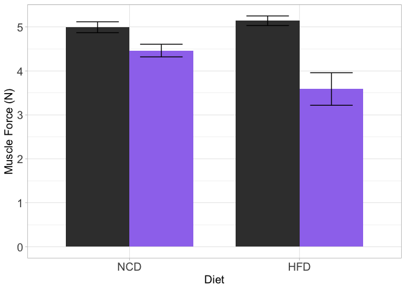
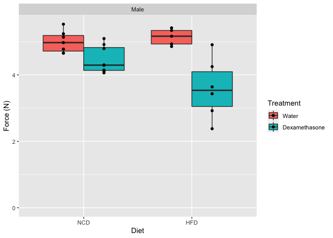

# Purpose

# Experimental Details

Link to the protocol used (permalink preferred) for the experiment and include any notes relevant to your analysis.  This might include specifics not in the general protocol such as cell lines, Treatment doses etc.

# Raw Data

Describe your raw data files, including what the columns mean (and what units they are in).


These data can be found in **/Users/davebrid/Documents/GitHub/CushingAcromegalyStudy/scripts/scripts-muscle** in a file named **no file found**.  This script was most recently updated on **Sat Sep 19 09:56:38 2020**.

# Analysis

We removed mouse 6013 double-checked nerve when done with muscle and 7179 slipped at 100hz for muscle stim, could not get higher force after that

# Number of Measurements


Table: Number of animals at sacrifice

|Sex  |Diet |Treatment     |  n|
|:----|:----|:-------------|--:|
|Male |NCD  |Water         |  7|
|Male |NCD  |Dexamethasone |  8|
|Male |HFD  |Water         |  5|
|Male |HFD  |Dexamethasone |  6|

Generated summary data for each measurement


## Fat Mass

<!-- -->

Table: ANOVA of Fat Mass

|term           | df|     sumsq|    meansq| statistic| p.value|
|:--------------|--:|---------:|---------:|---------:|-------:|
|Diet           |  1| 658630691| 658630691|    103.93|   0.000|
|Treatment      |  1|  16030350|  16030350|      2.53|   0.126|
|Diet:Treatment |  1|  36522274|  36522274|      5.76|   0.025|
|Residuals      | 22| 139419089|   6337231|        NA|      NA|

<!-- -->

## Blood Glucose
significant for FBG
diet is conditional on treatment, significant interaction between diet and treatment 
It tests whether the average treatment effect is the different for each diet, the respective diets.
effect of the treatment (difference between treated and control) differs between NCD and HFD

<!-- -->

Table: ANOVA of FBG

|term           | df| sumsq| meansq| statistic| p.value|
|:--------------|--:|-----:|------:|---------:|-------:|
|Diet           |  1| 64349|  64349|     25.02|   0.000|
|Treatment      |  1|  5855|   5855|      2.28|   0.146|
|Diet:Treatment |  1| 13289|  13289|      5.17|   0.033|
|Residuals      | 22| 56572|   2571|        NA|      NA|

## Gastrocnemius Weight

<!-- -->

Table: ANOVA of Gastroc Weights

|term           | df|   sumsq|  meansq| statistic| p.value|
|:--------------|--:|-------:|-------:|---------:|-------:|
|Diet           |  1|    1.03|    1.03|     0.005|   0.947|
|Treatment      |  1| 7796.87| 7796.87|    34.308|   0.000|
|Diet:Treatment |  1| 1406.09| 1406.09|     6.187|   0.021|
|Residuals      | 22| 4999.81|  227.26|        NA|      NA|

The gastroc weights are reduced **12.657%** in the NCD animals and **27.225%** in the HFD animals.

<!-- -->

Table: ANOVA of Gastroc Weights

|term           | df|   sumsq|  meansq| statistic| p.value|
|:--------------|--:|-------:|-------:|---------:|-------:|
|Diet           |  1|    1.03|    1.03|     0.005|   0.947|
|Treatment      |  1| 7796.87| 7796.87|    34.308|   0.000|
|Diet:Treatment |  1| 1406.09| 1406.09|     6.187|   0.021|
|Residuals      | 22| 4999.81|  227.26|        NA|      NA|

## Cross-Sectional Area

<!-- -->

Table: ANOVA of CSA

|term           | df| sumsq| meansq| statistic| p.value|
|:--------------|--:|-----:|------:|---------:|-------:|
|Diet           |  1|  0.50|   0.50|     0.156|   0.697|
|Treatment      |  1| 95.64|  95.64|    29.805|   0.000|
|Diet:Treatment |  1|  8.92|   8.92|     2.781|   0.110|
|Residuals      | 22| 70.59|   3.21|        NA|      NA|

The whole muscle cross-sectional areas are reduced **13.069%** in the NCD animals and **22.9%** in the HFD animals.

<!-- -->

Table: ANOVA of CSA

|term           | df| sumsq| meansq| statistic| p.value|
|:--------------|--:|-----:|------:|---------:|-------:|
|Diet           |  1|  0.50|   0.50|     0.156|   0.697|
|Treatment      |  1| 95.64|  95.64|    29.805|   0.000|
|Diet:Treatment |  1|  8.92|   8.92|     2.781|   0.110|
|Residuals      | 22| 70.59|   3.21|        NA|      NA|

## Force

### Force - Muscle

*Explanation* Not significant for force generated by muscle stimulation
diet is not conditional on treatment, no significant interaction between diet and treatment 
It tests whether the average treatment effect is the different for each diet, the respective diets.
effect of the treatment (difference between treated and control) doesnt significantly differs between NCD and HFD

<!-- --><!-- --><!-- -->

Table: ANOVA of Muscle force measurements

|term           | df| sumsq| meansq| statistic| p.value|
|:--------------|--:|-----:|------:|---------:|-------:|
|Diet           |  1|  1.10|  1.103|      3.95|   0.059|
|Treatment      |  1|  5.98|  5.983|     21.41|   0.000|
|Diet:Treatment |  1|  1.65|  1.645|      5.89|   0.024|
|Residuals      | 22|  6.15|  0.279|        NA|      NA|


Table: Summary statistics for muscle stimulation

|Treatment     |Diet | Mean|    SE|    SD|  n| shapiro| Rel.SD|
|:-------------|:----|----:|-----:|-----:|--:|-------:|------:|
|Water         |NCD  | 4.99| 0.124| 0.327|  7|   0.529|   6.55|
|Water         |HFD  | 5.14| 0.109| 0.245|  5|   0.532|   4.76|
|Dexamethasone |NCD  | 4.46| 0.144| 0.406|  8|   0.104|   9.10|
|Dexamethasone |HFD  | 3.59| 0.370| 0.907|  6|   0.987|  25.26|


Table: Levene's tests for NCD and HFD respectively

|term  | df| statistic| p.value|
|:-----|--:|---------:|-------:|
|group |  1|     0.172|   0.685|
|      | 13|        NA|      NA|
|group |  1|     4.012|   0.076|
|      |  9|        NA|      NA|


Table: Pairwise significance testing for effects of dexamethasone on muscle-stimulated contraction

|Diet | Student| Welch|
|:----|-------:|-----:|
|NCD  |   0.016| 0.015|
|HFD  |   0.005| 0.007|


<!-- -->

Table: ANOVA of Muscle force measurements

|term           | df| sumsq| meansq| statistic| p.value|
|:--------------|--:|-----:|------:|---------:|-------:|
|Diet           |  1|  1.10|  1.103|      3.95|   0.059|
|Treatment      |  1|  5.98|  5.983|     21.41|   0.000|
|Diet:Treatment |  1|  1.65|  1.645|      5.89|   0.024|
|Residuals      | 22|  6.15|  0.279|        NA|      NA|


### Force - Nerve

#Interpretation

significant for force generated by nerve stimulation
diet is conditional on treatment, significant interaction between diet and treatment 
It tests whether the average treatment effect is the different for each diet, the respective diets.
effect of the treatment (difference between treated and control) differs between NCD and HFD

<!-- -->

Table: Summary statistics for nerve stimulation

|Treatment     |Diet | Mean|    SE|    SD|  n| shapiro| Rel.SD|
|:-------------|:----|----:|-----:|-----:|--:|-------:|------:|
|Water         |NCD  | 5.37| 0.116| 0.307|  7|   0.644|   5.72|
|Water         |HFD  | 5.68| 0.195| 0.436|  5|   0.706|   7.69|
|Dexamethasone |NCD  | 4.82| 0.153| 0.431|  8|   0.514|   8.95|
|Dexamethasone |HFD  | 3.85| 0.384| 0.941|  6|   0.894|  24.45|


Table: Levene's tests for NCD and HFD respectively for nerve stimulation

|term  | df| statistic| p.value|
|:-----|--:|---------:|-------:|
|group |  1|      1.09|   0.315|
|      | 13|        NA|      NA|
|group |  1|      1.74|   0.220|
|      |  9|        NA|      NA|


Table: Pairwise significance testing for effects of dexamethasone on nerve-stimulated contraction

|Diet | Student| Welch|
|:----|-------:|-----:|
|NCD  |   0.015| 0.014|
|HFD  |   0.003| 0.003|


Table: ANOVA of Nerve force measurements

|term           | df| sumsq| meansq| statistic| p.value|
|:--------------|--:|-----:|------:|---------:|-------:|
|Diet           |  1| 0.996|  0.996|      3.10|   0.092|
|Treatment      |  1| 7.657|  7.657|     23.87|   0.000|
|Diet:Treatment |  1| 2.600|  2.600|      8.11|   0.009|
|Residuals      | 22| 7.056|  0.321|        NA|      NA|

<!-- -->

legend("topright",c("Water","Dexamethasone"), fill=c('gray23','mediumpurple2'),bty="n")


<!-- -->

Table: ANOVA of Nerve force measurements

|term           | df| sumsq| meansq| statistic| p.value|
|:--------------|--:|-----:|------:|---------:|-------:|
|Diet           |  1| 0.996|  0.996|      3.10|   0.092|
|Treatment      |  1| 7.657|  7.657|     23.87|   0.000|
|Diet:Treatment |  1| 2.600|  2.600|      8.11|   0.009|
|Residuals      | 22| 7.056|  0.321|        NA|      NA|

## Overall Reductions in NCD/HFD


Table: Absolute and Relative Decreases with Dexamethasone

|Sex  |Diet |Measure                   |    Water| Dexamethasone| Reduction| Percent.Reduction|
|:----|:----|:-------------------------|--------:|-------------:|---------:|-----------------:|
|Male |NCD  |CSA_mean.n                |    21.75|         18.91|     2.843|             13.07|
|Male |HFD  |CSA_mean.n                |    22.81|         17.58|     5.223|             22.90|
|Male |NCD  |Fat.Mass_mean.n           |  3154.29|       3611.25|  -456.964|            -14.49|
|Male |HFD  |Fat.Mass_mean.n           | 15962.00|      11605.00|  4357.000|             27.30|
|Male |NCD  |FBG_mean.n                |   140.29|        131.62|     8.661|              6.17|
|Male |HFD  |FBG_mean.n                |   191.00|        274.17|   -83.167|            -43.54|
|Male |NCD  |Gastroc_mean.n            |   174.84|        152.71|    22.130|             12.66|
|Male |HFD  |Gastroc_mean.n            |   191.00|        139.00|    52.000|             27.23|
|Male |NCD  |Po-Muscle (mN)_mean.n     |  4994.29|       4463.25|   531.036|             10.63|
|Male |HFD  |Po-Muscle (mN)_mean.n     |  5141.00|       3588.33|  1552.667|             30.20|
|Male |NCD  |Po-Muscle (N)_mean.n      |     4.99|          4.46|     0.531|             10.63|
|Male |HFD  |Po-Muscle (N)_mean.n      |     5.14|          3.59|     1.553|             30.20|
|Male |NCD  |Po-Nerve (mN)_mean.n      |  5367.14|       4820.62|   546.518|             10.18|
|Male |HFD  |Po-Nerve (mN)_mean.n      |  5678.20|       3847.33|  1830.867|             32.24|
|Male |NCD  |Po-Nerve (N)_mean.n       |     5.37|          4.82|     0.547|             10.18|
|Male |HFD  |Po-Nerve (N)_mean.n       |     5.68|          3.85|     1.831|             32.24|
|Male |NCD  |Spo Muscle (N/cm2)_mean.n |    22.97|         23.60|    -0.627|             -2.73|
|Male |HFD  |Spo Muscle (N/cm2)_mean.n |    22.63|         20.47|     2.161|              9.55|
|Male |NCD  |Spo Nerve (N/cm2)_mean.n  |    24.69|         25.50|    -0.813|             -3.29|
|Male |HFD  |Spo Nerve (N/cm2)_mean.n  |    24.97|         21.89|     3.082|             12.34|
|Male |NCD  |Weight_mean.n             | 31500.00|      29212.50|  2287.500|              7.26|
|Male |HFD  |Weight_mean.n             | 46540.00|      34266.67| 12273.333|             26.37|


### Force versus CSA

<!-- --><!-- -->

<!-- --><!-- -->

Table: Linear model regressing against cross-sectional area

|term        | estimate| std.error| statistic| p.value|
|:-----------|--------:|---------:|---------:|-------:|
|(Intercept) |    0.068|     0.779|     0.087|   0.931|
|CSA         |    0.222|     0.038|     5.781|   0.000|


Table: Linear model regressing against cross-sectional area, showing fit

| r.squared| adj.r.squared| sigma| statistic| p.value| df| logLik|  AIC|  BIC| deviance| df.residual| nobs|
|---------:|-------------:|-----:|---------:|-------:|--:|------:|----:|----:|--------:|-----------:|----:|
|     0.582|         0.565| 0.509|      33.4|       0|  1|  -18.3| 42.6| 46.4|     6.22|          24|   26|


Table: Linear model including dexamethasone treatment as a covariate

|term                   | estimate| std.error| statistic| p.value|
|:----------------------|--------:|---------:|---------:|-------:|
|(Intercept)            |    0.904|     1.281|     0.706|   0.487|
|CSA                    |    0.187|     0.057|     3.262|   0.003|
|TreatmentDexamethasone |   -0.247|     0.299|    -0.826|   0.417|


Table: Linear model including dexamethasone treatment as a covariate, showing fit

| r.squared| adj.r.squared| sigma| statistic| p.value| df| logLik|  AIC|  BIC| deviance| df.residual| nobs|
|---------:|-------------:|-----:|---------:|-------:|--:|------:|----:|----:|--------:|-----------:|----:|
|     0.594|         0.559| 0.512|      16.8|       0|  2|  -17.9| 43.8| 48.9|     6.04|          23|   26|

# Interpretation

A brief summary of what the interpretation of these results were there's
is not a significant interaction between diet and treatment on generated force by stimulating muscle or nerve. 


Changes in force are proportional to changes in CSA. CSA is the determining factor in strength as measured by force generated through stimulation of nerve and muscle in gastroc.
force versus cross-sectional-understand whether muscle strength will decline in proportion only to the size. 
reitterated- look at SPo or specific force
If muscle strength is reduced primary due to neuropathy, perhaps secondary to diabetes in these mice, we will identify this by comparing neuronal to direct muscle stimulation

# Session Information


```r
sessionInfo()
```

```
## R version 4.0.2 (2020-06-22)
## Platform: x86_64-apple-darwin17.0 (64-bit)
## Running under: macOS Catalina 10.15.6
## 
## Matrix products: default
## BLAS:   /Library/Frameworks/R.framework/Versions/4.0/Resources/lib/libRblas.dylib
## LAPACK: /Library/Frameworks/R.framework/Versions/4.0/Resources/lib/libRlapack.dylib
## 
## locale:
## [1] en_US.UTF-8/en_US.UTF-8/en_US.UTF-8/C/en_US.UTF-8/en_US.UTF-8
## 
## attached base packages:
## [1] stats     graphics  grDevices utils     datasets  methods   base     
## 
## other attached packages:
## [1] car_3.0-8     carData_3.0-4 broom_0.7.0   forcats_0.5.0 readxl_1.3.1 
## [6] ggplot2_3.3.2 dplyr_1.0.2   tidyr_1.1.2   knitr_1.29   
## 
## loaded via a namespace (and not attached):
##  [1] zip_2.0.4         Rcpp_1.0.5        pillar_1.4.6      compiler_4.0.2   
##  [5] cellranger_1.1.0  highr_0.8         tools_4.0.2       digest_0.6.25    
##  [9] lattice_0.20-41   nlme_3.1-149      evaluate_0.14     lifecycle_0.2.0  
## [13] tibble_3.0.3      gtable_0.3.0      mgcv_1.8-33       pkgconfig_2.0.3  
## [17] rlang_0.4.7       Matrix_1.2-18     openxlsx_4.1.5    curl_4.3         
## [21] yaml_2.2.1        haven_2.3.1       xfun_0.16         rio_0.5.16       
## [25] withr_2.2.0       stringr_1.4.0     hms_0.5.3         generics_0.0.2   
## [29] vctrs_0.3.4       grid_4.0.2        tidyselect_1.1.0  data.table_1.13.0
## [33] glue_1.4.2        R6_2.4.1          foreign_0.8-80    rmarkdown_2.3    
## [37] purrr_0.3.4       farver_2.0.3      magrittr_1.5      splines_4.0.2    
## [41] scales_1.1.1      backports_1.1.9   ellipsis_0.3.1    htmltools_0.5.0  
## [45] abind_1.4-5       colorspace_1.4-1  labeling_0.3      stringi_1.4.6    
## [49] munsell_0.5.0     crayon_1.3.4
```

# References

If needed, using Rmarkdown citation tools (see this link for more information: http://rmarkdown.rstudio.com/authoring_bibliographies_and_citations.html)
