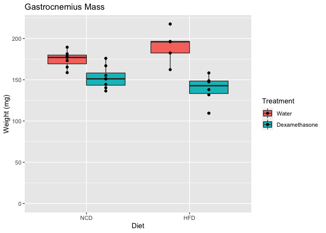
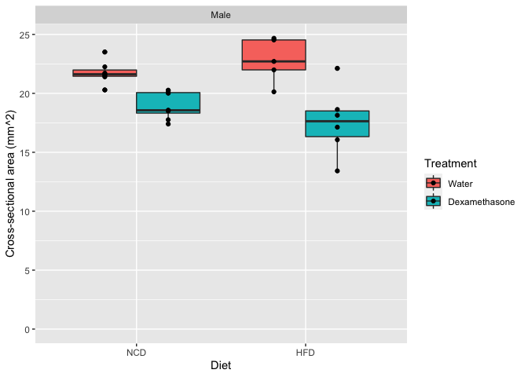
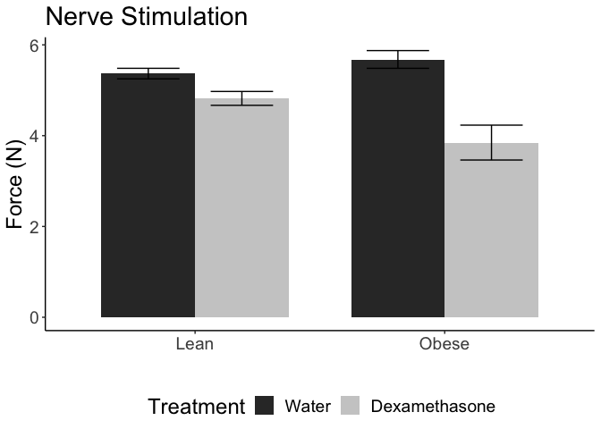
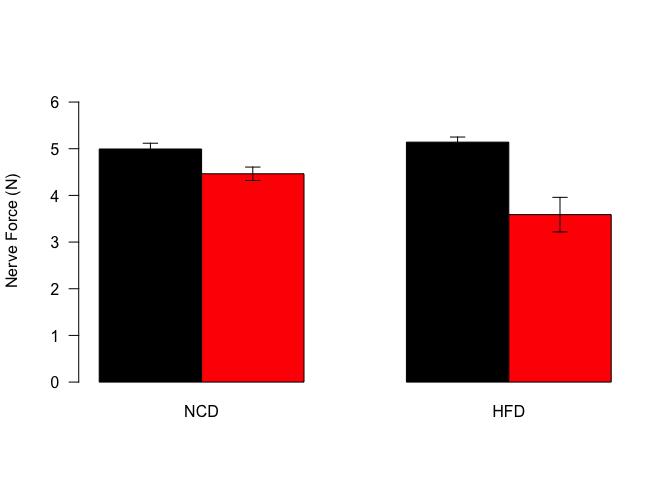
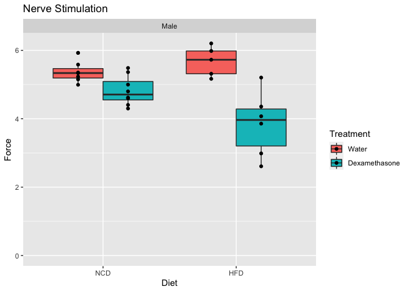
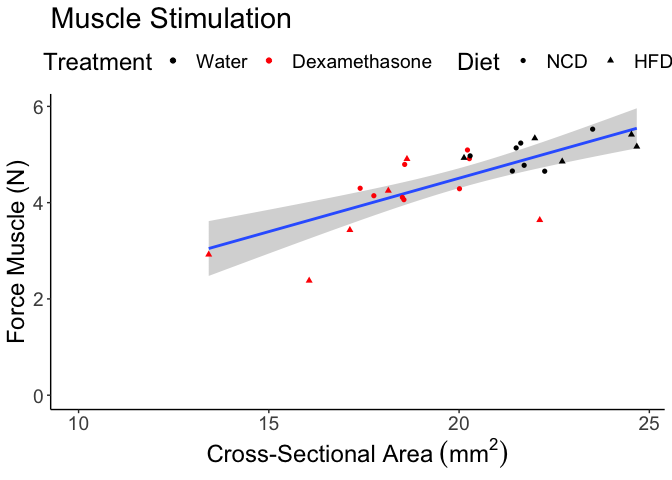
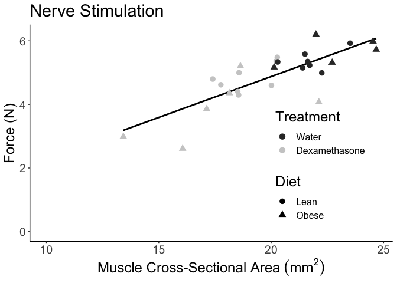

# Purpose

# Experimental Details

Link to the protocol used (permalink preferred) for the experiment and include any notes relevant to your analysis.  This might include specifics not in the general protocol such as cell lines, Treatment doses etc.

# Raw Data

Describe your raw data files, including what the columns mean (and what units they are in).


These data can be found in **/Users/davebrid/Documents/GitHub/CushingAcromegalyStudy/scripts/scripts-muscle** in a file named **no file found**.  This script was most recently updated on **Tue Jan  7 11:37:22 2020**.

# Analysis

We removed mouse 6013 double-checked nerve when done with muscle and 7179 slipped at 100hz for muscle stim, could not get higher force after that

# Number of Measurements


Table: Number of animals at sacrifice

Sex    Diet   Treatment         n
-----  -----  --------------  ---
Male   NCD    Water             7
Male   NCD    Dexamethasone     8
Male   HFD    Water             5
Male   HFD    Dexamethasone     6

Generated summary data for each measurement


## Fat Mass

<!-- -->

Table: ANOVA of Fat Mass

term              df       sumsq      meansq   statistic   p.value
---------------  ---  ----------  ----------  ----------  --------
Diet               1   658630691   658630691      103.93     0.000
Treatment          1    16030350    16030350        2.53     0.126
Diet:Treatment     1    36522274    36522274        5.76     0.025
Residuals         22   139419089     6337231          NA        NA

<!-- -->

## Blood Glucose
significant for FBG
diet is conditional on treatment, significant interaction between diet and treatment 
It tests whether the average treatment effect is the different for each diet, the respective diets.
effect of the treatment (difference between treated and control) differs between NCD and HFD

<!-- -->

Table: ANOVA of FBG

term              df   sumsq   meansq   statistic   p.value
---------------  ---  ------  -------  ----------  --------
Diet               1   64349    64349       25.02     0.000
Treatment          1    5855     5855        2.28     0.146
Diet:Treatment     1   13289    13289        5.17     0.033
Residuals         22   56572     2571          NA        NA

## Gastrocnemius Weight

<!-- -->

Table: ANOVA of Gastroc Weights

term              df     sumsq    meansq   statistic   p.value
---------------  ---  --------  --------  ----------  --------
Diet               1      1.03      1.03       0.005     0.947
Treatment          1   7796.87   7796.87      34.308     0.000
Diet:Treatment     1   1406.09   1406.09       6.187     0.021
Residuals         22   4999.81    227.26          NA        NA

The gastroc weights are reduced **12.657%** in the NCD animals and **27.225%** in the HFD animals.

<!-- -->

Table: ANOVA of Gastroc Weights

term              df     sumsq    meansq   statistic   p.value
---------------  ---  --------  --------  ----------  --------
Diet               1      1.03      1.03       0.005     0.947
Treatment          1   7796.87   7796.87      34.308     0.000
Diet:Treatment     1   1406.09   1406.09       6.187     0.021
Residuals         22   4999.81    227.26          NA        NA

## Cross-Sectional Area

<!-- -->

Table: ANOVA of CSA

term              df   sumsq   meansq   statistic   p.value
---------------  ---  ------  -------  ----------  --------
Diet               1    0.50     0.50       0.156     0.697
Treatment          1   95.64    95.64      29.805     0.000
Diet:Treatment     1    8.92     8.92       2.781     0.110
Residuals         22   70.59     3.21          NA        NA

The whole muscle cross-sectional areas are reduced **13.069%** in the NCD animals and **22.9%** in the HFD animals.

<!-- -->

Table: ANOVA of CSA

term              df   sumsq   meansq   statistic   p.value
---------------  ---  ------  -------  ----------  --------
Diet               1    0.50     0.50       0.156     0.697
Treatment          1   95.64    95.64      29.805     0.000
Diet:Treatment     1    8.92     8.92       2.781     0.110
Residuals         22   70.59     3.21          NA        NA

## Force

### Force - Muscle
#Explanation
not significant for force generated by muscle stimulation
diet is not conditional on treatment, no significant interaction between diet and treatment 
It tests whether the average treatment effect is the different for each diet, the respective diets.
effect of the treatment (difference between treated and control) doesnt significantly differs between NCD and HFD

<!-- --><!-- --><!-- -->

Table: ANOVA of Muscle force measurements

term              df     sumsq    meansq   statistic   p.value
---------------  ---  --------  --------  ----------  --------
Diet               1   1103398   1103398        3.95     0.059
Treatment          1   5982731   5982731       21.41     0.000
Diet:Treatment     1   1644903   1644903        5.89     0.024
Residuals         22   6146260    279375          NA        NA


<!-- -->

Table: ANOVA of Muscle force measurements

term              df     sumsq    meansq   statistic   p.value
---------------  ---  --------  --------  ----------  --------
Diet               1   1103398   1103398        3.95     0.059
Treatment          1   5982731   5982731       21.41     0.000
Diet:Treatment     1   1644903   1644903        5.89     0.024
Residuals         22   6146260    279375          NA        NA


### Force - Nerve
#Interpretation
significant for force generated by nerve stimulation
diet is conditional on treatment, significant interaction between diet and treatment 
It tests whether the average treatment effect is the different for each diet, the respective diets.
effect of the treatment (difference between treated and control) differs between NCD and HFD

<!-- -->

Table: ANOVA of Nerve force measurements

term              df     sumsq    meansq   statistic   p.value
---------------  ---  --------  --------  ----------  --------
Diet               1    995788    995788        3.10     0.092
Treatment          1   7657426   7657426       23.87     0.000
Diet:Treatment     1   2599669   2599669        8.11     0.009
Residuals         22   7056221    320737          NA        NA

<!-- -->

legend("topright",c("Water","Dexamethasone"), fill=c('gray23','mediumpurple2'),bty="n")


<!-- -->

Table: ANOVA of Nerve force measurements

term              df     sumsq    meansq   statistic   p.value
---------------  ---  --------  --------  ----------  --------
Diet               1    995788    995788        3.10     0.092
Treatment          1   7657426   7657426       23.87     0.000
Diet:Treatment     1   2599669   2599669        8.11     0.009
Residuals         22   7056221    320737          NA        NA

## Overall Reductions in NCD/HFD


Table: Absolute and Relative Decreases with Dexamethasone

Sex    Diet   Measure                        Water   Dexamethasone   Reduction   Percent.Reduction
-----  -----  --------------------------  --------  --------------  ----------  ------------------
Male   NCD    CSA_mean.n                      21.8            18.9       2.843               13.07
Male   HFD    CSA_mean.n                      22.8            17.6       5.223               22.90
Male   NCD    Fat.Mass_mean.n               3154.3          3611.2    -456.964              -14.49
Male   HFD    Fat.Mass_mean.n              15962.0         11605.0    4357.000               27.30
Male   NCD    FBG_mean.n                     140.3           131.6       8.661                6.17
Male   HFD    FBG_mean.n                     191.0           274.2     -83.167              -43.54
Male   NCD    Gastroc_mean.n                 174.8           152.7      22.130               12.66
Male   HFD    Gastroc_mean.n                 191.0           139.0      52.000               27.23
Male   NCD    Po-Muscle (mN)_mean.n         4994.3          4463.2     531.036               10.63
Male   HFD    Po-Muscle (mN)_mean.n         5141.0          3588.3    1552.667               30.20
Male   NCD    Po-Nerve (mN)_mean.n          5367.1          4820.6     546.518               10.18
Male   HFD    Po-Nerve (mN)_mean.n          5678.2          3847.3    1830.867               32.24
Male   NCD    Spo Muscle (N/cm2)_mean.n       23.0            23.6      -0.627               -2.73
Male   HFD    Spo Muscle (N/cm2)_mean.n       22.6            20.5       2.161                9.55
Male   NCD    Spo Nerve (N/cm2)_mean.n        24.7            25.5      -0.813               -3.29
Male   HFD    Spo Nerve (N/cm2)_mean.n        25.0            21.9       3.082               12.34
Male   NCD    Weight_mean.n                31500.0         29212.5    2287.500                7.26
Male   HFD    Weight_mean.n                46540.0         34266.7   12273.333               26.37


### Force versus CSA

<!-- -->

<!-- -->

Table: Linear model regressing against cross-sectional area

term           estimate   std.error   statistic   p.value
------------  ---------  ----------  ----------  --------
(Intercept)        67.8       779.1       0.087     0.931
CSA               222.0        38.4       5.781     0.000


Table: Linear model regressing against cross-sectional area, showing fit

 r.squared   adj.r.squared   sigma   statistic   p.value   df   logLik   AIC   BIC   deviance   df.residual
----------  --------------  ------  ----------  --------  ---  -------  ----  ----  ---------  ------------
     0.582           0.565     509        33.4         0    2     -198   402   406    6218490            24


Table: Linear model including dexamethasone treatment as a covariate

term                      estimate   std.error   statistic   p.value
-----------------------  ---------  ----------  ----------  --------
(Intercept)                    904      1281.1       0.706     0.487
CSA                            187        57.3       3.262     0.003
TreatmentDexamethasone        -247       299.0      -0.826     0.417


Table: Linear model including dexamethasone treatment as a covariate, showing fit

 r.squared   adj.r.squared   sigma   statistic   p.value   df   logLik   AIC   BIC   deviance   df.residual
----------  --------------  ------  ----------  --------  ---  -------  ----  ----  ---------  ------------
     0.594           0.559     512        16.8         0    3     -198   403   408    6039340            23

# Interpretation

A brief summary of what the interpretation of these results were there's
is not a significant interaction between diet and treatment on generated force by stimulating muscle or nerve. 


Changes in force are proportional to changes in CSA. CSA is the determining factor in strength as measured by force generated through stimulation of nerve and muscle in gastroc.
force versus cross-sectional-understand whether muscle strength will decline in proportion only to the size. 
reitterated- look at SPo or specific force
If muscle strength is reduced primary due to neuropathy, perhaps secondary to diabetes in these mice, we will identify this by comparing neuronal to direct muscle stimulation

# Session Information


```r
sessionInfo()
```

```
## R version 3.5.0 (2018-04-23)
## Platform: x86_64-apple-darwin15.6.0 (64-bit)
## Running under: macOS  10.15.2
## 
## Matrix products: default
## BLAS: /Library/Frameworks/R.framework/Versions/3.5/Resources/lib/libRblas.0.dylib
## LAPACK: /Library/Frameworks/R.framework/Versions/3.5/Resources/lib/libRlapack.dylib
## 
## locale:
## [1] en_US.UTF-8/en_US.UTF-8/en_US.UTF-8/C/en_US.UTF-8/en_US.UTF-8
## 
## attached base packages:
## [1] stats     graphics  grDevices utils     datasets  methods   base     
## 
## other attached packages:
## [1] broom_0.5.2      forcats_0.4.0    readxl_1.3.1     ggplot2_3.1.1   
## [5] dplyr_0.8.3      tidyr_0.8.3.9000 knitr_1.23      
## 
## loaded via a namespace (and not attached):
##  [1] Rcpp_1.0.1       pillar_1.4.2     compiler_3.5.0   cellranger_1.1.0
##  [5] plyr_1.8.4       highr_0.8        tools_3.5.0      zeallot_0.1.0   
##  [9] digest_0.6.20    lattice_0.20-38  nlme_3.1-140     evaluate_0.14   
## [13] tibble_2.1.3     gtable_0.3.0     pkgconfig_2.0.2  rlang_0.4.0     
## [17] yaml_2.2.0       xfun_0.7         withr_2.1.2      stringr_1.4.0   
## [21] generics_0.0.2   vctrs_0.2.0      grid_3.5.0       tidyselect_0.2.5
## [25] glue_1.3.1       R6_2.4.0         rmarkdown_1.13   purrr_0.3.2     
## [29] reshape2_1.4.3   magrittr_1.5     ellipsis_0.2.0.1 backports_1.1.4 
## [33] scales_1.0.0     htmltools_0.4.0  assertthat_0.2.1 colorspace_1.4-1
## [37] labeling_0.3     stringi_1.4.3    lazyeval_0.2.2   munsell_0.5.0   
## [41] crayon_1.3.4
```

# References

If needed, using Rmarkdown citation tools (see this link for more information: http://rmarkdown.rstudio.com/authoring_bibliographies_and_citations.html)
