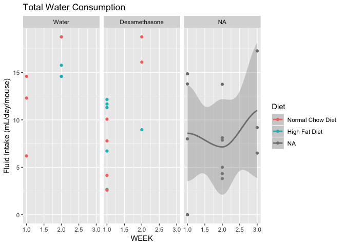
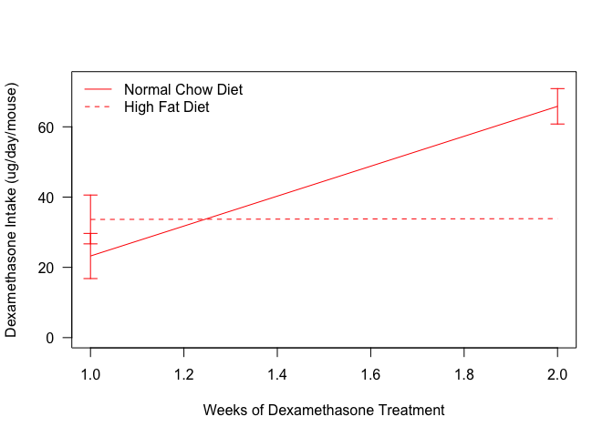

# Purpose

# Experimental Details


Dexamethasone was dissolved in water at a concentration of 3.78 ug/mL and animals were given *ad libitum* access.  Water bottle volumes were determined weekly.

# Raw Data

The input file contains tracked water and dexamethasone amounts per week.  The data includes the staring and ending volumes each week and a calculation of animals per week.


These data can be found in **/Users/davebrid/Documents/GitHub/CushingAcromegalyStudy/scripts/scripts-muscle** in a file named **no file found**.  This script was most recently updated on **Tue Jan  7 11:23:00 2020**.

# Analysis

## Weekly Analysis

<!-- --><!-- -->

## Average Analysis


Table: Average dexamethasone intake per group, averaged accross the experiment

Diet               Treatment        Intake.mean   Intake.se   Shapiro    n
-----------------  --------------  ------------  ----------  --------  ---
Normal Chow Diet   Dexamethasone           22.5        5.85     0.610    4
High Fat Diet      Dexamethasone           34.0        7.10     0.226    5


Table: Average fluid intake per group, averaged accross the experiment

Diet               Treatment        Intake.mean   Intake.se    n
-----------------  --------------  ------------  ----------  ---
Normal Chow Diet   Water                  11.42        2.79    3
Normal Chow Diet   Dexamethasone           5.94        1.55    4
Normal Chow Diet   NA                     13.36          NA    1
High Fat Diet      Dexamethasone           8.99        1.88    5
NA                 NA                      6.87        1.74    6

<!-- -->

Table: Levene's test

term     df   statistic   p.value
------  ---  ----------  --------
group     1       0.046     0.837
          7          NA        NA


Table: Student's t-test

 estimate1   estimate2   statistic   p.value   parameter   conf.low   conf.high  method              alternative 
----------  ----------  ----------  --------  ----------  ---------  ----------  ------------------  ------------
      22.5          34       -1.21     0.267           7      -34.1        11.1  Two Sample t-test   two.sided   


# Session Information


```r
sessionInfo()
```

```
## R version 3.5.0 (2018-04-23)
## Platform: x86_64-apple-darwin15.6.0 (64-bit)
## Running under: macOS  10.15.2
## 
## Matrix products: default
## BLAS: /Library/Frameworks/R.framework/Versions/3.5/Resources/lib/libRblas.0.dylib
## LAPACK: /Library/Frameworks/R.framework/Versions/3.5/Resources/lib/libRlapack.dylib
## 
## locale:
## [1] en_US.UTF-8/en_US.UTF-8/en_US.UTF-8/C/en_US.UTF-8/en_US.UTF-8
## 
## attached base packages:
## [1] stats     graphics  grDevices utils     datasets  methods   base     
## 
## other attached packages:
##  [1] broom_0.5.2         car_3.0-3           carData_3.0-2      
##  [4] ggplot2_3.1.1       forcats_0.4.0       readr_1.3.1        
##  [7] knitcitations_1.0.9 dplyr_0.8.3         tidyr_0.8.3.9000   
## [10] knitr_1.23         
## 
## loaded via a namespace (and not attached):
##  [1] tidyselect_0.2.5  xfun_0.7          purrr_0.3.2      
##  [4] reshape2_1.4.3    lattice_0.20-38   haven_2.1.0      
##  [7] generics_0.0.2    colorspace_1.4-1  vctrs_0.2.0      
## [10] htmltools_0.4.0   yaml_2.2.0        rlang_0.4.0      
## [13] pillar_1.4.2      foreign_0.8-71    glue_1.3.1       
## [16] withr_2.1.2       readxl_1.3.1      plyr_1.8.4       
## [19] stringr_1.4.0     munsell_0.5.0     gtable_0.3.0     
## [22] cellranger_1.1.0  zip_2.0.2         evaluate_0.14    
## [25] labeling_0.3      rio_0.5.16        curl_3.3         
## [28] highr_0.8         Rcpp_1.0.1        backports_1.1.4  
## [31] scales_1.0.0      jsonlite_1.6      abind_1.4-5      
## [34] hms_0.4.2         digest_0.6.20     stringi_1.4.3    
## [37] openxlsx_4.1.0.1  grid_3.5.0        bibtex_0.4.2     
## [40] tools_3.5.0       magrittr_1.5      lazyeval_0.2.2   
## [43] tibble_2.1.3      RefManageR_1.2.12 crayon_1.3.4     
## [46] pkgconfig_2.0.2   zeallot_0.1.0     data.table_1.12.2
## [49] xml2_1.2.0        lubridate_1.7.4   assertthat_0.2.1 
## [52] rmarkdown_1.13    httr_1.4.0        R6_2.4.0         
## [55] nlme_3.1-140      compiler_3.5.0
```


