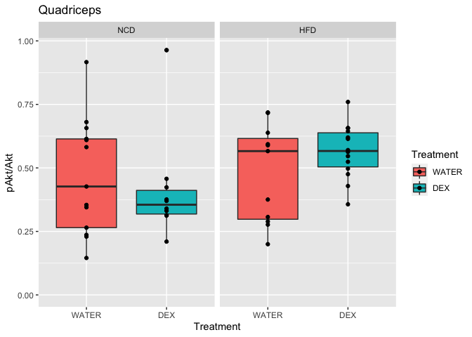
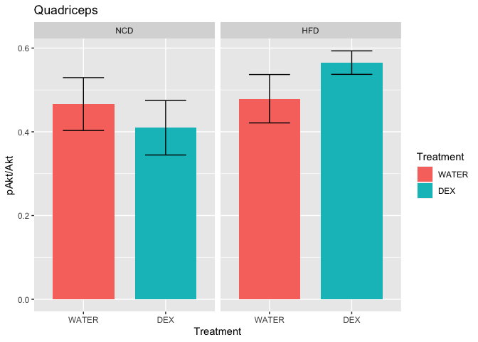
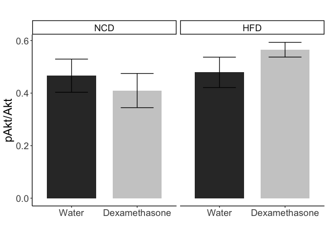

These data can be found in **/Users/davebrid/Documents/GitHub/CushingAcromegalyStudy/scripts/scripts-muscle** in a file named **Westerns from glucose clamps.xlsx**.  This script was most recently updated on **Fri Sep 18 14:55:41 2020**.

# Analysis for Akt Phosphorylation

## 2x2 ANOVA with Interaction


Table: Two-Way ANOVA with Interaction

|term           | df| sumsq| meansq| statistic| p.value|
|:--------------|--:|-----:|------:|---------:|-------:|
|Treatment      |  1| 0.010|  0.010|      0.28|   0.599|
|Diet           |  1| 0.082|  0.082|      2.38|   0.130|
|Treatment:Diet |  1| 0.060|  0.060|      1.75|   0.193|
|Residuals      | 44| 1.514|  0.034|        NA|      NA|


Table: Student's t-tests, separated by diet

|Diet | p.value|
|:----|-------:|
|NCD  |   0.545|
|HFD  |   0.164|

Pairwise t-tests are for NCD 

## Boxplots

<!-- -->


## Barplots


Table: Summary statistics

|Treatment |Diet |  Mean| Error|  N| Shapiro|
|:---------|:----|-----:|-----:|--:|-------:|
|WATER     |NCD  | 0.466| 0.063| 13|   0.488|
|WATER     |HFD  | 0.479| 0.058| 11|   0.132|
|DEX       |NCD  | 0.410| 0.065| 10|   0.001|
|DEX       |HFD  | 0.565| 0.028| 14|   0.993|

<!-- --><!-- -->

# Session Information


```r
sessionInfo()
```

```
## R version 4.0.2 (2020-06-22)
## Platform: x86_64-apple-darwin17.0 (64-bit)
## Running under: macOS Catalina 10.15.6
## 
## Matrix products: default
## BLAS:   /Library/Frameworks/R.framework/Versions/4.0/Resources/lib/libRblas.dylib
## LAPACK: /Library/Frameworks/R.framework/Versions/4.0/Resources/lib/libRlapack.dylib
## 
## locale:
## [1] en_US.UTF-8/en_US.UTF-8/en_US.UTF-8/C/en_US.UTF-8/en_US.UTF-8
## 
## attached base packages:
## [1] stats     graphics  grDevices utils     datasets  methods   base     
## 
## other attached packages:
## [1] ggplot2_3.3.2 broom_0.7.0   readxl_1.3.1  dplyr_1.0.2   tidyr_1.1.2  
## [6] knitr_1.29   
## 
## loaded via a namespace (and not attached):
##  [1] Rcpp_1.0.5       magrittr_1.5     munsell_0.5.0    tidyselect_1.1.0
##  [5] colorspace_1.4-1 R6_2.4.1         rlang_0.4.7      highr_0.8       
##  [9] stringr_1.4.0    tools_4.0.2      grid_4.0.2       gtable_0.3.0    
## [13] xfun_0.16        withr_2.2.0      htmltools_0.5.0  ellipsis_0.3.1  
## [17] yaml_2.2.1       digest_0.6.25    tibble_3.0.3     lifecycle_0.2.0 
## [21] crayon_1.3.4     farver_2.0.3     purrr_0.3.4      vctrs_0.3.4     
## [25] glue_1.4.2       evaluate_0.14    rmarkdown_2.3    labeling_0.3    
## [29] stringi_1.4.6    compiler_4.0.2   pillar_1.4.6     cellranger_1.1.0
## [33] scales_1.1.1     backports_1.1.9  generics_0.0.2   pkgconfig_2.0.3
```
