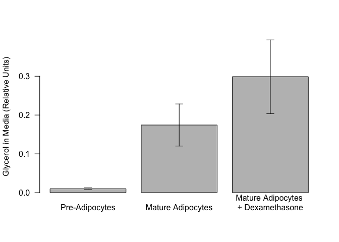

# Analysis of Glycerol Levels in 3T3-L1 Adipocytes
Innocence Harvey and Dave Bridges  
2017-08-10  


# Purpose

To determine the effects of adipocyte differentiation, and glucocorticoid treatment on glycerol released to the media in 3T3-L1 Cells

# Experimental Details

Cells were differentiated and treated with dexamethasone for a total of 15 days

# Raw Data

These are the summary glycerol levels from three independent experiments.


These data can be found in /Users/davebrid/Documents/GitHub/CushingAcromegalyStudy/scripts/scripts-obesity in a file named ../../data/raw/3T3-L1 Adipocyte Glycerol Assay.csv.  This script was most recently updated on Thu Aug 10 17:21:38 2017.

# Analysis


<!-- -->


## Normalized Values

We normalized each experiment such that the mature adipocytes glycerol levels were equal to one.


<!-- -->

## Statistics

We observed a **70.962%** increase in glycerol in the media with dexamethasone.

For the normalized data, we did a Shapiro-Wilk test on the Mature Adipocytes with Dexamethasone group.  This had a p-value of 0.741 so normality could be assumed.  We therefore did a one-way *t*-test which yielded a p-value of **0.001**.

In terms of the pre-adipocytes, we observed a **91.787%** decrease in glycerol in the. For this, we did a Shapiro-Wilk test on the Pre-Adipocytes group.  There were only two replicates for pre-adipocytes, so we just assumed normality.  We did a one-way *t*-test which yielded a p-value of **0.037**.

# Interpretation

Both differentiation and dexamethasone increased glycerol release.

# Session Information


```r
sessionInfo()
```

```
## R version 3.3.0 (2016-05-03)
## Platform: x86_64-apple-darwin13.4.0 (64-bit)
## Running under: OS X 10.12.6 (unknown)
## 
## locale:
## [1] en_US.UTF-8/en_US.UTF-8/en_US.UTF-8/C/en_US.UTF-8/en_US.UTF-8
## 
## attached base packages:
## [1] stats     graphics  grDevices utils     datasets  methods   base     
## 
## other attached packages:
## [1] bindrcpp_0.2  forcats_0.2.0 readr_1.1.1   dplyr_0.7.2   tidyr_0.6.3  
## [6] knitr_1.17   
## 
## loaded via a namespace (and not attached):
##  [1] Rcpp_0.12.12     assertthat_0.2.0 digest_0.6.12    rprojroot_1.2   
##  [5] R6_2.2.2         backports_1.1.0  magrittr_1.5     evaluate_0.10.1 
##  [9] rlang_0.1.2      stringi_1.1.5    rmarkdown_1.6    tools_3.3.0     
## [13] stringr_1.2.0    glue_1.1.1       hms_0.3          yaml_2.1.14     
## [17] pkgconfig_2.0.1  htmltools_0.3.6  bindr_0.1        tibble_1.3.3
```

# References

If needed, using Rmarkdown citation tools (see this link for more information: http://rmarkdown.rstudio.com/authoring_bibliographies_and_citations.html)
