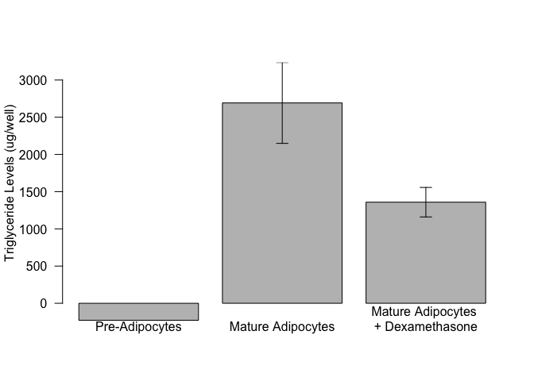

# Analysis of Triglycerides from Dexamethasone Exposed 3T3-L1 Adipocytes
Innocence Harvey and Dave Bridges  
2017-08-16  


# Purpose

# Experimental Details

# Raw Data

Describe your raw data files, including what the columns mean (and what units they are in).


These data can be found in /Users/davebrid/Documents/GitHub/CushingAcromegalyStudy/scripts/scripts-obesity in a file named ../../data/raw/3T3-L1 Cellular Triglyceride Levels.xlsx.  This script was most recently updated on Mon Sep  4 14:36:59 2017.

# Analysis


Table: Summary for cellular triglyceride levels

Treatment                             mean    se   length
-----------------------------------  -----  ----  -------
Pre-Adipocytes                        -228   168        2
Mature Adipocytes                     2278   519        3
Mature Adipocytes 
+ Dexamethasone    1102   280        3

Dexamethasone treatment caused a **51.612**% reduction in cellular triglyceride levels in 3T3-L1 adipocytes.

<!-- -->

### Normalized Values

<!-- -->

Table: Normalized values

Treatment                               mean      se   length
-----------------------------------  -------  ------  -------
Pre-Adipocytes                        -0.075   0.047        2
Mature Adipocytes                      1.000   0.000        3
Mature Adipocytes 
+ Dexamethasone     0.476   0.038        3

## Statistics

### Absolute Values

For evaluating the effects of dexamethasone, we observed that dexamethasone reduced TG levels by **51.612%**.


To test for significance, we first did a Shapiro-Wilk test on the two groups.  This yielded p-value of 0.761 for the Mature Adipocytes and 0.803 for the cells treated with Dexamethasone.  Based on the assumptions of normality we next did a Levene's test, which yielded a p-value of 0.491.  This means we can assume equal variance and therefore did a Student's *t*-test.  This had a p-value of **0.138**.

### Normalized Values

For evaluating the effects of dexamethasone, after normalizing to each experiment's control, we observed that dexamethasone reduced TG levels by **52.398%**.


To test for significance, we first did a Shapiro-Wilk test on the two groups.  This yielded p-value of 0.873 for the cells treated with Dexamethasone.  We therefore did a One-way *t*-test.  This had a p-value of **0.005**.

# Interpretation

Dexamethasone lowers cellular triglyceride levels

# Session Information


```r
sessionInfo()
```

```
## R version 3.3.0 (2016-05-03)
## Platform: x86_64-apple-darwin13.4.0 (64-bit)
## Running under: OS X 10.12.6 (unknown)
## 
## locale:
## [1] en_US.UTF-8/en_US.UTF-8/en_US.UTF-8/C/en_US.UTF-8/en_US.UTF-8
## 
## attached base packages:
## [1] stats     graphics  grDevices utils     datasets  methods   base     
## 
## other attached packages:
## [1] car_2.1-5     bindrcpp_0.2  forcats_0.2.0 readxl_1.0.0  dplyr_0.7.2  
## [6] tidyr_0.7.1   knitr_1.17   
## 
## loaded via a namespace (and not attached):
##  [1] Rcpp_0.12.12       cellranger_1.1.0   nloptr_1.0.4      
##  [4] highr_0.6          bindr_0.1          tools_3.3.0       
##  [7] digest_0.6.12      lme4_1.1-13        evaluate_0.10.1   
## [10] tibble_1.3.3       nlme_3.1-131       lattice_0.20-35   
## [13] mgcv_1.8-18        pkgconfig_2.0.1    rlang_0.1.2       
## [16] Matrix_1.2-10      yaml_2.1.14        parallel_3.3.0    
## [19] SparseM_1.77       stringr_1.2.0      MatrixModels_0.4-1
## [22] rprojroot_1.2      nnet_7.3-12        grid_3.3.0        
## [25] glue_1.1.1         R6_2.2.2           rmarkdown_1.6     
## [28] minqa_1.2.4        purrr_0.2.3        magrittr_1.5      
## [31] backports_1.1.0    htmltools_0.3.6    MASS_7.3-47       
## [34] splines_3.3.0      assertthat_0.2.0   pbkrtest_0.4-7    
## [37] quantreg_5.33      stringi_1.1.5
```
