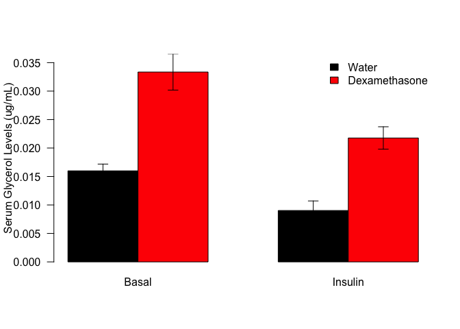
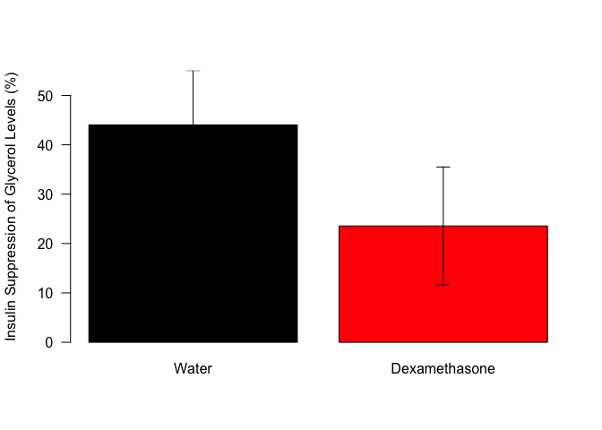
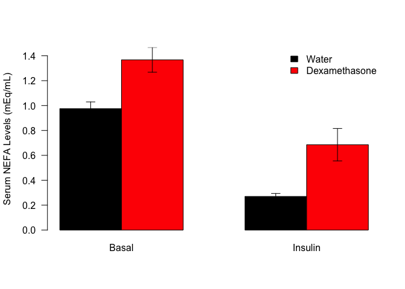
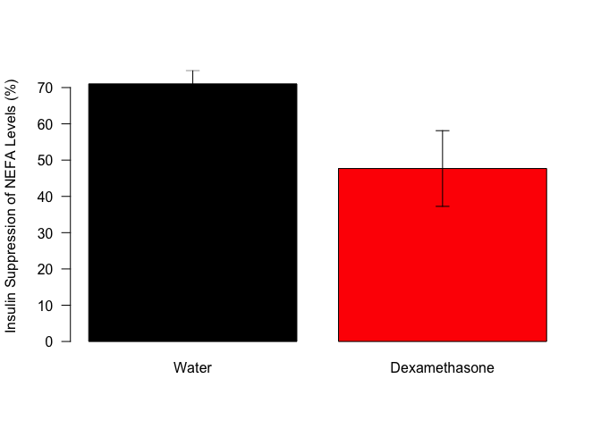
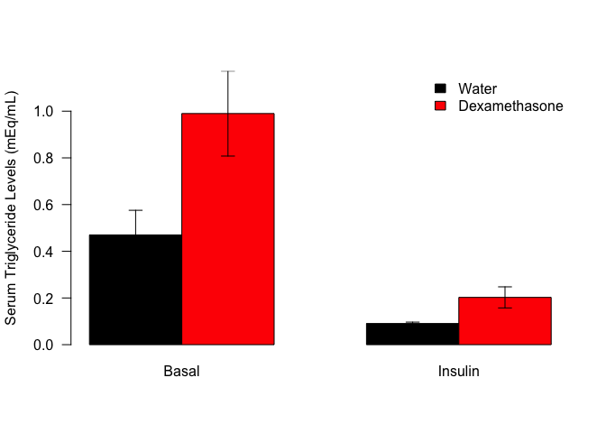

# Analysis of Lipolysis Data from Glucose Clamp Studies
Innocence Harvey and Dave Bridges  
2017-08-29  


# Purpose

To determine baseline and lipid-suppressed markers of lipolysis.

# Experimental Details


# Raw Data

This includes calculated levels for glycerol, triglycerides and non-esterified fatty acids for only the HFD animals.  


These data can be found in /Users/davebrid/Documents/GitHub/CushingAcromegalyStudy/scripts/scripts-obesity in a file named ../../data/raw/Analyzed Clamp glycerol_TG_NEFA data.xlsx.  This script was most recently updated on Mon Sep  4 18:15:13 2017.

# Analysis


Table: Number of mice in each group.

Treatment         n
--------------  ---
Water            11
Dexamethasone    14

## Glycerol Levels

<!-- -->

#### Glycerol Statistics


For basal glycerol levels, we observed a **108.499601** percent increase in glycerol levels with dexamethasone.  The data could be assumed to have a normal distribution from a Shapiro-Wilk test (p=0.6073725).  To test for equal variance we used Levene's test, which for basal glycerol levels had a p-value of 0.0234908.  Based on unequal variance we did a Welch's *t*-test which had a p-value of **9.3540914&times; 10^-5^**.

For insulin-suppressed glycerol levels, we observed a **141.1598303** percent increase in glycerol levels with dexamethasone.  The data could be assumed to have a normal distribution from a Shapiro-Wilk test (p=0.3655122).  To test for equal variance we used Levene's test, which for insulin-suppressed glycerol levels had a p-value of 0.5249883.  Based on equal variance we did a Student's *t*-test which had a p-value of **8.5105461&times; 10^-5^**.

### Suppression by Insulin

<!-- -->

#### Glycerol Suppression Statistics

For relative insulin suppression of Glycerol levels, we observed a **46.493129** percent reduction in insulin suppression of Glycerol levels with dexamethasone.  The data could not be assumed to have a normal distribution from a Shapiro-Wilk test (p=0.0162616).  To test for equal variance we used Levene's test, which for insulin-suppressed Glycerol levels had a p-value of 0.7333091.  Based on a lack of normality we did a Mann-Whitney test which had a p-value of **0.2440768**.

## Non-Esterified Fatty Acid Levels

<!-- -->

#### NEFA Statistics

For basal NEFA levels, we observed a **40.2080444** percent increase in NEFA levels with dexamethasone.  The data could be assumed to have a normal distribution from a Shapiro-Wilk test (p=0.1209745).  To test for equal variance we used Levene's test, which for basal NEFA levels had a p-value of 0.0519178.  Based on equal variance we did a Student's *t*-test which had a p-value of **0.0039941**.

For insulin-suppressed NEFA levels, we observed a **153.8970146** percent increase in NEFA levels with dexamethasone.  The data could not be assumed to have a normal distribution from a Shapiro-Wilk test (p=8.8611636&times; 10^-4^).  To test for equal variance we used Levene's test, which for insulin-suppressed NEFA levels had a p-value of 0.0487146.  Based on a lack of normality we did a Mann-Whitney test which had a p-value of **1.9658217&times; 10^-4^**.

### Suppression by Insulin

<!-- -->

#### Insulin Suppression Statistics

For relative insulin suppression of NEFA levels, we observed a **32.852772** percent reduction in insulin suppression of NEFA levels with dexamethasone.  We observed a 71.01346 percent suppression with insulin in the control group, and a 47.6835699 percent suppression in the dexamethasone treated group.  The data could not be assumed to have a normal distribution from a Shapiro-Wilk test (p=9.8595803&times; 10^-4^).  To test for equal variance we used Levene's test, which for insulin-suppressed NEFA levels had a p-value of 0.168005.  Based on a lack of normality we did a Mann-Whitney test which had a p-value of **0.0579513**.

# Triglyceride Levels

<!-- -->

#### Triglyceride Statistics

For basal triglyceride levels, we observed a **110.5328997** percent increase in triglyceride levels with dexamethasone.  The data could be assumed to have a normal distribution from a Shapiro-Wilk test (p=0.0057778).  To test for equal variance we used Levene's test, which for basal triglyceride levels had a p-value of 0.3315949.  Based on equal variance we did a Student's *t*-test which had a p-value of **0.031086**.

For insulin-suppressed triglyceride levels, we observed a **123.5714286** percent increase in triglyceride levels with dexamethasone.  The data could not be assumed to have a normal distribution from a Shapiro-Wilk test (p=0.0028644).  To test for equal variance we used Levene's test, which for insulin-suppressed triglyceride levels had a p-value of 0.0362327.  Based on a lack of normality we did a Mann-Whitney test which had a p-value of **0.037241**.

### Suppression by Insulin

<!-- -->

#### Insulin Suppression Statistics

For relative insulin suppression of TG levels, we observed a **13.900295** percent increase in insulin suppression of TG levels with dexamethasone.  The data could not be assumed to have a normal distribution from a Shapiro-Wilk test (p=0.0335239).  To test for equal variance we used Levene's test, which for insulin-suppressed TG levels had a p-value of 0.0077595.  Based on a lack of normality we did a Mann-Whitney test which had a p-value of **0.2670862**.


# Interpretation

We observed significant increases in glycerol and NEFA levels with dexamethasone.  In terms of insulin responsiveness, the differences in insulin suppression of lipolysis markers were not statistically significant, though there was a trend towards insulin resistance.

# Session Information


```r
sessionInfo()
```

```
## R version 3.3.0 (2016-05-03)
## Platform: x86_64-apple-darwin13.4.0 (64-bit)
## Running under: OS X 10.12.6 (unknown)
## 
## locale:
## [1] en_US.UTF-8/en_US.UTF-8/en_US.UTF-8/C/en_US.UTF-8/en_US.UTF-8
## 
## attached base packages:
## [1] stats     graphics  grDevices utils     datasets  methods   base     
## 
## other attached packages:
## [1] car_2.1-5    broom_0.4.2  bindrcpp_0.2 readxl_1.0.0 dplyr_0.7.2 
## [6] tidyr_0.7.1  knitr_1.17  
## 
## loaded via a namespace (and not attached):
##  [1] Rcpp_0.12.12       nloptr_1.0.4       cellranger_1.1.0  
##  [4] highr_0.6          plyr_1.8.4         bindr_0.1         
##  [7] tools_3.3.0        digest_0.6.12      lme4_1.1-13       
## [10] evaluate_0.10.1    tibble_1.3.3       nlme_3.1-131      
## [13] lattice_0.20-35    mgcv_1.8-18        pkgconfig_2.0.1   
## [16] rlang_0.1.2        Matrix_1.2-10      psych_1.7.5       
## [19] yaml_2.1.14        parallel_3.3.0     SparseM_1.77      
## [22] stringr_1.2.0      MatrixModels_0.4-1 rprojroot_1.2     
## [25] grid_3.3.0         nnet_7.3-12        glue_1.1.1        
## [28] R6_2.2.2           foreign_0.8-69     rmarkdown_1.6     
## [31] minqa_1.2.4        purrr_0.2.3        reshape2_1.4.2    
## [34] magrittr_1.5       backports_1.1.0    htmltools_0.3.6   
## [37] MASS_7.3-47        splines_3.3.0      assertthat_0.2.0  
## [40] pbkrtest_0.4-7     mnormt_1.5-5       quantreg_5.33     
## [43] stringi_1.1.5
```
