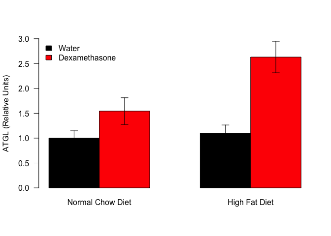

Table: Blot summary values

Genotype   Treatment        mean      se   length   shapiro.p
---------  --------------  -----  ------  -------  ----------
WildType   Water            1.00   0.408        3       0.783
WildType   Dexamethasone    3.38   1.034        3       0.237
Knockout   Water            1.71   0.441        4       0.500
Knockout   Dexamethasone    1.94   0.536        4       0.083


This script uses the files in ../../data/raw/aGRKO HFD Male IWAT Westerns.csv. These data are located in /Users/iharvey/Desktop/CushingAcromegalyStudy/scripts/scripts-obesity and this script was most recently run on Mon Jul 23 13:41:06 2018.

<!-- -->

Blots were normalized to total protein (Revert) staining.  We observed a 3.385 fold increase in NCD animals due to dexamethasone and a 1.139 fold increase in HFD animals.

# Statistics


From a two-way ANOVA with an interaction, the interaction term was significant **p=0.114**:


Table: ANOVA for WAT ATGL Levels

                      Df   Sum Sq   Mean Sq   F value   Pr(>F)
-------------------  ---  -------  --------  --------  -------
Genotype               1    0.464     0.464     0.352    0.566
Treatment              1    4.695     4.695     3.557    0.089
Genotype:Treatment     1    3.953     3.953     2.995    0.114
Residuals             10   13.200     1.320        NA       NA

Tukey's tests (pairwise  comparasons are):


Table: Tukey's HSD tests for iWAT ATGL Levels

                                                   diff      lwr    upr   p adj
----------------------------------------------  -------  -------  -----  ------
Knockout:Water-WildType:Water                     0.706   -1.979   3.39   0.851
WildType:Dexamethasone-WildType:Water             2.385   -0.485   5.25   0.113
Knockout:Dexamethasone-WildType:Water             0.944   -1.741   3.63   0.711
WildType:Dexamethasone-Knockout:Water             1.680   -1.005   4.36   0.282
Knockout:Dexamethasone-Knockout:Water             0.238   -2.248   2.72   0.991
Knockout:Dexamethasone-WildType:Dexamethasone    -1.442   -4.126   1.24   0.400

# Session Information


```
## R version 3.4.3 (2017-11-30)
## Platform: x86_64-apple-darwin15.6.0 (64-bit)
## Running under: OS X El Capitan 10.11.6
## 
## Matrix products: default
## BLAS: /Library/Frameworks/R.framework/Versions/3.4/Resources/lib/libRblas.0.dylib
## LAPACK: /Library/Frameworks/R.framework/Versions/3.4/Resources/lib/libRlapack.dylib
## 
## locale:
## [1] en_US.UTF-8/en_US.UTF-8/en_US.UTF-8/C/en_US.UTF-8/en_US.UTF-8
## 
## attached base packages:
## [1] stats     graphics  grDevices utils     datasets  methods   base     
## 
## other attached packages:
## [1] bindrcpp_0.2  tidyr_0.8.0   dplyr_0.7.4   forcats_0.3.0 readr_1.1.1  
## [6] knitr_1.20   
## 
## loaded via a namespace (and not attached):
##  [1] Rcpp_0.12.15     bindr_0.1        magrittr_1.5     hms_0.4.1       
##  [5] tidyselect_0.2.3 R6_2.2.2         rlang_0.2.0      highr_0.6       
##  [9] stringr_1.3.0    tools_3.4.3      htmltools_0.3.6  yaml_2.1.16     
## [13] rprojroot_1.3-2  digest_0.6.15    assertthat_0.2.0 tibble_1.4.2    
## [17] purrr_0.2.4      glue_1.2.0       evaluate_0.10.1  rmarkdown_1.8   
## [21] stringi_1.1.6    compiler_3.4.3   pillar_1.1.0     backports_1.1.2 
## [25] pkgconfig_2.0.1
```
