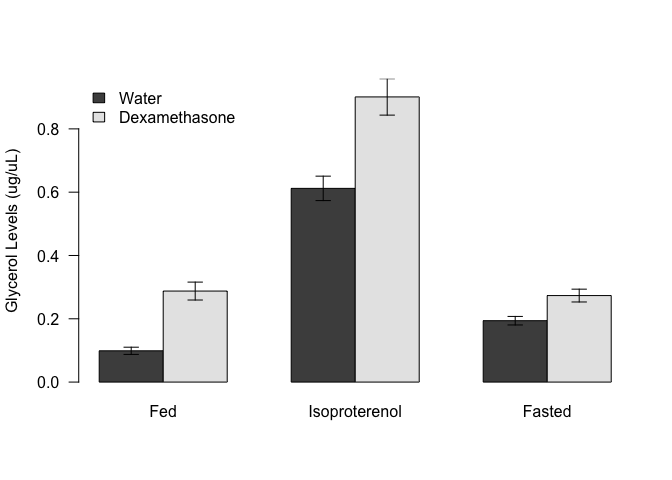
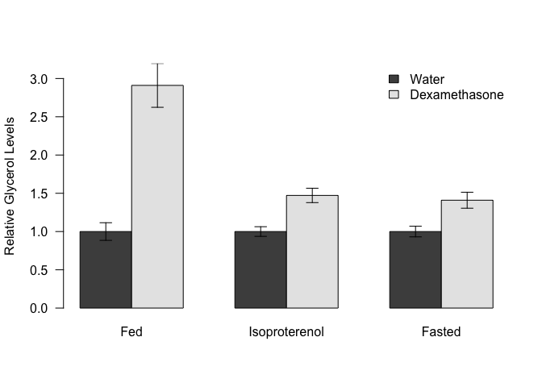

# Analysis of Lipolysis in Dexamethasone Treated Mice
Innocence Harvey and Dave Bridges  
July 10, 2015  

These data are located in /Users/davebrid/Documents/GitHub/CushingAcromegalyStudy/scripts/scripts-obesity and was most recently updated on Fri Aug 11 11:34:10 2017.  This script imports data from the file ../../data/raw/NCD Glycerol and TG Assays.xlsx

# Glycerol Analysis

<!-- -->

## Relative Effects of Dexamethasone

Table: Fold change with dexamethasone

Group             Fed   Isoproterenol   Fasted
--------------  -----  --------------  -------
Water            1.00            1.00     1.00
Dexamethasone    2.91            1.47     1.41

<!-- -->

## Glycerol Statistics

### Effects of Dexamethasone 

Pairwise statistical tests, checking for the effects of dexamethasone are shown below.

Table: Shapiro-Wilk Tests for Each Group

Group               ID   Basal.Glycerol   Fasted.Glycerol   Isoproterenol.Glycerol
--------------  ------  ---------------  ----------------  -----------------------
Water            0.876            0.832             0.189                    0.599
Dexamethasone    0.525            0.878             0.576                    0.446

All Shapiro-Wilk tests were >0.05 so normality could be assumed for each group (p>0.189).  We next performed Levene's tests, the results of which were:

* Basal Glycerol p=0.096, equal variance assumed, Student's *t*-test **p=1.415&times; 10^-6^**.
* Fasted Glycerol p=0.824, equal variance assumed, Student's *t*-test **p=0.011**.
* Isoproterenol-Stimulated Glycerol p=0.377, equal variance assumed, Student's *t*-test **p=0**.

# Session Information
\begin{itemize}\raggedright
  \item R version 3.3.0 (2016-05-03), \verb|x86_64-apple-darwin13.4.0|
  \item Locale: \verb|en_US.UTF-8/en_US.UTF-8/en_US.UTF-8/C/en_US.UTF-8/en_US.UTF-8|
  \item Base packages: base, datasets, graphics, grDevices,
    methods, stats, utils
  \item Other packages: bindrcpp~0.2, car~2.1-5, dplyr~0.7.2,
    forcats~0.2.0, knitr~1.17, readxl~1.0.0, tidyr~0.6.3
  \item Loaded via a namespace (and not attached):
    assertthat~0.2.0, backports~1.1.0, bindr~0.1,
    cellranger~1.1.0, digest~0.6.12, evaluate~0.10.1, glue~1.1.1,
    grid~3.3.0, highr~0.6, htmltools~0.3.6, lattice~0.20-35,
    lme4~1.1-13, magrittr~1.5, MASS~7.3-47, Matrix~1.2-10,
    MatrixModels~0.4-1, mgcv~1.8-18, minqa~1.2.4, nlme~3.1-131,
    nloptr~1.0.4, nnet~7.3-12, parallel~3.3.0, pbkrtest~0.4-7,
    pkgconfig~2.0.1, quantreg~5.33, R6~2.2.2, Rcpp~0.12.12,
    rlang~0.1.2, rmarkdown~1.6, rprojroot~1.2, SparseM~1.77,
    splines~3.3.0, stringi~1.1.5, stringr~1.2.0, tibble~1.3.3,
    tools~3.3.0, yaml~2.1.14
\end{itemize}
