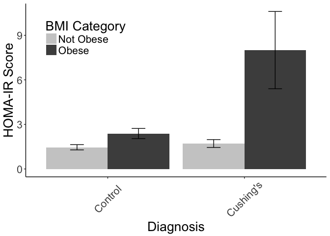
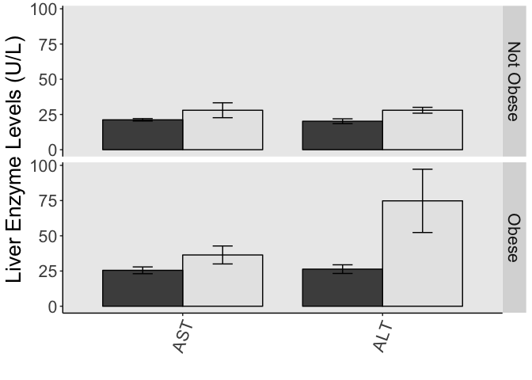
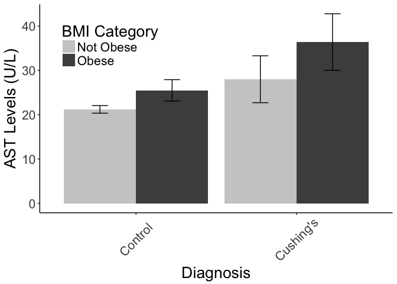

# Clinical Data for Obese vs Non-Obese
Quynh Tran and Dave Bridges  
October 21, 2015  


This file was last compiled on ``Mon Jul 31 20:20:12 2017``.  Unless otherwise noted this analysis removes subject 29.


# Analysis


## BMI


```r
library(ggplot2)
item <- 'BMI'
  #pdf(sprintf('../figures/Cushing-%s-barplot.pdf', gene))
  clinical.data <- all.o1[all.o1$measurement==item,]
  ggplot(clinical.data, aes(x=diagnosis, y=mean, fill=BMI.cat)) + 
    geom_bar(position=position_dodge(), stat="identity") +
    geom_errorbar(aes(ymin=mean-se, ymax=mean+se),
                  width=.2,                    # Width of the error bars
                  position=position_dodge(.9)) +
    ylab("BMI") + xlab("Diagnosis") + guides(fill=guide_legend(title="BMI Category")) +
    theme(panel.grid.minor = element_blank()) + 
    theme(panel.grid.major = element_blank()) + 
    theme(panel.border=element_blank())+ 
    theme(axis.line = element_line(color = 'black')) +
    scale_fill_grey(start = 0.8, end = .3) +
    #guides(fill = guide_legend(keywidth = .5, keyheight = .5)) +
    theme(text = element_text(size=20), axis.text.x = element_text(angle=45,hjust=.5,vjust=.5)) +
    theme(legend.position=c(.20,.85))+
    theme(legend.background = element_rect(fill = "transparent", colour = "transparent")) +
    theme(panel.background = element_blank())
```

<!-- -->

### BMI Statistics

Did a 2-way ANOVA on the BMI data


```r
bmi.aov <- aov(value~diagnosis*BMI.cat, data=subset(melted.data.used, measurement=="BMI"))
kable(summary(bmi.aov)[[1]], caption="2 Way ANOVA with interaction for BMI")
```


Table: 2 Way ANOVA with interaction for BMI

                     Df    Sum Sq   Mean Sq   F value    Pr(>F)
------------------  ---  --------  --------  --------  --------
diagnosis             1    68.506    68.506    3.0991   0.09870
BMI.cat               1   549.548   549.548   24.8609   0.00016
diagnosis:BMI.cat     1    40.430    40.430    1.8290   0.19628
Residuals            15   331.574    22.105        NA        NA

There was no interaction between BMI and diagnosis for HOMA-IR score **(p=0.19628)**.  There was a significant effect of BMI, as expected **(p=0.00016)**.  The residuals of this model pass a Shapiro-Wilk test, so normality can be assumed (p=0.97324).

# Glucose Homeostasis


```r
for (item in glucose.data.vars) {
  #pdf(sprintf('../figures/Cushing-%s-barplot.pdf', gene))
  clinical.data <- all.o1[all.o1$measurement==item,]
  ggplot(clinical.data, aes(x=diagnosis, y=mean, fill=BMI.cat)) + 
    geom_bar(position=position_dodge(), stat="identity") +
    geom_errorbar(aes(ymin=mean-se, ymax=mean+se),
                  width=.2,                    # Width of the error bars
                  position=position_dodge(.9))+
    ggtitle(as.name(item))
  #ggsave(filename=paste('../Figures/Cushing_clinical_BMI/Cushing-BMI-', item, '-barplot.pdf',sep=""))
}
```

## HOMA Score


```r
item <- 'HOMA.IR'
  #pdf(sprintf('../figures/Cushing-%s-barplot.pdf', gene))
  clinical.data <- all.o1[all.o1$measurement==item,]
  ggplot(clinical.data, aes(x=diagnosis, y=mean, fill=BMI.cat)) + 
    geom_bar(position=position_dodge(), stat="identity") +
    geom_errorbar(aes(ymin=mean-se, ymax=mean+se),
                  width=.2,                    # Width of the error bars
                  position=position_dodge(.9)) +
    ylab("HOMA-IR Score") + xlab("Diagnosis") + guides(fill=guide_legend(title="BMI Category")) +
    theme(panel.grid.minor = element_blank()) + 
    theme(panel.grid.major = element_blank()) + 
    theme(panel.border=element_blank())+ 
    theme(axis.line = element_line(color = 'black')) +
    scale_fill_grey(start = 0.8, end = .3) +
    #guides(fill = guide_legend(keywidth = .5, keyheight = .5)) +
    theme(text = element_text(size=20), axis.text.x = element_text(angle=45,hjust=.5,vjust=.5)) +
    theme(legend.position=c(.20,.80))+
    theme(legend.background = element_rect(fill = "transparent", colour = "transparent")) +
    theme(panel.background = element_blank())
```

<!-- -->

Cushing's disease resulted in a **3.35469** fold increase in HOMA-IR score in the obese subejcts but only a **1.17145** fold increase in the non-obese subjects.

### HOMA-IR Statistics

Did a 2-way ANOVA on the HOMA data


```r
homa.aov <- aov(value~diagnosis*BMI.cat, data=subset(melted.data.used, measurement=="HOMA.IR"))
kable(summary(homa.aov)[[1]], caption="2 Way ANOVA with interaction for HOMA-IR Score")
```


Table: 2 Way ANOVA with interaction for HOMA-IR Score

                     Df   Sum Sq   Mean Sq   F value    Pr(>F)
------------------  ---  -------  --------  --------  --------
diagnosis             1   44.594   44.5939    6.7777   0.02186
BMI.cat               1   41.122   41.1223    6.2501   0.02659
diagnosis:BMI.cat     1   28.806   28.8059    4.3781   0.05659
Residuals            13   85.533    6.5795        NA        NA

There was a near-significant interaction between BMI and diagnosis for HOMA-IR score **(p=0.05659)**.  The residuals of this model fail a Shapiro-Wilk test, so normality cannot be assumed (p=0.00195).


```r
for (item in clinical.data.vars) {
  #pdf(sprintf('../figures/Cushing-%s-barplot.pdf', gene))
  clinical.data <- all.o1[all.o1$measurement==item,]
  ggplot(clinical.data, aes(x=diagnosis, y=mean, fill=BMI.cat)) + 
    geom_bar(position=position_dodge(), stat="identity") +
    geom_errorbar(aes(ymin=mean-se, ymax=mean+se),
                  width=.2,                    # Width of the error bars
                  position=position_dodge(.9))+
    ggtitle(as.name(item))
  #ggsave(filename=paste('../Figures/Cushing_clinical_BMI/Cushing-BMI-', item, '-barplot.pdf',sep=""))
}

for (item in lipid.data.vars) {
  #pdf(sprintf('../figures/Cushing-%s-barplot.pdf', gene))
  clinical.data <- all.o1[all.o1$measurement==item,]
  ggplot(clinical.data, aes(x=diagnosis, y=mean, fill=BMI.cat)) + 
    geom_bar(position=position_dodge(), stat="identity") +
    geom_errorbar(aes(ymin=mean-se, ymax=mean+se),
                  width=.2,                    # Width of the error bars
                  position=position_dodge(.9))+
    ggtitle(as.name(item))
  #ggsave(filename=paste('../Figures/Cushing_clinical_BMI/Cushing-BMI-', item, '-barplot.pdf',sep=""))
}

for (item in lipolysis.data.vars) {
  #pdf(sprintf('../figures/Cushing-%s-barplot.pdf', gene))
  clinical.data <- all.o1[all.o1$measurement==item,]
  ggplot(clinical.data, aes(x=diagnosis, y=mean, fill=BMI.cat)) + 
    geom_bar(position=position_dodge(), stat="identity") +
    geom_errorbar(aes(ymin=mean-se, ymax=mean+se),
                  width=.2,                    # Width of the error bars
                  position=position_dodge(.9))+
    ggtitle(as.name(item))
  #ggsave(filename=paste('../Figures/Cushing_clinical_BMI/Cushing-BMI-', item, '-barplot.pdf',sep=""))
}

for (item in liver.data.vars) {
  #pdf(sprintf('../figures/Cushing-%s-barplot.pdf', gene))
  clinical.data <- all.o1[all.o1$measurement==item,]
  ggplot(clinical.data, aes(x=diagnosis, y=mean, fill=BMI.cat)) + 
    geom_bar(position=position_dodge(), stat="identity") +
    geom_errorbar(aes(ymin=mean-se, ymax=mean+se),
                  width=.2,                    # Width of the error bars
                  position=position_dodge(.9))+
    ggtitle(as.name(item))
  #ggsave(filename=paste('../Figures/Cushing_clinical_BMI/Cushing-BMI-', item, '-barplot.pdf',sep=""))
}
```


```r
####lipolysis graphs####
ggplot(lipolysis.stat, aes(x=measurement, y=mean, fill=diagnosis))+
    geom_bar(stat="identity",width=.8, position=position_dodge(width=.8), col="black", show_guide=F) +
    geom_errorbar(position=position_dodge(width=.8), aes(ymin=mean-se, ymax=mean+se), width=.2)+
    facet_grid(BMI.cat~.)+
    #theme_bw()+theme(axis.text.x=element_text(angle=90))+
    xlab("")+ ylab("Average") +
    theme(panel.grid.minor = element_blank()) + theme(panel.grid.major = element_blank()) + 
    theme(panel.border=element_blank())+ 
    theme(axis.line = element_line(color = 'black')) +
    scale_fill_grey(start = 0.3, end = .9) +
    #guides(fill = guide_legend(keywidth = .5, keyheight = .5)) +
    theme(text = element_text(size=20), axis.text.x = element_text(angle=70,hjust=.5,vjust=.5)) +
    theme(legend.position=c(.60,.90))
```

<!-- -->

```r
#ggsave("../Figures/Cushing_clinical_BMI/Cushing-BMI-lipolysis-barplot.pdf")

####glucose graphs####
ggplot(glucose.stat, aes(x=measurement, y=mean, fill=diagnosis))+
    geom_bar(stat="identity",width=.8, position=position_dodge(width=.8), col="black", show_guide=F) +
    geom_errorbar(position=position_dodge(width=.8), aes(ymin=mean-se, ymax=mean+se), width=.2)+
    facet_grid(BMI.cat~.)+
    #theme_bw()+theme(axis.text.x=element_text(angle=90))+
    xlab("")+ ylab("Average") +
    theme(panel.grid.minor = element_blank()) + theme(panel.grid.major = element_blank()) + 
    theme(panel.border=element_blank())+ 
    theme(axis.line = element_line(color = 'black')) +
    scale_fill_grey(start = 0.3, end = .9) +
    #guides(fill = guide_legend(keywidth = .5, keyheight = .5)) +
    theme(text = element_text(size=20), axis.text.x = element_text(angle=70,hjust=.5,vjust=.5)) +
    theme(legend.position=c(.60,.90))
```

<!-- -->

```r
#ggsave("../Figures/Cushing_clinical_BMI/Cushing-BMI-glucosePanel-barplot.pdf")


####clinical graphs####
ggplot(clinical.stat, aes(x=measurement, y=mean, fill=diagnosis))+
    geom_bar(stat="identity",width=.8, position=position_dodge(width=.8), col="black", show_guide=F) +
    geom_errorbar(position=position_dodge(width=.8), aes(ymin=mean-se, ymax=mean+se), width=.2)+
    facet_grid(BMI.cat~.)+
    #theme_bw()+
    theme(axis.text.x=element_text(angle=90))+
    xlab("")+ ylab("Average") +
    theme(panel.grid.minor = element_blank()) + theme(panel.grid.major = element_blank()) + 
    theme(panel.border=element_blank())+ 
    theme(axis.line = element_line(color = 'black')) +
    scale_fill_grey(start = 0.3, end = .9) +
    guides(fill = guide_legend(keywidth = .5, keyheight = .5)) +
    theme(text = element_text(size=20), axis.text.x = element_text(angle=70,hjust=.5,vjust=.5)) +
    theme(legend.position=c(.60,.90))
```

<!-- -->

```r
#ggsave("../Figures/Cushing_clinical_BMI/Cushing-BMI-clinicalPanel-barplot.pdf")
```


```r
####liver graphs####
ggplot(liver.stat, aes(x=measurement, y=mean, fill=diagnosis))+
    geom_bar(stat="identity",width=.8, position=position_dodge(width=.8), col="black", show_guide=F) +
    geom_errorbar(position=position_dodge(width=.8), aes(ymin=mean-se, ymax=mean+se), width=.2)+
    facet_grid(BMI.cat~.)+
    #theme_bw()+
    theme(axis.text.x=element_text(angle=90))+
    xlab("")+ ylab("Liver Enzyme Levels (U/L)") +
    theme(panel.grid.minor = element_blank()) + theme(panel.grid.major = element_blank()) + 
    theme(panel.border=element_blank())+ 
    theme(axis.line = element_line(color = 'black')) +
    scale_fill_grey(start = 0.3, end = .9) +
    guides(fill = guide_legend(keywidth = .5, keyheight = .5)) +
    theme(text = element_text(size=20), axis.text.x = element_text(angle=70,hjust=.5,vjust=.5)) +
    theme(legend.position=c(.60,.90))
```

<!-- -->

```r
#ggsave("../Figures/Cushing_clinical_BMI/Cushing-BMI-liverPanel-barplot.pdf")
```
## Liver Enzymes

### AST


```r
item <- 'AST'
  #pdf(sprintf('../figures/Cushing-%s-barplot.pdf', gene))
  clinical.data <- all.o1[all.o1$measurement==item,]
  ggplot(clinical.data, aes(x=diagnosis, y=mean, fill=BMI.cat)) + 
    geom_bar(position=position_dodge(), stat="identity") +
    geom_errorbar(aes(ymin=mean-se, ymax=mean+se),
                  width=.2,                    # Width of the error bars
                  position=position_dodge(.9)) +
    ylab("AST Levels (U/L)") + xlab("Diagnosis") + guides(fill=guide_legend(title="BMI Category")) +
    theme(panel.grid.minor = element_blank()) + 
    theme(panel.grid.major = element_blank()) + 
    theme(panel.border=element_blank())+ 
    theme(axis.line = element_line(color = 'black')) +
    scale_fill_grey(start = 0.8, end = .3) +
    #guides(fill = guide_legend(keywidth = .5, keyheight = .5)) +
    theme(text = element_text(size=20), axis.text.x = element_text(angle=45,hjust=.5,vjust=.5)) +
    theme(legend.position=c(.20,.80))+
    theme(legend.background = element_rect(fill = "transparent", colour = "transparent")) +
    theme(panel.background = element_blank())
```

<!-- -->

#### AST Statistics

Did a 2-way ANOVA on the AST data


```r
ast.aov <- aov(value~diagnosis*BMI.cat, data=subset(melted.data.used, measurement=="AST"))
kable(summary(ast.aov)[[1]], caption="2 Way ANOVA with interaction for AST Levels")
```


Table: 2 Way ANOVA with interaction for AST Levels

                     Df     Sum Sq   Mean Sq   F value    Pr(>F)
------------------  ---  ---------  --------  --------  --------
diagnosis             1    436.194   436.194   5.58507   0.03204
BMI.cat               1    164.049   164.049   2.10051   0.16783
diagnosis:BMI.cat     1     18.678    18.678   0.23915   0.63189
Residuals            15   1171.500    78.100        NA        NA

```r
item <- 'ALT'
  #pdf(sprintf('../figures/Cushing-%s-barplot.pdf', gene))
  clinical.data <- all.o1[all.o1$measurement==item,]
  ggplot(clinical.data, aes(x=diagnosis, y=mean, fill=BMI.cat)) + 
    geom_bar(position=position_dodge(), stat="identity") +
    geom_errorbar(aes(ymin=mean-se, ymax=mean+se),
                  width=.2,                    # Width of the error bars
                  position=position_dodge(.9)) +
    ylab("ALT Levels (U/L)") + xlab("Diagnosis") + guides(fill=guide_legend(title="BMI Category")) +
    theme(panel.grid.minor = element_blank()) + 
    theme(panel.grid.major = element_blank()) + 
    theme(panel.border=element_blank())+ 
    theme(axis.line = element_line(color = 'black')) +
    scale_fill_grey(start = 0.8, end = .3) +
    #guides(fill = guide_legend(keywidth = .5, keyheight = .5)) +
    theme(text = element_text(size=20), axis.text.x = element_text(angle=45,hjust=.5,vjust=.5)) +
    theme(legend.position=c(.20,.80))+
    theme(legend.background = element_rect(fill = "transparent", colour = "transparent")) +
    theme(panel.background = element_blank())
```

<!-- -->

Cushing's disease resulted in a **2.84051** fold increase in ALT levels in the obese subejcts but only a **1.38614** fold increase in the non-obese subjects.

#### ALT Statistics

Did a 2-way ANOVA on the ALT data


```r
alt.aov <- aov(value~diagnosis*BMI.cat, data=subset(melted.data.used, measurement=="ALT"))
kable(summary(alt.aov)[[1]], caption="2 Way ANOVA with interaction for ALT Levels")
```


Table: 2 Way ANOVA with interaction for ALT Levels

                     Df    Sum Sq   Mean Sq   F value    Pr(>F)
------------------  ---  --------  --------  --------  --------
diagnosis             1    5261.5   5261.46    7.5387   0.01502
BMI.cat               1    2371.8   2371.76    3.3983   0.08511
diagnosis:BMI.cat     1    1837.5   1837.53    2.6328   0.12550
Residuals            15   10468.9    697.93        NA        NA

# Session Information


```r
sessionInfo()
```

```
## R version 3.3.0 (2016-05-03)
## Platform: x86_64-apple-darwin13.4.0 (64-bit)
## Running under: OS X 10.12.6 (unknown)
## 
## locale:
## [1] en_US.UTF-8/en_US.UTF-8/en_US.UTF-8/C/en_US.UTF-8/en_US.UTF-8
## 
## attached base packages:
## [1] stats     graphics  grDevices utils     datasets  methods   base     
## 
## other attached packages:
## [1] ggplot2_2.2.1  plyr_1.8.4     reshape2_1.4.2 knitr_1.15.1  
## 
## loaded via a namespace (and not attached):
##  [1] Rcpp_0.12.10     digest_0.6.12    rprojroot_1.2    grid_3.3.0      
##  [5] gtable_0.2.0     backports_1.0.5  magrittr_1.5     scales_0.4.1    
##  [9] evaluate_0.10    highr_0.6        stringi_1.1.3    lazyeval_0.2.0  
## [13] rmarkdown_1.6    labeling_0.3     tools_3.3.0      stringr_1.2.0   
## [17] munsell_0.4.3    yaml_2.1.14      colorspace_1.3-2 htmltools_0.3.5 
## [21] tibble_1.3.0
```
