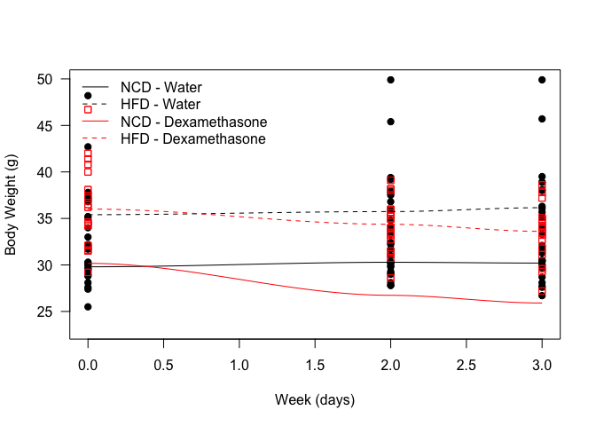
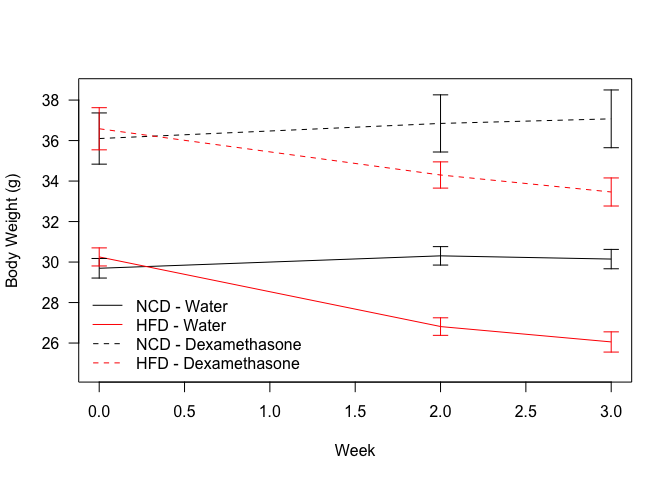
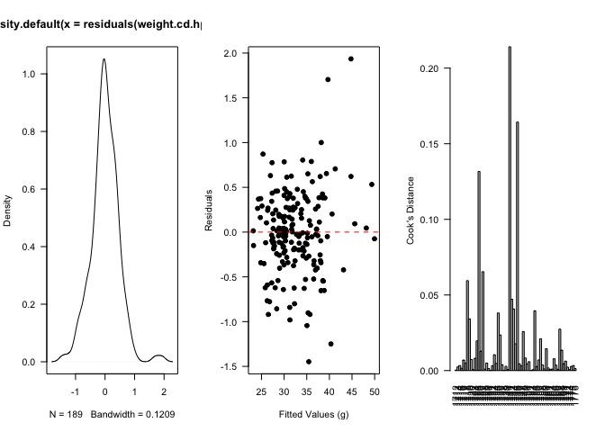
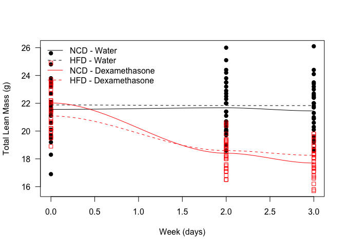
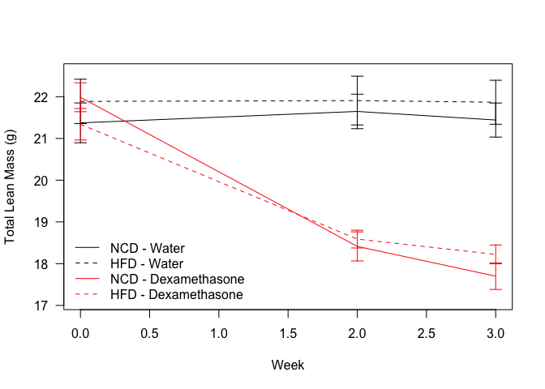
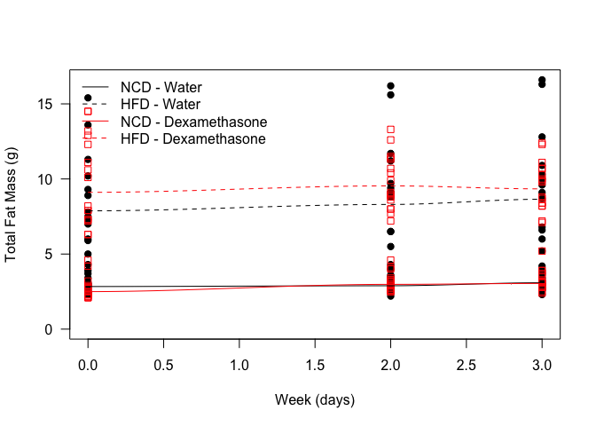
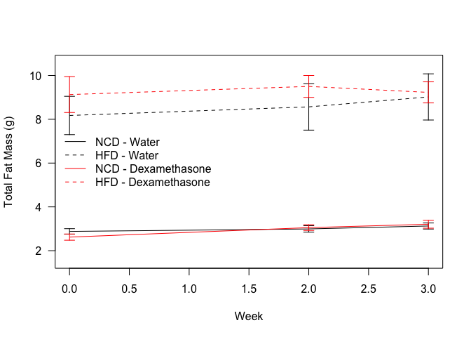
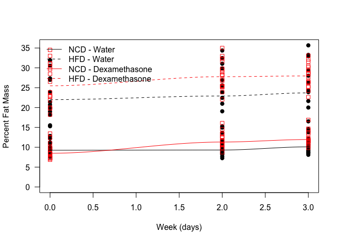
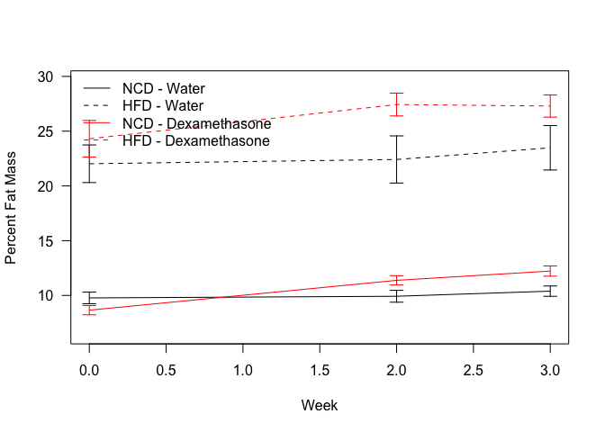

# Body Composition Analysis of High Fat Diet/Dexamethasone Time Course Experiments
Innocence Harvey and Dave Bridges  
April 5, 2017  


# Data Entry
This was from combined weights over several measurements of C57BL/6J mice placed on a chow or high fat diet.  Some animals may appear multiple times in this analysis.  Data is downloaded  from the mousedb website.  This includes only fed weights.


```
## 
## Attaching package: 'dplyr'
```

```
## The following objects are masked from 'package:stats':
## 
##     filter, lag
```

```
## The following objects are masked from 'package:base':
## 
##     intersect, setdiff, setequal, union
```

Data was downloaded from MouseDB then aand the data is saved as ../../data/raw/MMPC MRI Data.csv.  These data are located in /Users/davebrid/Documents/GitHub/CushingAcromegalyStudy/scripts/scripts-obesity and was most recently updated on Wed Aug 16 11:41:16 2017.

# Body Weights

<!-- -->

<!-- -->


```
## Loading required package: Matrix
```

```
## 
## Attaching package: 'Matrix'
```

```
## The following object is masked from 'package:tidyr':
## 
##     expand
```

```
## 
## Attaching package: 'influence.ME'
```

```
## The following object is masked from 'package:stats':
## 
##     influence
```

<!-- -->

Based on linear fixed effects models, allowing for uncorrelated intercepts and slopes for the animals, within the water group, the High Protein Diet animals gained NAg  weight per week, or NAg over the experiment.  This is a NA% change in body weight gain.  This effect was significant with a p-value of 1.28272&times; 10^-15^.  The residuals of this model **did not meet** the presumption of normality via a Shapiro-Wilk test (p=0.00055).


# Lean Mass

<!-- -->


<!-- -->

# Fat Mass

<!-- -->

<!-- -->


# Percent Fat Mass

<!-- -->

<!-- -->


# Session Information

```
## R version 3.3.0 (2016-05-03)
## Platform: x86_64-apple-darwin13.4.0 (64-bit)
## Running under: OS X 10.12.6 (unknown)
## 
## locale:
## [1] en_US.UTF-8/en_US.UTF-8/en_US.UTF-8/C/en_US.UTF-8/en_US.UTF-8
## 
## attached base packages:
## [1] stats     graphics  grDevices utils     datasets  methods   base     
## 
## other attached packages:
## [1] influence.ME_0.9-9 lme4_1.1-13        Matrix_1.2-10     
## [4] bindrcpp_0.2       tidyr_0.6.3        dplyr_0.7.2       
## [7] knitr_1.17        
## 
## loaded via a namespace (and not attached):
##  [1] Rcpp_0.12.12     bindr_0.1        magrittr_1.5     MASS_7.3-47     
##  [5] splines_3.3.0    lattice_0.20-35  R6_2.2.2         rlang_0.1.2     
##  [9] minqa_1.2.4      stringr_1.2.0    tools_3.3.0      grid_3.3.0      
## [13] nlme_3.1-131     htmltools_0.3.6  yaml_2.1.14      assertthat_0.2.0
## [17] rprojroot_1.2    digest_0.6.12    tibble_1.3.3     nloptr_1.0.4    
## [21] glue_1.1.1       evaluate_0.10.1  rmarkdown_1.6    stringi_1.1.5   
## [25] backports_1.1.0  pkgconfig_2.0.1
```

