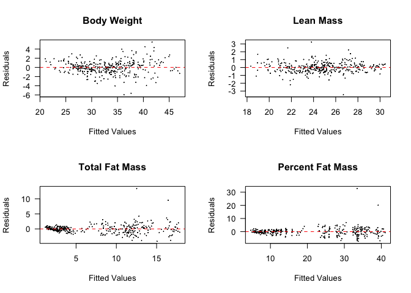

This script uses the files in ../../data/raw/Normal Chow Diet Body Composition Data.csv and ../../data/raw/High Fat Diet Body Composition Data.csv.  These data are located in /Users/davebrid/Documents/GitHub/CushingAcromegalyStudy/scripts/scripts-obesity and this script was most recently run on Mon Mar 12 12:41:12 2018.  These data were written out in summary format to the file ../../data/processed/Summarized Body Composition Data.csv.

# Body Weights

<!-- -->


# Lean Mass

<!-- -->

# Fat Mass

<!-- -->


# Percent Fat Mass

<!-- -->


# Diagnostics Plots

## Normality Plots

<!-- -->

## Residual Plots

<!-- -->

# Session Information


```
## R version 3.4.2 (2017-09-28)
## Platform: x86_64-apple-darwin15.6.0 (64-bit)
## Running under: macOS High Sierra 10.13.3
## 
## Matrix products: default
## BLAS: /Library/Frameworks/R.framework/Versions/3.4/Resources/lib/libRblas.0.dylib
## LAPACK: /Library/Frameworks/R.framework/Versions/3.4/Resources/lib/libRlapack.dylib
## 
## locale:
## [1] en_US.UTF-8/en_US.UTF-8/en_US.UTF-8/C/en_US.UTF-8/en_US.UTF-8
## 
## attached base packages:
## [1] stats     graphics  grDevices utils     datasets  methods   base     
## 
## other attached packages:
## [1] lme4_1.1-14   Matrix_1.2-12 bindrcpp_0.2  tidyr_0.7.2   dplyr_0.7.4  
## [6] knitr_1.17   
## 
## loaded via a namespace (and not attached):
##  [1] Rcpp_0.12.14     bindr_0.1        magrittr_1.5     MASS_7.3-47     
##  [5] splines_3.4.2    tidyselect_0.2.3 lattice_0.20-35  R6_2.2.2        
##  [9] rlang_0.1.4      minqa_1.2.4      stringr_1.2.0    tools_3.4.2     
## [13] grid_3.4.2       nlme_3.1-131     htmltools_0.3.6  yaml_2.1.15     
## [17] assertthat_0.2.0 rprojroot_1.2    digest_0.6.12    tibble_1.3.4    
## [21] nloptr_1.0.4     purrr_0.2.4      glue_1.2.0       evaluate_0.10.1 
## [25] rmarkdown_1.8    stringi_1.1.6    compiler_3.4.2   backports_1.1.1 
## [29] pkgconfig_2.0.1
```
