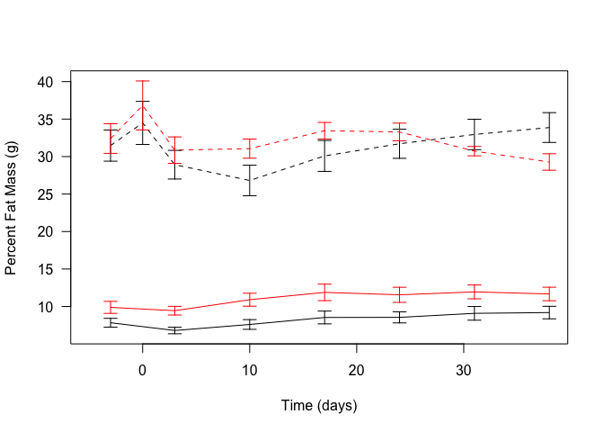

This script uses the files in ../../data/raw/Normal Chow Diet Body Composition Data.csv and ../../data/raw/High Fat Diet Body Composition Data.csv.  These data are located in /Users/davebrid/Documents/GitHub/CushingAcromegalyStudy/scripts/scripts-obesity and this script was most recently run on Thu Sep 12 15:23:26 2019.  These data were written out in summary format to the file ../../data/processed/Summarized Body Composition Data.csv.

# Body Weights

<!-- -->


# Lean Mass

<!-- -->

Table: Coefficients from mixed linear model of the interaction of time of dexamethasoen/water with Diet and Treatment

                                           Estimate   Std. Error          df       t value    Pr(>|t|)
--------------------------------------  -----------  -----------  ----------  ------------  ----------
(Intercept)                              24.4795309    0.5293877    51.26107    46.2412131   0.0000000
Time                                     -0.0693685    0.0055325   302.94959   -12.5383458   0.0000000
TreatmentWater                            2.1446930    0.7495741    51.50766     2.8612155   0.0060844
DietHigh Fat Diet                         0.1979264    0.7461878    50.58850     0.2652502   0.7918946
Time:TreatmentWater                       0.0825803    0.0079461   303.00785    10.3925965   0.0000000
Time:DietHigh Fat Diet                   -0.0663224    0.0078919   303.04695    -8.4038617   0.0000000
TreatmentWater:DietHigh Fat Diet         -1.5048023    1.0558128    50.69206    -1.4252549   0.1602120
Time:TreatmentWater:DietHigh Fat Diet     0.0736834    0.0110138   303.04056     6.6900923   0.0000000

A Chi-squared test between models with time and treatment interacting, with a model where diet modifies the rate of lean mass loss yielded a p-value of 6.3198415\times 10^{-14}.

# Fat Mass

<!-- -->


# Percent Fat Mass

<!-- -->


# Diagnostics Plots

## Normality Plots

<!-- -->

## Residual Plots

<!-- -->

#  Endpoint Analysis


Table: Endpoint summary data.

Diet               Treatment        Body.Weight_mean   Lean.Mass_mean   Total.Fat.Mass_mean   Percent.Fat.Mass_mean
-----------------  --------------  -----------------  ---------------  --------------------  ----------------------
Normal Chow Diet   Dexamethasone            26.01667         22.25250              3.052500               11.667866
Normal Chow Diet   Water                    30.55833         27.14500              2.776667                9.188361
High Fat Diet      Dexamethasone            30.37500         19.92250              9.251667               30.379430
High Fat Diet      Water                    40.75000         25.96333             14.075000               34.151367


Table: Endpoint summary data for standard deviations.

Diet               Treatment        Body.Weight_sd   Lean.Mass_sd   Total.Fat.Mass_sd   Percent.Fat.Mass_sd
-----------------  --------------  ---------------  -------------  ------------------  --------------------
Normal Chow Diet   Dexamethasone          2.034178       1.793727           0.9075354              3.121467
Normal Chow Diet   Water                  2.326315       2.562437           0.7699390              2.891866
High Fat Diet      Dexamethasone          2.110633       1.314016           1.1741909              2.496570
High Fat Diet      Water                  3.977322       1.932343           3.6359105              6.359877

## Endpoint Barplots

<!-- -->

Table: ANOVA of endpoint Body Weights

term              df      sumsq       meansq   statistic     p.value
---------------  ---  ---------  -----------  ----------  ----------
Diet               1   635.1075   635.107500    85.18220   0.0000000
Treatment          1   667.5208   667.520833    89.52956   0.0000000
Diet:Treatment     1   102.0833   102.083333    13.69167   0.0005958
Residuals         44   328.0583     7.455871          NA          NA


Table: ANOVA of endpoint Fat-Free Mass

term              df        sumsq       meansq   statistic     p.value
---------------  ---  -----------  -----------  ----------  ----------
Diet               1    36.995408    36.995408    9.707451   0.0032270
Treatment          1   358.613333   358.613333   94.098741   0.0000000
Diet:Treatment     1     3.956008     3.956008    1.038041   0.3138471
Residuals         44   167.685417     3.811032          NA          NA


Table: ANOVA of endpoint Fat Mass

term              df       sumsq       meansq   statistic     p.value
---------------  ---  ----------  -----------  ----------  ----------
Diet               1   918.48752   918.487519   229.40687   0.0000000
Treatment          1    62.03927    62.039269    15.49529   0.0002908
Diet:Treatment     1    78.00450    78.004502    19.48286   0.0000649
Residuals         44   176.16496     4.003749          NA          NA

# Session Information


```
## R version 3.5.0 (2018-04-23)
## Platform: x86_64-apple-darwin15.6.0 (64-bit)
## Running under: macOS  10.14.6
## 
## Matrix products: default
## BLAS: /Library/Frameworks/R.framework/Versions/3.5/Resources/lib/libRblas.0.dylib
## LAPACK: /Library/Frameworks/R.framework/Versions/3.5/Resources/lib/libRlapack.dylib
## 
## locale:
## [1] en_US.UTF-8/en_US.UTF-8/en_US.UTF-8/C/en_US.UTF-8/en_US.UTF-8
## 
## attached base packages:
## [1] stats     graphics  grDevices utils     datasets  methods   base     
## 
## other attached packages:
## [1] broom_0.5.2      ggplot2_3.1.1    gridExtra_2.3    lmerTest_3.1-0  
## [5] lme4_1.1-21      Matrix_1.2-17    tidyr_0.8.3.9000 dplyr_0.8.3     
## [9] knitr_1.23      
## 
## loaded via a namespace (and not attached):
##  [1] Rcpp_1.0.1          highr_0.8           plyr_1.8.4         
##  [4] pillar_1.4.2        compiler_3.5.0      nloptr_1.2.1       
##  [7] tools_3.5.0         boot_1.3-22         zeallot_0.1.0      
## [10] digest_0.6.20       evaluate_0.14       tibble_2.1.3       
## [13] nlme_3.1-140        gtable_0.3.0        lattice_0.20-38    
## [16] pkgconfig_2.0.2     rlang_0.4.0         yaml_2.2.0         
## [19] xfun_0.7            withr_2.1.2         stringr_1.4.0      
## [22] generics_0.0.2      vctrs_0.2.0         grid_3.5.0         
## [25] tidyselect_0.2.5    glue_1.3.1          R6_2.4.0           
## [28] rmarkdown_1.13      minqa_1.2.4         purrr_0.3.2        
## [31] magrittr_1.5        scales_1.0.0        backports_1.1.4    
## [34] htmltools_0.3.6     splines_3.5.0       MASS_7.3-51.4      
## [37] assertthat_0.2.1    colorspace_1.4-1    numDeriv_2016.8-1.1
## [40] labeling_0.3        stringi_1.4.3       lazyeval_0.2.2     
## [43] munsell_0.5.0       crayon_1.3.4
```
