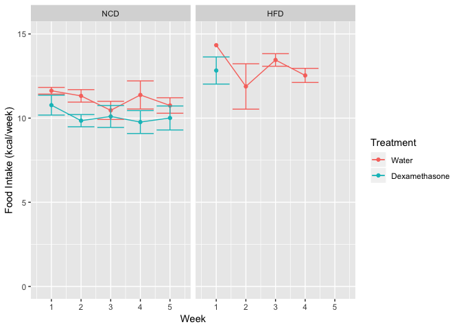
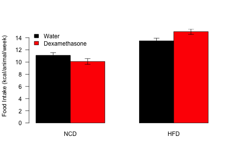

# Purpose

To test whether food intake is different betwen NCD and HFD animals treated with dexamethasone or water.

# Experimental Details

We monitored weekly food intake, at the cage level throughout the experiment

# Raw Data

Describe your raw data files, including what the columns mean (and what units they are in).


These data can be found in /Users/davebrid/Documents/GitHub/CushingAcromegalyStudy/scripts/scripts-obesity in a file named ../../data/raw/HFD and NCD Food Intake Data.csv.  This script was most recently updated on Thu Sep 12 15:26:15 2019.

# Analysis


We converted NCD and HFD in grams to kcal by these factors


Table: Energy Density of Diets

Diet    Calories per gram
-----  ------------------
NCD                  2.91
HFD                  4.73

## Weekly Data

<!-- -->

## Analysis on the Aggregate


Table: Summary statistics for aggregated weekly food intake

Diet   Treatment        Food.mean   Food.se   Food.sd
-----  --------------  ----------  --------  --------
NCD    Water                 11.1     0.435     0.753
NCD    Dexamethasone         10.1     0.472     0.818
HFD    Water                 13.5     0.431     0.746
HFD    Dexamethasone         15.0     0.440     0.985

<!-- -->

### Aggregate Food Intake Statistics

To analyse these data, we first aggregated the average food intake per cage, assuming this did not change over time.


Table: Two-way ANOVA with Interaction for aggregated food intake.

term              df    sumsq   meansq   statistic   p.value
---------------  ---  -------  -------  ----------  --------
Diet               1    7.738    7.738       26.23     0.000
Treatment          1    0.354    0.354        1.20     0.276
Diet:Treatment     1    2.347    2.347        7.96     0.006
Residuals         96   28.324    0.295          NA        NA

Based on this ANOVA there was a significant interaction between diet and treatment, with HFD/Dexamethasone animals eating less food than HFD/Water animals.  We further analysed this via pairwiwse tests.


Table: Shapiro-Wilk test results for food intake groups

Diet   Treatment        Shapiro
-----  --------------  --------
NCD    Water              0.137
NCD    Dexamethasone      0.359
HFD    Water              0.563
HFD    Dexamethasone      0.438

Based on these tests, normality could be assumed for eachg group.


Based on Levene's tests, HFD (p=0.613) and NCD (p=0.71) could be assumed to have equal variance.

We therefore performed Student's *t*-tests with the following results


Table: Pairwise Student's t-test for the effects of dexamethasone on food intake

       estimate1   estimate2   statistic   p.value   parameter   conf.low   conf.high  method              alternative 
----  ----------  ----------  ----------  --------  ----------  ---------  ----------  ------------------  ------------
NCD         11.1        10.1        2.97     0.006          28      0.314       1.704  Two Sample t-test   two.sided   
HFD         13.5        15.0       -2.19     0.032          68     -2.928      -0.138  Two Sample t-test   two.sided   

The effects were significant in both cases, with HFD animals eating slightly more food (11.181% increase) and NCD animals eating slightly less (-9.082% decrease) food on a per calorie basis.

# Interpretation


# Session Information


```r
sessionInfo()
```

```
## R version 3.5.0 (2018-04-23)
## Platform: x86_64-apple-darwin15.6.0 (64-bit)
## Running under: macOS  10.14.6
## 
## Matrix products: default
## BLAS: /Library/Frameworks/R.framework/Versions/3.5/Resources/lib/libRblas.0.dylib
## LAPACK: /Library/Frameworks/R.framework/Versions/3.5/Resources/lib/libRlapack.dylib
## 
## locale:
## [1] en_US.UTF-8/en_US.UTF-8/en_US.UTF-8/C/en_US.UTF-8/en_US.UTF-8
## 
## attached base packages:
## [1] stats     graphics  grDevices utils     datasets  methods   base     
## 
## other attached packages:
## [1] car_3.0-3        carData_3.0-2    broom_0.5.2      ggplot2_3.1.1   
## [5] forcats_0.4.0    readr_1.3.1      dplyr_0.8.3      tidyr_0.8.3.9000
## [9] knitr_1.23      
## 
## loaded via a namespace (and not attached):
##  [1] zip_2.0.2         Rcpp_1.0.1        cellranger_1.1.0 
##  [4] pillar_1.4.2      compiler_3.5.0    highr_0.8        
##  [7] plyr_1.8.4        tools_3.5.0       zeallot_0.1.0    
## [10] digest_0.6.20     lattice_0.20-38   nlme_3.1-140     
## [13] evaluate_0.14     tibble_2.1.3      gtable_0.3.0     
## [16] pkgconfig_2.0.2   rlang_0.4.0       openxlsx_4.1.0.1 
## [19] curl_3.3          yaml_2.2.0        haven_2.1.0      
## [22] xfun_0.7          rio_0.5.16        withr_2.1.2      
## [25] stringr_1.4.0     generics_0.0.2    vctrs_0.2.0      
## [28] hms_0.4.2         grid_3.5.0        tidyselect_0.2.5 
## [31] data.table_1.12.2 glue_1.3.1        R6_2.4.0         
## [34] readxl_1.3.1      foreign_0.8-71    rmarkdown_1.13   
## [37] purrr_0.3.2       reshape2_1.4.3    magrittr_1.5     
## [40] backports_1.1.4   scales_1.0.0      htmltools_0.3.6  
## [43] abind_1.4-5       assertthat_0.2.1  colorspace_1.4-1 
## [46] labeling_0.3      stringi_1.4.3     lazyeval_0.2.2   
## [49] munsell_0.5.0     crayon_1.3.4
```
