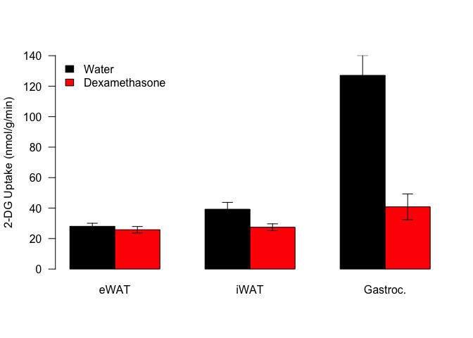
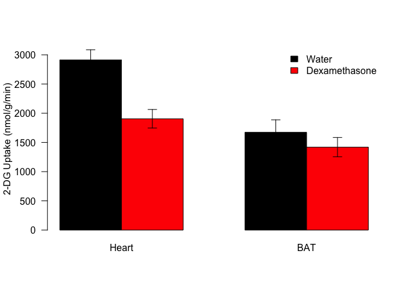
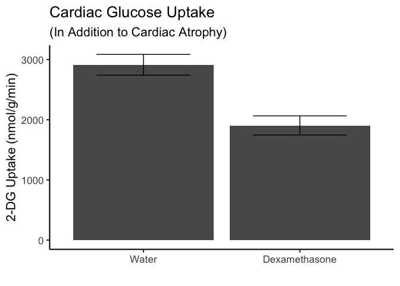

# Purpose

# Experimental Details

Link to the protocol used (permalink preferred) for the experiment and include any notes relevant to your analysis.  This might include specifics not in the general protocol such as cell lines, treatment doses etc.

# Raw Data

The input data is extracted glucose uptake (nmol/g/min) from the clamp datafiles.


These data can be found in /Users/davebrid/Documents/GitHub/CushingAcromegalyStudy/scripts/scripts-obesity in a file named ../../data/raw/Clamp HFD tissue uptake data.csv.  This script was most recently updated on Mon Oct  2 10:02:27 2023.

# Analysis


|Treatment     |  BW_mean| Gastroc_mean| Heart_mean| vWAT_mean| scWAT_mean| BAT_mean|
|:-------------|--------:|------------:|----------:|---------:|----------:|--------:|
|Water         | 34.05455|    127.09909|   2913.243|  28.05411|   39.26952| 1673.125|
|Dexamethasone | 30.80000|     40.81704|   1905.398|  25.80526|   27.44161| 1419.747|

## Adipose and Muscle Tissue

<!-- -->

## Statistics


Table: Shapiro-Wilk Tests

|Treatment     |        BW|   Gastroc|     Heart|      vWAT|     scWAT|       BAT|
|:-------------|---------:|---------:|---------:|---------:|---------:|---------:|
|Water         | 0.0455959| 0.6512470| 0.6714639| 0.6869895| 0.0047864| 0.9753073|
|Dexamethasone | 0.5017064| 0.0000341| 0.2413769| 0.2592101| 0.5848611| 0.1745121|

### Epididymal WAT

There was a **8.0161288**% decreasein eWAT glucose uptake.  These data could be assumed to be normally distributed (p=0.2592101).  A Levene's test showed the data could be assumed to have equal variation (p=0.8041117) so a Student's *t*-test was done, which had a p-value of **0.4555776**.

### Inguinal WAT

There was a **30.119802**% decrease in iWAT glucose uptake.  These data could not be assumed to be normally so Mann-Whitney test was done, which had a p-value of **0.0507161**.

### Gastrocnemieus

There was a **67.885655**% decrease in gastrocnemius glucose uptake.  These data could not be assumed to be normally so Mann-Whitney test was done, which had a p-value of **2.0191143&times; 10^-5^**.

### Heart

There was a **34.5952856**% decreasein heart glucose uptake.  These data could be assumed to be normally distributed (p=0.2413769).  A Levene's test showed the data could be assumed to have equal variation (p=0.9900442) so a Student's *t*-test was done, which had a p-value of **2.8456753&times; 10^-4^**.

### Brown Adipose Tissue

There was a **15.1439827**% decreasein BAT glucose uptake.  These data could be assumed to be normally distributed (p=0.1745121).  A Levene's test showed the data could be assumed to have equal variation (p=0.9344637) so a Student's *t*-test was done, which had a p-value of **0.3498177**.


<!-- --><!-- -->

# Interpretation

Reduced glucose uptake in 

# Session Information


```r
sessionInfo()
```

```
## R version 4.2.2 (2022-10-31)
## Platform: x86_64-apple-darwin17.0 (64-bit)
## Running under: macOS Big Sur ... 10.16
## 
## Matrix products: default
## BLAS:   /Library/Frameworks/R.framework/Versions/4.2/Resources/lib/libRblas.0.dylib
## LAPACK: /Library/Frameworks/R.framework/Versions/4.2/Resources/lib/libRlapack.dylib
## 
## locale:
## [1] en_US.UTF-8/en_US.UTF-8/en_US.UTF-8/C/en_US.UTF-8/en_US.UTF-8
## 
## attached base packages:
## [1] stats     graphics  grDevices utils     datasets  methods   base     
## 
## other attached packages:
## [1] ggplot2_3.4.2 car_3.1-2     carData_3.0-5 readr_2.1.4   dplyr_1.1.2  
## [6] tidyr_1.3.0   knitr_1.43   
## 
## loaded via a namespace (and not attached):
##  [1] highr_0.10       pillar_1.9.0     bslib_0.4.2      compiler_4.2.2  
##  [5] jquerylib_0.1.4  tools_4.2.2      digest_0.6.31    bit_4.0.5       
##  [9] gtable_0.3.3     jsonlite_1.8.5   evaluate_0.21    lifecycle_1.0.3 
## [13] tibble_3.2.1     pkgconfig_2.0.3  rlang_1.1.1      cli_3.6.1       
## [17] rstudioapi_0.14  yaml_2.3.7       parallel_4.2.2   xfun_0.39       
## [21] fastmap_1.1.1    withr_2.5.0      generics_0.1.3   vctrs_0.6.2     
## [25] sass_0.4.6       hms_1.1.3        grid_4.2.2       bit64_4.0.5     
## [29] tidyselect_1.2.0 glue_1.6.2       R6_2.5.1         fansi_1.0.4     
## [33] vroom_1.6.3      rmarkdown_2.22   farver_2.1.1     purrr_1.0.1     
## [37] tzdb_0.4.0       magrittr_2.0.3   scales_1.2.1     htmltools_0.5.5 
## [41] abind_1.4-5      colorspace_2.1-0 labeling_0.4.2   utf8_1.2.3      
## [45] munsell_0.5.0    cachem_1.0.8     crayon_1.5.2
```

# References

If needed, using Rmarkdown citation tools (see this link for more information: http://rmarkdown.rstudio.com/authoring_bibliographies_and_citations.html)
