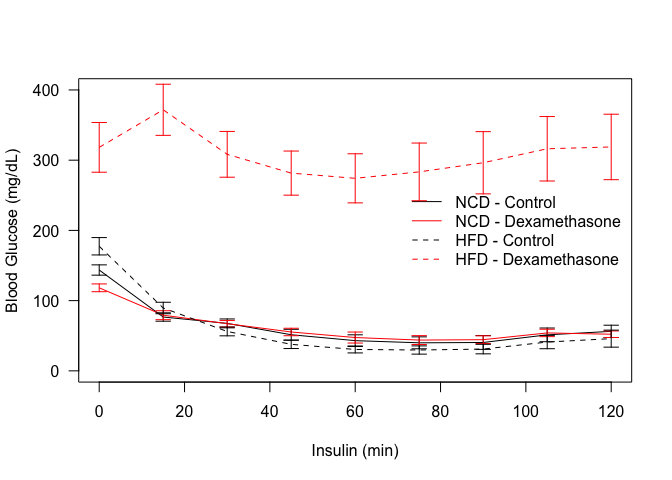

# ITT for Dexamethasone Treated HFD-Fed Mice at the MMPC
Innocence Harvey, Melanie Schmitt, Nathan Qi and Dave Bridges  
April 5, 2017  


This document can be found in /Users/davebrid/Documents/GitHub/CushingAcromegalyStudy/scripts/scripts-obesity.  It reads from the file ../../data/raw/mmpc-itt-data.csv and this script was most recently run on Wed Aug 16 11:27:09 2017.


<!-- -->

### ITT Statistics


Based on a mixed linear model testing for effects of a Diet:Treatment interaction, there is a significant interaction between Diet and Treatment during the ITT **(p=1.8935007&times; 10^-4^)**.  The residuals of this model fail to meet the criteria for normality via a Shapiro-Wilk test, so normality cannot be assumed (p=6.3716137&times; 10^-14^).

## Normalized to Fasting Glucose

<!-- -->


## Fasting Blood Glucose

<!-- -->

### Fasting Glucose Statistics

Analysed these data by 2-way ANOVA with an interaction


Table: 2 Way ANOVA for Fasting Glucose

                  Df      Sum Sq      Mean Sq    F value      Pr(>F)
---------------  ---  ----------  -----------  ---------  ----------
Treatment          1    26654.44    26654.442   11.45778   0.0012711
Diet               1   122634.93   122634.925   52.71630   0.0000000
Treatment:Diet     1    41040.14    41040.140   17.64167   0.0000914
Residuals         59   137252.81     2326.319         NA          NA

The residuals from this ANOVA can **not** be assumed to be normally distributed as they fail a Shapiro-Wilk test (p=2.2216492&times; 10^-6^).

## Area Under Curve During ITT

<!-- -->

### AUC Statistics

Analysed these data by 2-way ANOVA with an interaction


Table: 2 Way ANOVA for Area Under Curve of ITT

                  Df    Sum Sq     Mean Sq     F value      Pr(>F)
---------------  ---  --------  ----------  ----------  ----------
Treatment          1   1665064   1665063.7    7.918326   0.0074825
Diet               1   2246100   2246099.8   10.681483   0.0021939
Treatment:Diet     1   1580386   1580385.9    7.515634   0.0090222
Residuals         41   8621471    210279.8          NA          NA

The residuals from this ANOVA can **not** be assumed to be normally distributed as they fail a Shapiro-Wilk test (p=7.926514&times; 10^-7^).


# Session Information


```
## R version 3.3.0 (2016-05-03)
## Platform: x86_64-apple-darwin13.4.0 (64-bit)
## Running under: OS X 10.12.6 (unknown)
## 
## locale:
## [1] en_US.UTF-8/en_US.UTF-8/en_US.UTF-8/C/en_US.UTF-8/en_US.UTF-8
## 
## attached base packages:
## [1] stats     graphics  grDevices utils     datasets  methods   base     
## 
## other attached packages:
## [1] lme4_1.1-13   Matrix_1.2-10 tidyr_0.6.3   bindrcpp_0.2  dplyr_0.7.2  
## [6] knitr_1.17   
## 
## loaded via a namespace (and not attached):
##  [1] Rcpp_0.12.12     bindr_0.1        magrittr_1.5     MASS_7.3-47     
##  [5] splines_3.3.0    lattice_0.20-35  R6_2.2.2         rlang_0.1.2     
##  [9] minqa_1.2.4      highr_0.6        stringr_1.2.0    tools_3.3.0     
## [13] grid_3.3.0       nlme_3.1-131     htmltools_0.3.6  yaml_2.1.14     
## [17] assertthat_0.2.0 rprojroot_1.2    digest_0.6.12    tibble_1.3.3    
## [21] nloptr_1.0.4     glue_1.1.1       evaluate_0.10.1  rmarkdown_1.6   
## [25] stringi_1.1.5    backports_1.1.0  pkgconfig_2.0.1
```
