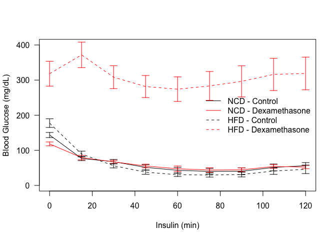
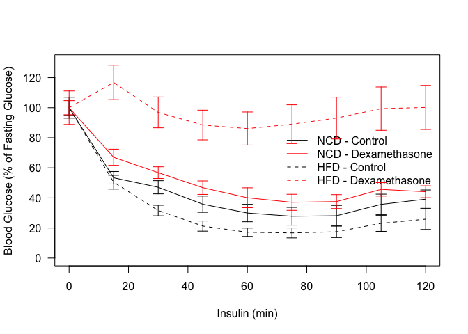
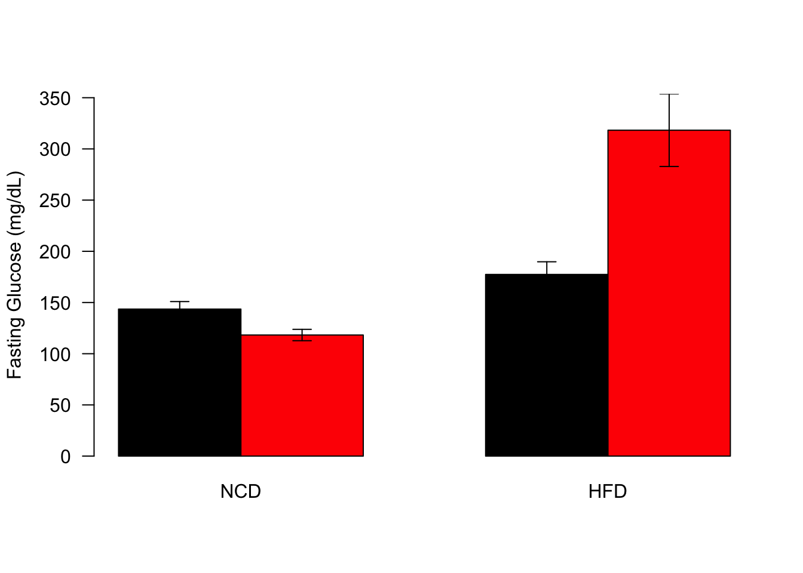
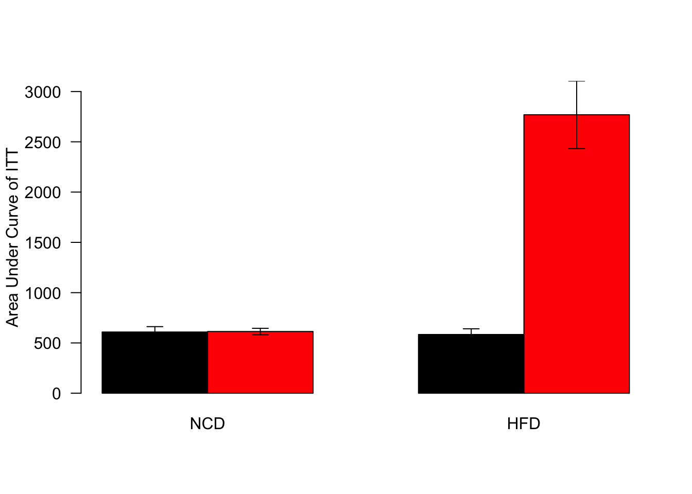

# ITT for Dexamethasone Treated HFD-Fed Mice
Innocence Harvey, Erin Stephenson and Dave Bridges  
February 11, 2015  


These data were found in the files ../../data/raw/HFD ITT Data.csv and ../../data/raw/NCD ITT Data.csv.  This document can be found in /Users/davebrid/Documents/GitHub/CushingAcromegalyStudy/scripts/scripts-obesity.  This scipt was mst recently run on Tue Jan 24 17:16:21 2017.


Table: Summary Statistics for ITT

Treatment       Diet    FG.mean     FG.se   AUC.mean    AUC.se    n
--------------  -----  --------  --------  ---------  --------  ---
Dexamethasone   NCD      118.25    5.5475     613.75    31.813   12
Dexamethasone   HFD      318.25   35.3986    2768.83   335.628   12
Water           NCD      143.58    7.3283     608.62    53.526   12
Water           HFD      177.42   12.3622     584.14    56.221   12

<!-- -->

### ITT Statistics


Based on a mixed linear model testing for effects of a Diet:Treatment interaction, there is a significant interaction between Diet and Treatment during the ITT **(p=1.87576&times; 10^-8^)**.  The residuals of this model fail to meet the criteria for normality via a Shapiro-Wilk test, so normality cannot be assumed (p=1.66328&times; 10^-15^).

## Normalized to Fasting Glucose

<!-- -->


## Fasting Blood Glucose

<!-- -->

While HFD animals had a 23.56355% increase in fasting glucose when compared to NCD animals, in the presence of dexamethasone, HFD-fed animals had a 121.64829% increase in fasting glucose relative to NCD controls not treated with dexamethasone.

In the chow condition, dexamethasone caused a 17.64364% decrease in fasting glucose.

### Fasting Glucose Statistics

Analysed these data by 2-way ANOVA with an interaction


Table: 2 Way ANOVA for Fasting Glucose

                  Df   Sum Sq    Mean Sq   F value    Pr(>F)
---------------  ---  -------  ---------  --------  --------
Treatment          1    40021    40020.8     8.951   0.00453
Diet               1   164034   164034.1    36.688   0.00000
Treatment:Diet     1    82834    82834.1    18.527   0.00009
Residuals         44   196728     4471.1        NA        NA

The residuals from this ANOVA can **not** be assumed to be normally distributed as they fail a Shapiro-Wilk test (p=0.0013).

## Area Under Curve During ITT

<!-- -->

### AUC Statistics

Analysed these data by 2-way ANOVA with an interaction


Table: 2 Way ANOVA for Area Under Curve of ITT

                  Df     Sum Sq    Mean Sq   F value    Pr(>F)
---------------  ---  ---------  ---------  --------  --------
Treatment          1   14700447   14700447    29.549   0.00001
Diet               1   12319220   12319220    24.762   0.00002
Treatment:Diet     1    9976062    9976062    20.052   0.00010
Residuals         31   15422526     497501        NA        NA

The residuals from this ANOVA can **not** be assumed to be normally distributed as they fail a Shapiro-Wilk test (p=0.00012).


# Session Information


```
## R version 3.3.0 (2016-05-03)
## Platform: x86_64-apple-darwin13.4.0 (64-bit)
## Running under: OS X 10.12.2 (unknown)
## 
## locale:
## [1] en_US.UTF-8/en_US.UTF-8/en_US.UTF-8/C/en_US.UTF-8/en_US.UTF-8
## 
## attached base packages:
## [1] stats     graphics  grDevices utils     datasets  methods   base     
## 
## other attached packages:
## [1] lme4_1.1-12    Matrix_1.2-7.1 tidyr_0.6.1    dplyr_0.5.0   
## [5] knitr_1.15.1  
## 
## loaded via a namespace (and not attached):
##  [1] Rcpp_0.12.9     magrittr_1.5    splines_3.3.0   MASS_7.3-45    
##  [5] lattice_0.20-34 R6_2.2.0        minqa_1.2.4     stringr_1.1.0  
##  [9] highr_0.6       tools_3.3.0     grid_3.3.0      nlme_3.1-128   
## [13] DBI_0.5-1       htmltools_0.3.5 yaml_2.1.14     lazyeval_0.2.0 
## [17] assertthat_0.1  rprojroot_1.1   digest_0.6.11   tibble_1.2     
## [21] nloptr_1.0.4    evaluate_0.10   rmarkdown_1.3   stringi_1.1.2  
## [25] backports_1.0.4
```
