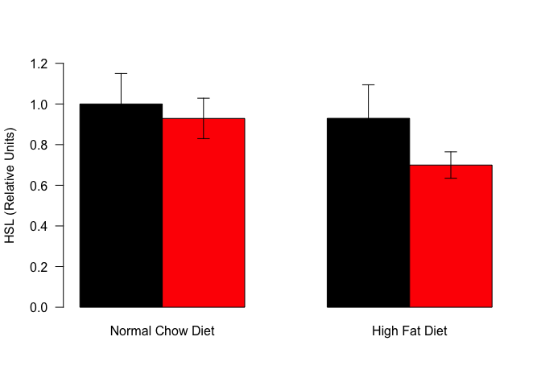
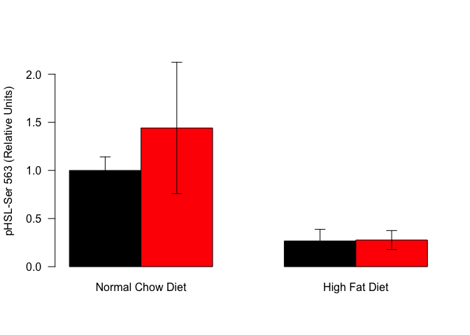
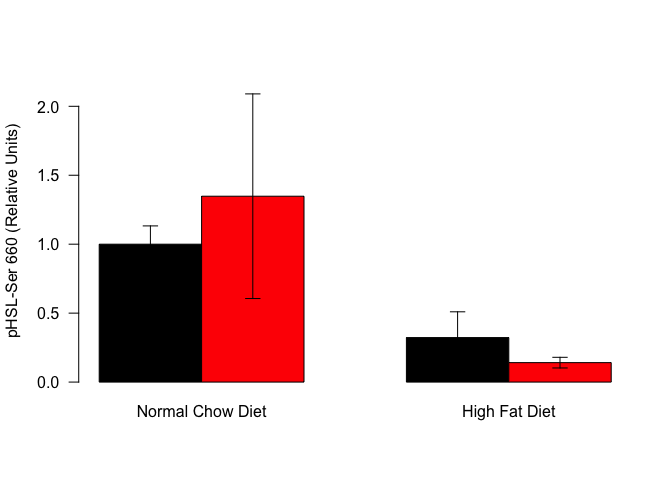
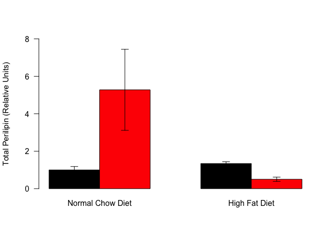
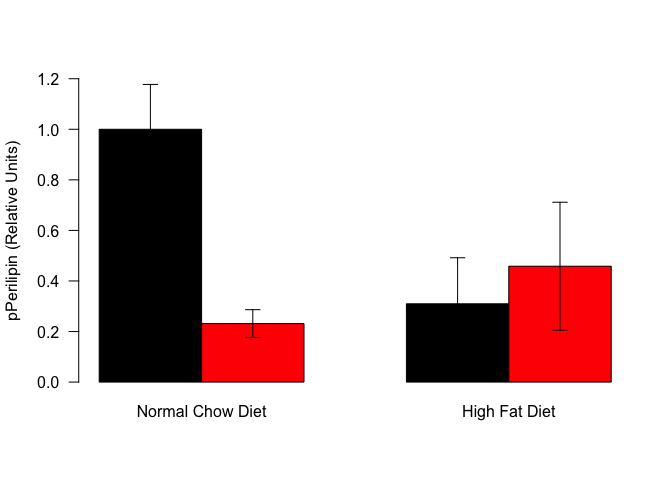
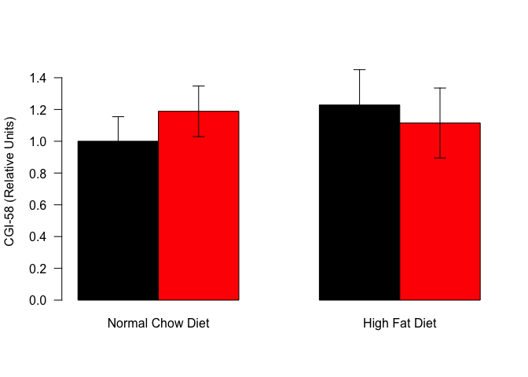

Table: Normalized Average Levels

Diet               Treatment       Protein       Levels
-----------------  --------------  -----------  -------
Normal Chow Diet   Water           ATGL           1.000
Normal Chow Diet   Dexamethasone   ATGL           1.544
High Fat Diet      Water           ATGL           1.098
High Fat Diet      Dexamethasone   ATGL           2.631
Normal Chow Diet   Water           HSL            1.000
Normal Chow Diet   Dexamethasone   HSL            0.929
High Fat Diet      Water           HSL            0.929
High Fat Diet      Dexamethasone   HSL            0.699
Normal Chow Diet   Water           CGI58          1.000
Normal Chow Diet   Dexamethasone   CGI58          1.189
High Fat Diet      Water           CGI58          1.228
High Fat Diet      Dexamethasone   CGI58          1.115
Normal Chow Diet   Water           Perilipin      1.000
Normal Chow Diet   Dexamethasone   Perilipin      5.278
High Fat Diet      Water           Perilipin      1.343
High Fat Diet      Dexamethasone   Perilipin      0.502
Normal Chow Diet   Water           pHSL_563       1.000
Normal Chow Diet   Dexamethasone   pHSL_563       1.441
High Fat Diet      Water           pHSL_563       0.267
High Fat Diet      Dexamethasone   pHSL_563       0.277
Normal Chow Diet   Water           pHSL_660       1.000
Normal Chow Diet   Dexamethasone   pHSL_660       1.348
High Fat Diet      Water           pHSL_660       0.323
High Fat Diet      Dexamethasone   pHSL_660       0.141
Normal Chow Diet   Water           pPerilipin     1.000
Normal Chow Diet   Dexamethasone   pPerilipin     0.231
High Fat Diet      Water           pPerilipin     0.310
High Fat Diet      Dexamethasone   pPerilipin     0.458


This script uses the files in ../../data/processed/Lipolysis iWAT Tissue Blot Data.csv. These data are located in /Users/davebrid/Documents/GitHub/CushingAcromegalyStudy/scripts/scripts-obesity and this script was most recently run on Sun Apr  8 16:45:20 2018.

# ATGL

<!-- -->

Blots were normalized to total protein (Revert) staining.  We observed a 1.544 fold increase in NCD animals due to dexamethasone and a 2.396 fold increase in HFD animals.

## ATGL Statistics


Table: 2-Way ANOVA with Interaction for ATGL Levels

term              df   sumsq   meansq   statistic   p.value
---------------  ---  ------  -------  ----------  --------
Diet               1    1.57    1.569        5.27     0.033
Treatment          1    5.90    5.899       19.82     0.000
Diet:Treatment     1    1.40    1.397        4.69     0.043
Residuals         19    5.66    0.298          NA        NA

# HSL

<!-- -->

Blots were normalized to total protein (Revert) staining.  We observed a 0.929 fold increase in NCD animals due to dexamethasone and a 0.753 fold increase in HFD animals.

## HSL Statistics


Table: 2-Way ANOVA with Interaction for HSL Levels

term              df   sumsq   meansq   statistic   p.value
---------------  ---  ------  -------  ----------  --------
Diet               1   0.067    0.067       0.713     0.423
Treatment          1   0.068    0.068       0.719     0.421
Diet:Treatment     1   0.019    0.019       0.200     0.667
Residuals          8   0.757    0.095          NA        NA

# pHSL-563

<!-- -->

Blots were normalized to total protein (Revert) staining.  We observed a 1.441 fold increase in NCD animals due to dexamethasone and a 1.035 fold increase in HFD animals.

## pHSL-563 Statistics


Table: 2-Way ANOVA with Interaction for HSL pSer 563 Levels

term              df   sumsq   meansq   statistic   p.value
---------------  ---  ------  -------  ----------  --------
Diet               1   2.700    2.700       3.543     0.097
Treatment          1   0.152    0.152       0.200     0.667
Diet:Treatment     1   0.140    0.140       0.184     0.680
Residuals          8   6.095    0.762          NA        NA

# pHSL-660

<!-- -->

Blots were normalized to total protein (Revert) staining.  We observed a 1.348 fold increase in NCD animals due to dexamethasone and a 0.437 fold increase in HFD animals.

## pHSL-660 Statistics


Table: 2-Way ANOVA with Interaction for HSL pSer 563 Levels

term              df   sumsq   meansq   statistic   p.value
---------------  ---  ------  -------  ----------  --------
Diet               1   2.663    2.663       2.938     0.125
Treatment          1   0.021    0.021       0.023     0.883
Diet:Treatment     1   0.210    0.210       0.232     0.643
Residuals          8   7.252    0.907          NA        NA

# Perilipin

<!-- -->

## Perilipin Statistics


Table: 2-Way ANOVA with Interaction for Total Perilipin Levels

term              df   sumsq   meansq   statistic   p.value
---------------  ---  ------  -------  ----------  --------
Diet               1    12.4    12.40        1.53     0.256
Treatment          1    10.8    10.83        1.34     0.286
Diet:Treatment     1    17.5    17.47        2.15     0.186
Residuals          7    56.8     8.11          NA        NA

# pPerilipin

<!-- -->

## pPerilipin Statistics


Table: 2-Way ANOVA with Interaction for Perilipin Phosphorylation Levels

term              df   sumsq   meansq   statistic   p.value
---------------  ---  ------  -------  ----------  --------
Diet               1   0.166    0.166        1.02     0.345
Treatment          1   0.352    0.352        2.17     0.184
Diet:Treatment     1   0.561    0.561        3.47     0.105
Residuals          7   1.132    0.162          NA        NA

# ADRB5 or CGI-58

<!-- -->

Blots were normalized to total protein (Revert) staining.  We observed a 1.189 fold increase in NCD animals due to dexamethasone and a 0.908 fold increase in HFD animals.

## CGI-58 Statistics


Table: 2-Way ANOVA with Interaction for CGI-58 Levels

term              df   sumsq   meansq   statistic   p.value
---------------  ---  ------  -------  ----------  --------
Diet               1   0.039    0.039       0.189     0.669
Treatment          1   0.012    0.012       0.056     0.816
Diet:Treatment     1   0.130    0.130       0.629     0.437
Residuals         19   3.932    0.207          NA        NA


# Session Information


```
## R version 3.4.4 (2018-03-15)
## Platform: x86_64-apple-darwin15.6.0 (64-bit)
## Running under: macOS High Sierra 10.13.3
## 
## Matrix products: default
## BLAS: /Library/Frameworks/R.framework/Versions/3.4/Resources/lib/libRblas.0.dylib
## LAPACK: /Library/Frameworks/R.framework/Versions/3.4/Resources/lib/libRlapack.dylib
## 
## locale:
## [1] en_US.UTF-8/en_US.UTF-8/en_US.UTF-8/C/en_US.UTF-8/en_US.UTF-8
## 
## attached base packages:
## [1] stats     graphics  grDevices utils     datasets  methods   base     
## 
## other attached packages:
## [1] broom_0.4.3   bindrcpp_0.2  forcats_0.2.0 readr_1.1.1   ggplot2_2.2.1
## [6] dplyr_0.7.4   tidyr_0.7.2   knitr_1.17   
## 
## loaded via a namespace (and not attached):
##  [1] Rcpp_0.12.14     compiler_3.4.4   plyr_1.8.4       highr_0.6       
##  [5] bindr_0.1        tools_3.4.4      digest_0.6.12    evaluate_0.10.1 
##  [9] tibble_1.3.4     gtable_0.2.0     nlme_3.1-131.1   lattice_0.20-35 
## [13] pkgconfig_2.0.1  rlang_0.1.4      psych_1.7.8      parallel_3.4.4  
## [17] yaml_2.1.15      stringr_1.2.0    hms_0.4.0        rprojroot_1.2   
## [21] grid_3.4.4       tidyselect_0.2.3 glue_1.2.0       R6_2.2.2        
## [25] foreign_0.8-69   rmarkdown_1.8    reshape2_1.4.2   purrr_0.2.4     
## [29] magrittr_1.5     backports_1.1.1  scales_0.5.0     htmltools_0.3.6 
## [33] mnormt_1.5-5     assertthat_0.2.0 colorspace_1.3-2 stringi_1.1.6   
## [37] lazyeval_0.2.1   munsell_0.4.3
```
