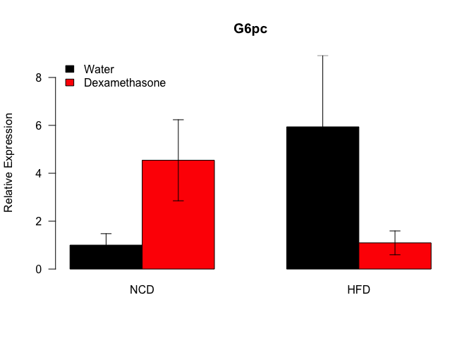
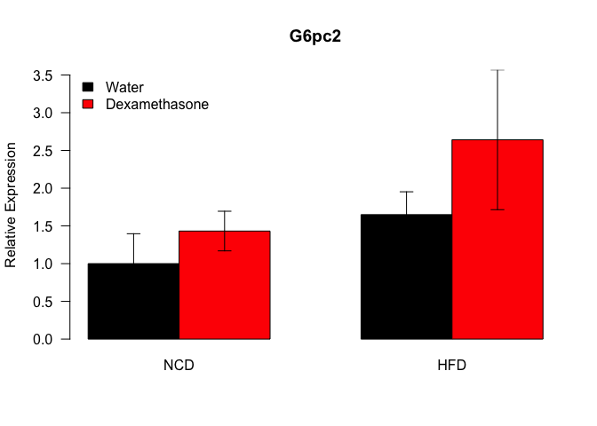
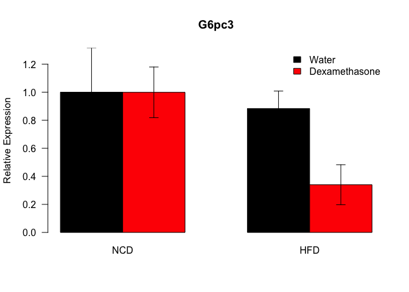
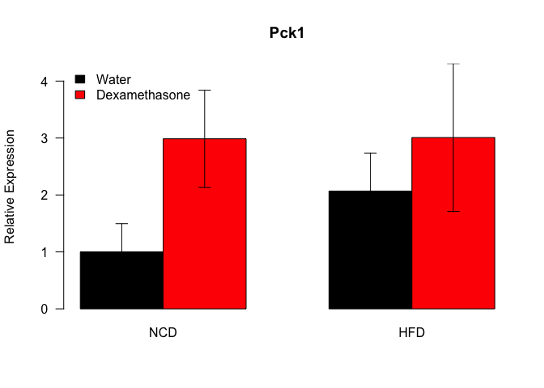
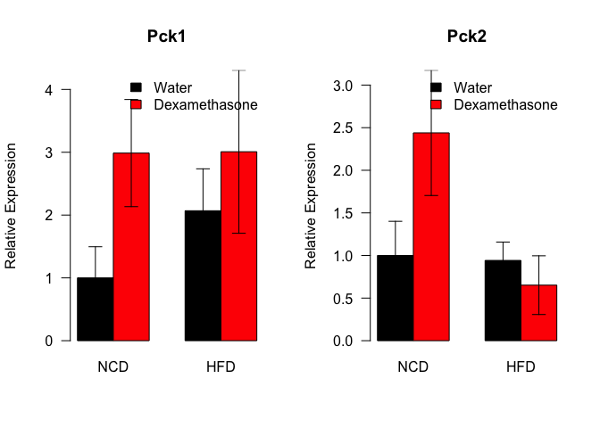
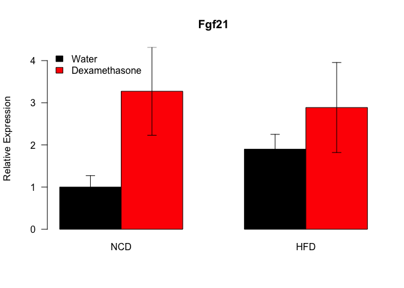
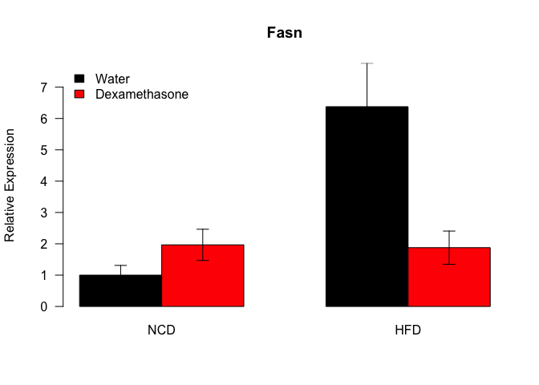
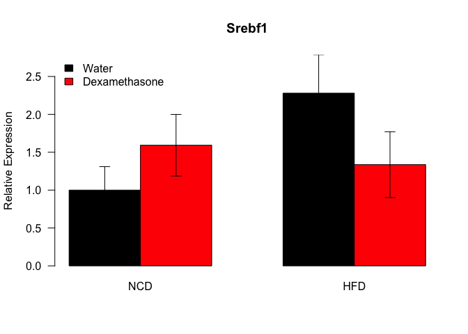

# qPCR Analysis of HFD/Dexamethasone Livers
Dave Bridges, Molly Carter and Innocence Harvey  
December 18, 2016  


# Data Entry


```r
datafile <- '../../data/raw/Liver qPCR Combined Well Results.csv'
library(readr)
qpcr.data <- read_csv(datafile, skip=11, na=c("","Undetermined"))
```


```r
standard <- 'Rplp0'

#remove first G6pc data
qpcr.data <- subset(qpcr.data, !(`Target Name`=="G6pc"&`Experiment Name`=="2016-12-14 160931.eds"))

#use only one set of Rplp0
qpcr.data <- subset(qpcr.data, !(`Target Name`=="Rplp0"&`Experiment Name`=="2016-12-19 153549.eds"))     
#qpcr.data <- subset(qpcr.data, !(`Target Name`=="Rplp0"&`Experiment Name`=="2017-01-05 180005.eds"))     

#remove 3041 which was high in most groups
qpcr.data <- subset(qpcr.data, !(`Sample Name`=="3041"))

#removed sample not actually loaded, this was a negative control
remove.sample <- '2102'

library(dplyr)
library(tidyr)

raw.cq <-
  qpcr.data %>%
  filter(`Sample Name` != remove.sample) %>%
  group_by(`Target Name`) %>%
  summarize(Avg.Ct = median(Cq, na.rm=T))
raw.cq$Rel.Expression <- 2^-(raw.cq$Avg.Ct-max(raw.cq$Avg.Ct, na.rm=T))
kable(raw.cq, caption="Median Cq Value for Each Gene Tested")
```


Table: Median Cq Value for Each Gene Tested

Target Name    Avg.Ct   Rel.Expression
------------  -------  ---------------
Fasn             24.9            84.48
Fgf21            31.3             1.00
G6pc             28.4             7.50
G6pc2            24.2           129.74
G6pc3            23.8           182.72
Hsd11b1          24.0           149.75
Pck1             29.5             3.39
Pck2             20.8          1432.47
Pcx              22.7           374.25
Rplp0            23.8           175.54
Srebf1           28.5             6.76

```r
clean.data <- 
  filter(qpcr.data, `Sample Name` != remove.sample) %>%
  select(`Sample Name`, `Biological Group Name`, `Target Name`, Cq) %>%
  group_by(`Sample Name`, `Biological Group Name`, `Target Name`) %>%
  summarize(Cq.mean = mean(Cq, na.rm=T)) %>%
  mutate(DCq = Cq.mean - Cq.mean[`Target Name`==standard]) %>%
  filter(`Target Name` != standard) %>%
  separate(`Biological Group Name`, into="Diet", remove=F) %>%
  separate( `Biological Group Name`, into=c("Not.Needed", "Treatment"), sep=5, remove=F, fill="left") %>%
  select(-Not.Needed)
clean.data$Treatment <- as.factor(clean.data$Treatment)
clean.data$Diet <- relevel(as.factor(clean.data$Diet), ref="NCD")
clean.data$`Biological Group Name`<- as.factor(clean.data$`Biological Group Name`)

#converted into quant space
clean.data$RQ <- 2^-clean.data$DCq

#for manually checking
#with(filter(clean.data, `Target Name`=='Fgf21') %>% arrange(`Biological Group Name`), barplot(RQ, col=Treatment, names.arg=`Sample Name`, las=2, cex.names=0.5))
#View(filter(qpcr.data, `Target Name`=="Pck1") %>% select(Cq, `Sample Name`) %>% group_by(`Sample Name`) %>% summarize(diff=min(Cq)-max(Cq))) 

analysed.data <-
  clean.data %>%
  group_by(`Target Name`, `Biological Group Name`) %>%
  summarize(mean = mean(RQ, na.rm=T),
            se = se(RQ)) %>%
  mutate(mean.norm = mean/mean[`Biological Group Name`=="NCD"],
         se.norm = se/mean[`Biological Group Name`=="NCD"]) %>%
  separate(`Biological Group Name`, into="Diet", remove=F) %>%
  separate( `Biological Group Name`, into=c("Not.Needed", "Treatment"), sep=5, remove=F, fill="left") %>%
  select(-Not.Needed)
analysed.data$Treatment <- as.factor(analysed.data$Treatment)
analysed.data$Diet <- relevel(as.factor(analysed.data$Diet), ref="NCD")
```


# Glucose-6-Phosphatase

There are three genes encoding this enzyme, *G6Pc*, *G6Pc2* and *G6Pc3*.  The first set of primers for G6Pc had multiple peaks during the dissociation curve so new primers were ordered and only this was analysed.

## Glucose-6-Phosphatase


```r
mRNA <- "G6pc"

plot.data <-
  analysed.data %>%
  filter(`Target Name`==mRNA) %>%
  select(Diet,Treatment,mean.norm) %>%
  spread(Diet,mean.norm)

plot.data.se <- 
  analysed.data %>%
  filter(`Target Name`==mRNA) %>%
  select(Diet,Treatment,se.norm) %>%
  spread(Diet,se.norm)

plot <- barplot(as.matrix(plot.data[3:4]),
                beside=T, las=1,
                main=mRNA,
                col=color.scheme,
                ylab="Relative Expression",
                ylim=c(0,max(plot.data[3:4]+plot.data.se[3:4])))

superpose.eb(plot,
             as.matrix(plot.data[3:4]),
             as.matrix(plot.data.se[3:4]))

legend("topleft", c("Control","Dexamethasone"), fill=color.scheme, bty="n")
```

<!-- -->

### G6pc Statistics


```r
gene.aov <- aov(RQ~Diet*Treatment, data=filter(clean.data, `Target Name`==mRNA))
kable(summary(gene.aov)[[1]], caption="ANOVA of G6pc Expresion")
```


Table: ANOVA of G6pc Expresion

                  Df   Sum Sq   Mean Sq   F value   Pr(>F)
---------------  ---  -------  --------  --------  -------
Diet               1    0.010     0.010     0.340    0.566
Treatment          1    0.002     0.002     0.079    0.782
Diet:Treatment     1    0.098     0.098     3.378    0.079
Residuals         23    0.669     0.029        NA       NA

```r
gene.aov <- aov(RQ~Diet+Treatment, data=filter(clean.data, `Target Name`==mRNA))
kable(summary(gene.aov)[[1]], caption="ANOVA of G6pc Expresion, No Interaction")
```


Table: ANOVA of G6pc Expresion, No Interaction

             Df   Sum Sq   Mean Sq   F value   Pr(>F)
----------  ---  -------  --------  --------  -------
Diet          1    0.010     0.010     0.309    0.583
Treatment     1    0.002     0.002     0.072    0.791
Residuals    24    0.767     0.032        NA       NA

## Glucose-6-Phosphatase Isoform 2


```r
mRNA <- "G6pc2"

plot.data <-
  analysed.data %>%
  filter(`Target Name`==mRNA) %>%
  select(Diet,Treatment,mean.norm) %>%
  spread(Diet,mean.norm)

plot.data.se <- 
  analysed.data %>%
  filter(`Target Name`==mRNA) %>%
  select(Diet,Treatment,se.norm) %>%
  spread(Diet,se.norm)

plot <- barplot(as.matrix(plot.data[3:4]),
                beside=T, las=1,
                main=mRNA,
                col=color.scheme,
                ylab="Relative Expression",
                ylim=c(0,max(plot.data[3:4]+plot.data.se[3:4])))

superpose.eb(plot,
             as.matrix(plot.data[3:4]),
             as.matrix(plot.data.se[3:4]))

legend("topleft", c("Control","Dexamethasone"), fill=color.scheme, bty="n")
```

<!-- -->

### G6pc2 Statistics


```r
gene.aov <- aov(RQ~Diet*Treatment, data=filter(clean.data, `Target Name`==mRNA))
kable(summary(gene.aov)[[1]], caption="ANOVA of G6pc2 Expresion")
```


Table: ANOVA of G6pc2 Expresion

                  Df   Sum Sq   Mean Sq   F value   Pr(>F)
---------------  ---  -------  --------  --------  -------
Diet               1    1.886     1.886     2.936    0.100
Treatment          1    1.535     1.535     2.390    0.136
Diet:Treatment     1    0.238     0.238     0.371    0.548
Residuals         23   14.776     0.642        NA       NA

```r
gene.aov <- aov(RQ~Diet+Treatment, data=filter(clean.data, `Target Name`==mRNA))
kable(summary(gene.aov)[[1]], caption="ANOVA of G6pc2 Expresion, No Interaction")
```


Table: ANOVA of G6pc2 Expresion, No Interaction

             Df   Sum Sq   Mean Sq   F value   Pr(>F)
----------  ---  -------  --------  --------  -------
Diet          1     1.89     1.886      3.02    0.095
Treatment     1     1.53     1.535      2.45    0.130
Residuals    24    15.01     0.626        NA       NA

## Glucose-6-Phosphatase Isoform 3


```r
mRNA <- "G6pc3"

plot.data <-
  analysed.data %>%
  filter(`Target Name`==mRNA) %>%
  select(Diet,Treatment,mean.norm) %>%
  spread(Diet,mean.norm)

plot.data.se <- 
  analysed.data %>%
  filter(`Target Name`==mRNA) %>%
  select(Diet,Treatment,se.norm) %>%
  spread(Diet,se.norm)

plot <- barplot(as.matrix(plot.data[3:4]),
                beside=T, las=1,
                main=mRNA,
                col=color.scheme,
                ylab="Relative Expression",
                ylim=c(0,max(plot.data[3:4]+plot.data.se[3:4])))

superpose.eb(plot,
             as.matrix(plot.data[3:4]),
             as.matrix(plot.data.se[3:4]))

legend("topright", c("Control","Dexamethasone"), fill=color.scheme, bty="n")
```

<!-- -->

### G6pc3 Statistics


```r
gene.aov <- aov(RQ~Diet*Treatment, data=filter(clean.data, `Target Name`==mRNA))
kable(summary(gene.aov)[[1]], caption="ANOVA of G6pc3 Expresion")
```


Table: ANOVA of G6pc3 Expresion

                  Df   Sum Sq   Mean Sq   F value   Pr(>F)
---------------  ---  -------  --------  --------  -------
Diet               1    1.112     1.112      2.53    0.125
Treatment          1    0.815     0.815      1.86    0.186
Diet:Treatment     1    0.814     0.814      1.85    0.186
Residuals         23   10.091     0.439        NA       NA

```r
gene.aov <- aov(RQ~Diet+Treatment, data=filter(clean.data, `Target Name`==mRNA))
kable(summary(gene.aov)[[1]], caption="ANOVA of G6pc3 Expresion, No Interaction")
```


Table: ANOVA of G6pc3 Expresion, No Interaction

             Df   Sum Sq   Mean Sq   F value   Pr(>F)
----------  ---  -------  --------  --------  -------
Diet          1    1.112     1.112      2.45    0.131
Treatment     1    0.815     0.815      1.79    0.193
Residuals    24   10.904     0.454        NA       NA

## Glucose-6-Phosphatase Isoforms Combined Barplot


```r
par(mfrow=c(1,3))

for (mRNA in c("G6pc","G6pc2","G6pc3")){

plot.data <-
  analysed.data %>%
  filter(`Target Name`==mRNA) %>%
  select(Diet,Treatment,mean.norm) %>%
  spread(Diet,mean.norm)

plot.data.se <- 
  analysed.data %>%
  filter(`Target Name`==mRNA) %>%
  select(Diet,Treatment,se.norm) %>%
  spread(Diet,se.norm)

plot <- barplot(as.matrix(plot.data[3:4]),
                beside=T, las=1,
                main=mRNA,
                col=color.scheme,
                ylab="Relative Expression",
                ylim=c(0,max(plot.data[3:4]+plot.data.se[3:4])))

superpose.eb(plot,
             as.matrix(plot.data[3:4]),
             as.matrix(plot.data.se[3:4]))

legend("topright", c("Control","Dexamethasone"), fill=color.scheme, bty="n")
}
```

<!-- -->

# Phosophenolpyruvate Carboxykinase

## Phosophenolpyruvate Carboxykinase 1


```r
mRNA <- "Pck1"

plot.data <-
  analysed.data %>%
  filter(`Target Name`==mRNA) %>%
  select(Diet,Treatment,mean.norm) %>%
  spread(Diet,mean.norm)

plot.data.se <- 
  analysed.data %>%
  filter(`Target Name`==mRNA) %>%
  select(Diet,Treatment,se.norm) %>%
  spread(Diet,se.norm)

plot <- barplot(as.matrix(plot.data[3:4]),
                beside=T, las=1,
                main=mRNA,
                col=color.scheme,
                ylab="Relative Expression",
                ylim=c(0,max(plot.data[3:4]+plot.data.se[3:4], na.rm=T)))

superpose.eb(plot,
             as.matrix(plot.data[3:4]),
             as.matrix(plot.data.se[3:4]))

legend("topleft", c("Control","Dexamethasone"), fill=color.scheme, bty="n")
```

<!-- -->

### Pck1 Statistics


```r
pck1.aov <- aov(RQ~Diet*Treatment, data=filter(clean.data, `Target Name`==mRNA))
kable(summary(pck1.aov)[[1]], caption="ANOVA of Pck1 Expresion")
```


Table: ANOVA of Pck1 Expresion

                  Df   Sum Sq   Mean Sq   F value   Pr(>F)
---------------  ---  -------  --------  --------  -------
Diet               1    0.000     0.000     0.168    0.686
Treatment          1    0.003     0.003     3.067    0.093
Diet:Treatment     1    0.000     0.000     0.392    0.537
Residuals         23    0.021     0.001        NA       NA

```r
pck1.aov <- aov(RQ~Diet+Treatment, data=filter(clean.data, `Target Name`==mRNA))
kable(summary(pck1.aov)[[1]], caption="ANOVA of Pck1 Expresion, No Interaction")
```


Table: ANOVA of Pck1 Expresion, No Interaction

             Df   Sum Sq   Mean Sq   F value   Pr(>F)
----------  ---  -------  --------  --------  -------
Diet          1    0.000     0.000     0.172    0.682
Treatment     1    0.003     0.003     3.146    0.089
Residuals    24    0.021     0.001        NA       NA

## Phosophenolpyruvate Carboxykinase 2


```r
mRNA <- "Pck2"

plot.data <-
  analysed.data %>%
  filter(`Target Name`==mRNA) %>%
  select(Diet,Treatment,mean.norm) %>%
  spread(Diet,mean.norm)

plot.data.se <- 
  analysed.data %>%
  filter(`Target Name`==mRNA) %>%
  select(Diet,Treatment,se.norm) %>%
  spread(Diet,se.norm)

plot <- barplot(as.matrix(plot.data[3:4]),
                beside=T, las=1,
                main=mRNA,
                col=color.scheme,
                ylab="Relative Expression",
                ylim=c(0,max(plot.data[3:4]+plot.data.se[3:4])))

superpose.eb(plot,
             as.matrix(plot.data[3:4]),
             as.matrix(plot.data.se[3:4]))

legend("topright", c("Control","Dexamethasone"), fill=color.scheme, bty="n")
```

<!-- -->

### Pck2 Statistics


```r
pck1.aov <- aov(RQ~Diet*Treatment, data=filter(clean.data, `Target Name`==mRNA))
kable(summary(pck1.aov)[[1]], caption="ANOVA of Pck2 Expresion")
```


Table: ANOVA of Pck2 Expresion

                  Df   Sum Sq   Mean Sq   F value   Pr(>F)
---------------  ---  -------  --------  --------  -------
Diet               1      406     406.0      4.09    0.055
Treatment          1      147     147.2      1.48    0.236
Diet:Treatment     1      331     331.1      3.33    0.081
Residuals         23     2284      99.3        NA       NA

```r
pck1.aov <- aov(RQ~Diet+Treatment, data=filter(clean.data, `Target Name`==mRNA))
kable(summary(pck1.aov)[[1]], caption="ANOVA of Pck2 Expresion, No Interaction")
```


Table: ANOVA of Pck2 Expresion, No Interaction

             Df   Sum Sq   Mean Sq   F value   Pr(>F)
----------  ---  -------  --------  --------  -------
Diet          1      406       406      3.73    0.065
Treatment     1      147       147      1.35    0.256
Residuals    24     2615       109        NA       NA

## PEPCK Combined Barplot


```r
par(mfrow=c(1,2))

for (mRNA in c("Pck1","Pck2")){

plot.data <-
  analysed.data %>%
  filter(`Target Name`==mRNA) %>%
  select(Diet,Treatment,mean.norm) %>%
  spread(Diet,mean.norm)

plot.data.se <- 
  analysed.data %>%
  filter(`Target Name`==mRNA) %>%
  select(Diet,Treatment,se.norm) %>%
  spread(Diet,se.norm)

plot <- barplot(as.matrix(plot.data[3:4]),
                beside=T, las=1,
                main=mRNA,
                col=color.scheme,
                ylab="Relative Expression",
                ylim=c(0,max(plot.data[3:4]+plot.data.se[3:4])))

superpose.eb(plot,
             as.matrix(plot.data[3:4]),
             as.matrix(plot.data.se[3:4]))

legend("topright", c("Control","Dexamethasone"), fill=color.scheme, bty="n")
}
```

<!-- -->

#Pyruvate Carboxylase


```r
mRNA <- "Pcx"

plot.data <-
  analysed.data %>%
  filter(`Target Name`==mRNA) %>%
  select(Diet,Treatment,mean.norm) %>%
  spread(Diet,mean.norm)

plot.data.se <- 
  analysed.data %>%
  filter(`Target Name`==mRNA) %>%
  select(Diet,Treatment,se.norm) %>%
  spread(Diet,se.norm)

plot <- barplot(as.matrix(plot.data[3:4]),
                beside=T, las=1,
                main=mRNA,
                col=color.scheme,
                ylab="Relative Expression",
                ylim=c(0,max(plot.data[3:4]+plot.data.se[3:4], na.rm=T)))

superpose.eb(plot,
             as.matrix(plot.data[3:4]),
             as.matrix(plot.data.se[3:4]))

legend("topleft", c("Control","Dexamethasone"), fill=color.scheme, bty="n")
```

<!-- -->

### Pcx Statistics


```r
pcx.aov <- aov(RQ~Diet*Treatment, data=filter(clean.data, `Target Name`==mRNA))
kable(summary(pcx.aov)[[1]], caption="ANOVA of Pcx Expresion")
```


Table: ANOVA of Pcx Expresion

                  Df    Sum Sq   Mean Sq   F value   Pr(>F)
---------------  ---  --------  --------  --------  -------
Diet               1     1.827     1.827     0.287    0.597
Treatment          1     0.042     0.042     0.007    0.936
Diet:Treatment     1    38.258    38.258     6.009    0.022
Residuals         23   146.431     6.367        NA       NA

```r
pcx.aov <- aov(RQ~Diet+Treatment, data=filter(clean.data, `Target Name`==mRNA))
kable(summary(pcx.aov)[[1]], caption="ANOVA of Pcx Expresion, No Interaction")
```


Table: ANOVA of Pcx Expresion, No Interaction

             Df    Sum Sq   Mean Sq   F value   Pr(>F)
----------  ---  --------  --------  --------  -------
Diet          1     1.827     1.827     0.237    0.630
Treatment     1     0.042     0.042     0.005    0.942
Residuals    24   184.688     7.695        NA       NA

#Hsd11b1


```r
mRNA <- "Hsd11b1"

plot.data <-
  analysed.data %>%
  filter(`Target Name`==mRNA) %>%
  select(Diet,Treatment,mean.norm) %>%
  spread(Diet,mean.norm)

plot.data.se <- 
  analysed.data %>%
  filter(`Target Name`==mRNA) %>%
  select(Diet,Treatment,se.norm) %>%
  spread(Diet,se.norm)

plot <- barplot(as.matrix(plot.data[3:4]),
                beside=T, las=1,
                main=mRNA,
                col=color.scheme,
                ylab="Relative Expression",
                ylim=c(0,max(plot.data[3:4]+plot.data.se[3:4])))

superpose.eb(plot,
             as.matrix(plot.data[3:4]),
             as.matrix(plot.data.se[3:4]))

legend("topleft", c("Control","Dexamethasone"), fill=color.scheme, bty="n")
```

<!-- -->

### Hsd11b1 Statistics


```r
hsd.aov <- aov(RQ~Diet*Treatment, data=filter(clean.data, `Target Name`==mRNA))
kable(summary(hsd.aov)[[1]], caption="ANOVA of Hsd11b1 Expresion")
```


Table: ANOVA of Hsd11b1 Expresion

                  Df   Sum Sq   Mean Sq   F value   Pr(>F)
---------------  ---  -------  --------  --------  -------
Diet               1    0.238     0.238     3.243    0.085
Treatment          1    0.012     0.012     0.162    0.691
Diet:Treatment     1    0.003     0.003     0.038    0.847
Residuals         23    1.689     0.073        NA       NA

```r
hsd.aov <- aov(RQ~Diet+Treatment, data=filter(clean.data, `Target Name`==mRNA))
kable(summary(hsd.aov)[[1]], caption="ANOVA of Hsd11b1 Expresion, No Interaction")
```


Table: ANOVA of Hsd11b1 Expresion, No Interaction

             Df   Sum Sq   Mean Sq   F value   Pr(>F)
----------  ---  -------  --------  --------  -------
Diet          1    0.238     0.238     3.378    0.078
Treatment     1    0.012     0.012     0.169    0.685
Residuals    24    1.692     0.070        NA       NA

# Fgf21


```r
mRNA <- "Fgf21"

plot.data <-
  analysed.data %>%
  filter(`Target Name`==mRNA) %>%
  select(Diet,Treatment,mean.norm) %>%
  spread(Diet,mean.norm)

plot.data.se <- 
  analysed.data %>%
  filter(`Target Name`==mRNA) %>%
  select(Diet,Treatment,se.norm) %>%
  spread(Diet,se.norm)

plot <- barplot(as.matrix(plot.data[3:4]),
                beside=T, las=1,
                main=mRNA,
                col=color.scheme,
                ylab="Relative Expression",
                ylim=c(0,max(plot.data[3:4]+plot.data.se[3:4])))

superpose.eb(plot,
             as.matrix(plot.data[3:4]),
             as.matrix(plot.data.se[3:4]))

legend("topleft", c("Control","Dexamethasone"), fill=color.scheme, bty="n")
```

<!-- -->

### Fgf21 Statistics


```r
fgf.aov <- aov(RQ~Diet*Treatment, data=filter(clean.data, `Target Name`==mRNA))
kable(summary(fgf.aov)[[1]], caption="ANOVA of Fgf21 Expresion")
```


Table: ANOVA of Fgf21 Expresion

                  Df   Sum Sq   Mean Sq   F value   Pr(>F)
---------------  ---  -------  --------  --------  -------
Diet               1    0.000         0     0.001    0.970
Treatment          1    0.000         0     4.959    0.036
Diet:Treatment     1    0.000         0     0.767    0.390
Residuals         23    0.001         0        NA       NA

```r
fgf.aov <- aov(RQ~Diet + Treatment, data=filter(clean.data, `Target Name`==mRNA))
kable(summary(fgf.aov)[[1]], caption="ANOVA of Fgf21 Expresion, No Interaction")
```


Table: ANOVA of Fgf21 Expresion, No Interaction

             Df   Sum Sq   Mean Sq   F value   Pr(>F)
----------  ---  -------  --------  --------  -------
Diet          1    0.000         0     0.001    0.970
Treatment     1    0.000         0     5.007    0.035
Residuals    24    0.001         0        NA       NA

# Fatty Acid Synthase


```r
mRNA <- "Fasn"

plot.data <-
  analysed.data %>%
  filter(`Target Name`==mRNA) %>%
  select(Diet,Treatment,mean.norm) %>%
  spread(Diet,mean.norm)

plot.data.se <- 
  analysed.data %>%
  filter(`Target Name`==mRNA) %>%
  select(Diet,Treatment,se.norm) %>%
  spread(Diet,se.norm)

plot <- barplot(as.matrix(plot.data[3:4]),
                beside=T, las=1,
                main=mRNA,
                col=color.scheme,
                ylab="Relative Expression",
                ylim=c(0,max(plot.data[3:4]+plot.data.se[3:4])))

superpose.eb(plot,
             as.matrix(plot.data[3:4]),
             as.matrix(plot.data.se[3:4]))

legend("topleft", c("Control","Dexamethasone"), fill=color.scheme, bty="n")
```

<!-- -->

### Fasn Statistics


```r
gene.aov <- aov(RQ~Diet*Treatment, data=filter(clean.data, `Target Name`==mRNA))
kable(summary(gene.aov)[[1]], caption="ANOVA of Fasn Expresion")
```


Table: ANOVA of Fasn Expresion

                  Df   Sum Sq   Mean Sq   F value   Pr(>F)
---------------  ---  -------  --------  --------  -------
Diet               1    3.433     3.433     10.36    0.004
Treatment          1    0.963     0.963      2.91    0.102
Diet:Treatment     1    2.324     2.324      7.01    0.014
Residuals         23    7.622     0.331        NA       NA

```r
gene.aov <- aov(RQ~Diet+Treatment, data=filter(clean.data, `Target Name`==mRNA))
kable(summary(gene.aov)[[1]], caption="ANOVA of Fasn Expresion, No Interaction")
```


Table: ANOVA of Fasn Expresion, No Interaction

             Df   Sum Sq   Mean Sq   F value   Pr(>F)
----------  ---  -------  --------  --------  -------
Diet          1    3.433     3.433      8.29    0.008
Treatment     1    0.963     0.963      2.32    0.140
Residuals    24    9.945     0.414        NA       NA

# Srebf1


```r
mRNA <- "Srebf1"

plot.data <-
  analysed.data %>%
  filter(`Target Name`==mRNA) %>%
  select(Diet,Treatment,mean.norm) %>%
  spread(Diet,mean.norm)

plot.data.se <- 
  analysed.data %>%
  filter(`Target Name`==mRNA) %>%
  select(Diet,Treatment,se.norm) %>%
  spread(Diet,se.norm)

plot <- barplot(as.matrix(plot.data[3:4]),
                beside=T, las=1,
                main=mRNA,
                col=color.scheme,
                ylab="Relative Expression",
                ylim=c(0,max(plot.data[3:4]+plot.data.se[3:4])))

superpose.eb(plot,
             as.matrix(plot.data[3:4]),
             as.matrix(plot.data.se[3:4]))

legend("topleft", c("Control","Dexamethasone"), fill=color.scheme, bty="n")
```

<!-- -->

### Srebf1 Statistics


```r
gene.aov <- aov(RQ~Diet*Treatment, data=filter(clean.data, `Target Name`==mRNA))
kable(summary(gene.aov)[[1]], caption="ANOVA of Srebf1 Expresion")
```


Table: ANOVA of Srebf1 Expresion

                  Df   Sum Sq   Mean Sq   F value   Pr(>F)
---------------  ---  -------  --------  --------  -------
Diet               1    0.002     0.002     1.878    0.184
Treatment          1    0.000     0.000     0.139    0.713
Diet:Treatment     1    0.003     0.003     2.723    0.113
Residuals         23    0.027     0.001        NA       NA

```r
gene.aov <- aov(RQ~Diet+Treatment, data=filter(clean.data, `Target Name`==mRNA))
kable(summary(gene.aov)[[1]], caption="ANOVA of Srebf1 Expresion, No Interaction")
```


Table: ANOVA of Srebf1 Expresion, No Interaction

             Df   Sum Sq   Mean Sq   F value   Pr(>F)
----------  ---  -------  --------  --------  -------
Diet          1    0.002     0.002      1.75    0.198
Treatment     1    0.000     0.000      0.13    0.722
Residuals    24    0.030     0.001        NA       NA

# Session Information

```r
sessionInfo()
```

```
## R version 3.3.0 (2016-05-03)
## Platform: x86_64-apple-darwin13.4.0 (64-bit)
## Running under: OS X 10.12.2 (unknown)
## 
## locale:
## [1] en_US.UTF-8/en_US.UTF-8/en_US.UTF-8/C/en_US.UTF-8/en_US.UTF-8
## 
## attached base packages:
## [1] stats     graphics  grDevices utils     datasets  methods   base     
## 
## other attached packages:
## [1] tidyr_0.6.1  dplyr_0.5.0  readr_1.0.0  knitr_1.15.1
## 
## loaded via a namespace (and not attached):
##  [1] Rcpp_0.12.9     digest_0.6.11   rprojroot_1.1   assertthat_0.1 
##  [5] R6_2.2.0        DBI_0.5-1       backports_1.0.4 magrittr_1.5   
##  [9] evaluate_0.10   highr_0.6       stringi_1.1.2   lazyeval_0.2.0 
## [13] rmarkdown_1.3   tools_3.3.0     stringr_1.1.0   yaml_2.1.14    
## [17] htmltools_0.3.5 tibble_1.2
```
