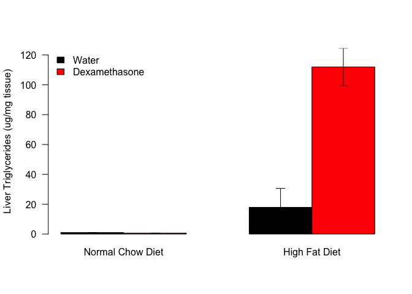

Table: Summary Statistics for Liver Triglycerides

Diet               Treatment        Liver.TG.mean   Liver.TG.se   Liver.TG.sd   Liver.TG.n
-----------------  --------------  --------------  ------------  ------------  -----------
Normal Chow Diet   Water                 0.970041      0.082078      0.232152            8
Normal Chow Diet   Dexamethasone         0.609654      0.090098      0.254836            8
High Fat Diet      Water                17.902117     12.681950     35.869973            8
High Fat Diet      Dexamethasone       111.993689     12.532765     43.414771           12

This script uses the files in ../../data/raw/Liver TG hfd and chow dex.csv. These data are located in /Users/davebrid/Documents/GitHub/CushingAcromegalyStudy/scripts/scripts-obesity and this script was most recently run on Thu Sep 12 08:51:12 2019.

<!-- -->

We observed a 17.455019 fold increase with High Fat Diet and a 37.151731% decrease with dexamethasone in chow but a 114.452585 fold increase with High Fat Diet and Dexamethasone.


# Statistics


From a two-way ANOVA with an interaction, the interaction term was significant (p=0.000068):


Table: ANOVA for Liver Triglyceride Levels

                  Df    Sum Sq     Mean Sq   F value     Pr(>F)
---------------  ---  --------  ----------  --------  ---------
Diet               1   48107.9   48107.865   51.7625   0.000000
Treatment          1   23031.6   23031.618   24.7813   0.000021
Diet:Treatment     1   19464.4   19464.376   20.9430   0.000068
Residuals         32   29740.7     929.396        NA         NA

# Session Information


```
## R version 3.5.0 (2018-04-23)
## Platform: x86_64-apple-darwin15.6.0 (64-bit)
## Running under: macOS  10.14.6
## 
## Matrix products: default
## BLAS: /Library/Frameworks/R.framework/Versions/3.5/Resources/lib/libRblas.0.dylib
## LAPACK: /Library/Frameworks/R.framework/Versions/3.5/Resources/lib/libRlapack.dylib
## 
## locale:
## [1] en_US.UTF-8/en_US.UTF-8/en_US.UTF-8/C/en_US.UTF-8/en_US.UTF-8
## 
## attached base packages:
## [1] stats     graphics  grDevices utils     datasets  methods   base     
## 
## other attached packages:
## [1] tidyr_0.8.3.9000 dplyr_0.8.3      knitr_1.23      
## 
## loaded via a namespace (and not attached):
##  [1] Rcpp_1.0.1       magrittr_1.5     tidyselect_0.2.5 R6_2.4.0        
##  [5] rlang_0.4.0      stringr_1.4.0    highr_0.8        tools_3.5.0     
##  [9] xfun_0.7         htmltools_0.3.6  yaml_2.2.0       assertthat_0.2.1
## [13] digest_0.6.20    tibble_2.1.3     crayon_1.3.4     purrr_0.3.2     
## [17] vctrs_0.2.0      zeallot_0.1.0    glue_1.3.1       evaluate_0.14   
## [21] rmarkdown_1.13   stringi_1.4.3    compiler_3.5.0   pillar_1.4.2    
## [25] backports_1.1.4  pkgconfig_2.0.2
```
