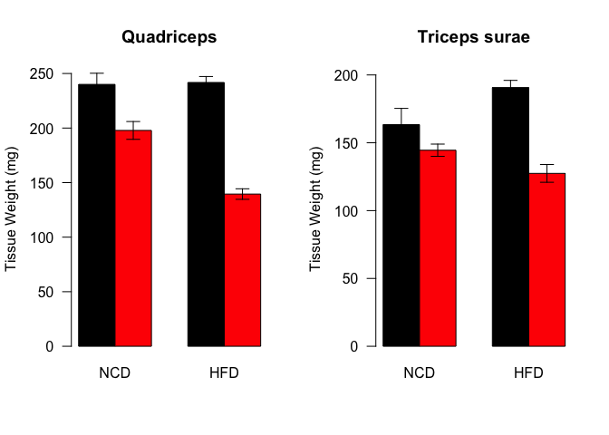

# Analysis of Tissue Weights from HFD/Dexamethasone Studies
Innocence Harvey and Dave Bridges  
April 7, 2017  


# Data Entry


This script generates figures from the tissue weights found in ../../data/raw/HFD and Chow Tissue Weights.csv.  This file is located in /Users/davebrid/Documents/GitHub/CushingAcromegalyStudy/scripts/scripts-obesity and was most recently updated on Thu Aug 10 17:24:28 2017.

# Number of Animals


Table: Number of mice in each group

Status   Diet   Treatment        Number
-------  -----  --------------  -------
Fasted   NCD    Water                 8
Fasted   NCD    Dexamethasone         8
Fasted   HFD    Water                22
Fasted   HFD    Dexamethasone        12
Fed      NCD    Water                 4
Fed      NCD    Dexamethasone         4

# Summary Data

The remainder of this analysis is only for Fasted animals


Table: Averaged Values

Diet   Treatment        iWAT_mean.na   eWAT_mean.na   TS_mean.na   Quad_mean.na
-----  --------------  -------------  -------------  -----------  -------------
NCD    Water                140.9750       187.1125     163.3750       240.0250
NCD    Dexamethasone        111.0625       173.1875     144.5000       197.8250
HFD    Water                840.7545      1136.3773     190.6905       241.7727
HFD    Dexamethasone        286.8000       464.1000     127.4417       139.5000

# Muscle Barplots

<!-- -->

# Adipose Barplots

<!-- -->

## Analysis of Adipose Tissue Weights

We observed reductions in both iWAT and eWAT with HFD/Dexamethasone.  

### Inguinal Adipose Tissue

This included a 65.8877848% reduction in iWAT mass in the HFD mice.  A Shapiro-Wilk test of the iWAT values had a p-value of >0.0621229, so normality could be assumed.  To test for equal variance, Levene's tests were performed.


The p-value from the Levene's test were 0.0041061 for HFD.  Based on this a Welch's *t* test was performed with a p-value of **4.4777019&times; 10^-7^**.  

For NCD the Levene's test had a p-value of and  0.2829918, so equal variance could be assumed.  Based on this, a Student's *t*-test had a p-value of **0.4967434** for NCD.


There was only a 21.2183011% reduction in iWAT mass in the NCD mice.


Based on a 2-way ANOVA with Diet and Group as the interacting covariates there was a significant interaction between diet and treatment:


Table: Two Way ANOVA with Interaction between treatment and diet.

term          df       sumsq       meansq   statistic    p.value
-----------  ---  ----------  -----------  ----------  ---------
Diet           1   3579646.8   3579646.80    65.49123   0.00e+00
Group          1   1400297.4   1400297.44    25.61906   5.20e-06
Diet:Group     1    983744.2    983744.15    17.99804   8.73e-05
Residuals     54   2951554.4     54658.42          NA         NA

The p-value for the interaction was **8.7281221&times; 10^-5^**.  The residuals of this model, passed through a Shapiro-Wilk test had a p-value of 0.0015701, so normality could not be assumed.

### Epididimal Adipose Tissue

This included a 59.1596901% reduction in eWAT mass in the HFD mice.

There was only a 7.4420469% reduction in eWAT mass in the NCD mice.


The p-value from the Levene's test were 0.0298476 for HFD.  Based on this a Welch's *t* test was performed with a p-value of **3.7377627&times; 10^-14^**.  

For NCD the Levene's test had a p-value of and  0.8965011, so equal variance could be assumed.  Based on this, a Student's *t*-test had a p-value of **0.5452112** for NCD.

Based on a 2-way ANOVA with Diet and Group as the interacting covariates there was a significant interaction between diet and treatment:


Table: Two Way ANOVA with Interaction between treatment and diet.

term          df     sumsq       meansq   statistic   p.value
-----------  ---  --------  -----------  ----------  --------
Diet           1   6924250   6924250.12   342.62891         0
Group          1   2055412   2055411.62   101.70682         0
Diet:Group     1   1455533   1455532.97    72.02335         0
Residuals     54   1091296     20209.18          NA        NA

The p-value for the interaction was **1.6294353&times; 10^-11^**.  The residuals of this model, passed through a Shapiro-Wilk test had a p-value of 0.0049698, so normality could not be assumed.

# Session Information

```
## R version 3.3.0 (2016-05-03)
## Platform: x86_64-apple-darwin13.4.0 (64-bit)
## Running under: OS X 10.12.6 (unknown)
## 
## locale:
## [1] en_US.UTF-8/en_US.UTF-8/en_US.UTF-8/C/en_US.UTF-8/en_US.UTF-8
## 
## attached base packages:
## [1] stats     graphics  grDevices utils     datasets  methods   base     
## 
## other attached packages:
## [1] broom_0.4.2   car_2.1-5     bindrcpp_0.2  forcats_0.2.0 readr_1.1.1  
## [6] dplyr_0.7.2   tidyr_0.6.3   knitr_1.17   
## 
## loaded via a namespace (and not attached):
##  [1] Rcpp_0.12.12       plyr_1.8.4         nloptr_1.0.4      
##  [4] highr_0.6          bindr_0.1          tools_3.3.0       
##  [7] digest_0.6.12      lme4_1.1-13        evaluate_0.10.1   
## [10] tibble_1.3.3       nlme_3.1-131       lattice_0.20-35   
## [13] mgcv_1.8-18        pkgconfig_2.0.1    rlang_0.1.2       
## [16] psych_1.7.5        Matrix_1.2-10      yaml_2.1.14       
## [19] parallel_3.3.0     SparseM_1.77       stringr_1.2.0     
## [22] MatrixModels_0.4-1 hms_0.3            rprojroot_1.2     
## [25] nnet_7.3-12        grid_3.3.0         glue_1.1.1        
## [28] R6_2.2.2           foreign_0.8-69     rmarkdown_1.6     
## [31] minqa_1.2.4        reshape2_1.4.2     magrittr_1.5      
## [34] backports_1.1.0    htmltools_0.3.6    MASS_7.3-47       
## [37] splines_3.3.0      mnormt_1.5-5       assertthat_0.2.0  
## [40] pbkrtest_0.4-7     quantreg_5.33      stringi_1.1.5
```
