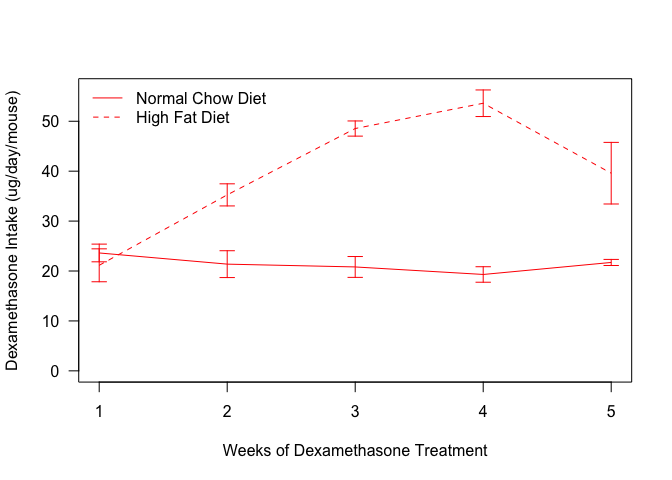
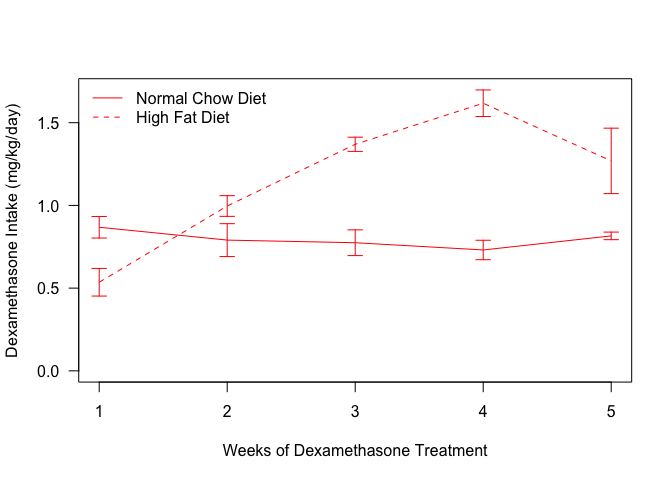
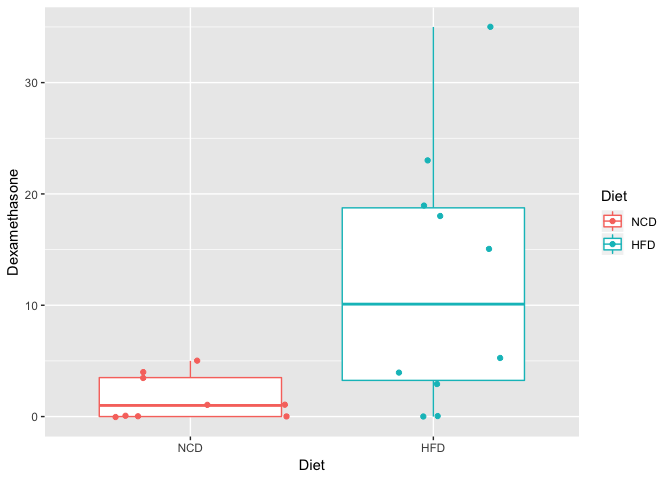

# Purpose

# Experimental Details


Dexamethasone was dissolved in water at a concentration of 3.78 ug/mL and animals were given *ad libitum* access.  Water bottle volumes were determined weekly.

# Raw Data

The input file contains tracked water and dexamethasone amounts per week.  The data includes the staring and ending volumes each week and a calculation of animals per week.


These data can be found in **/Users/davebrid/Documents/GitHub/CushingAcromegalyStudy/scripts/scripts-obesity** in a file named **no file found**.  This script was most recently updated on **Tue Apr  3 15:50:46 2018**.

# Analysis

## Weekly Analysis

<!-- --><!-- -->

## Average Analysis


Table: Average dexamethasone intake per group, averaged accross the experiment

Diet               Treatment        Intake.mean   Intake.se    n
-----------------  --------------  ------------  ----------  ---
Normal Chow Diet   Water                    0.0        0.00    3
Normal Chow Diet   Dexamethasone           21.1        1.02    3
High Fat Diet      Water                    0.0        0.00    3
High Fat Diet      Dexamethasone           40.5        1.82    5

<!-- -->

# Normalization to Body Weight


Loaded body summary composition data from ../../data/processed/Summarized Body Composition Data.csv.  Divided the average weekly intakes by the average weekly body weights.


## Normalized Intake - Weekly Analysis

<!-- -->

## Normalized Intake - Averaged Analysis


Table: Average dexamethasone intake per group normalized by body weight, averaged accross the experiment

Diet               Treatment        Agg.Intake.mean   Agg.Intake.se
-----------------  --------------  ----------------  --------------
Normal Chow Diet   Dexamethasone              0.785           0.062
Normal Chow Diet   Water                      0.000           0.000
High Fat Diet      Dexamethasone              1.158           0.093
High Fat Diet      Water                      0.000           0.000

<!-- -->

# Interpretation

The HFD animals had **1.923** fold more fluid intake than the NCD animals over the course of the experiment.  

Once normalized to body weight, the HFD animals had **47.444%** higher dexamethasone intake.

## Relationship to Human Doses


In general, according to @Nair_2016 we can predict that we should divide the mouse dose by 12.3 to get an equivalent human dose.


Table: Effective human dose in ug/kg/day

Diet               Treatment        Human.dose
-----------------  --------------  -----------
Normal Chow Diet   Dexamethasone          63.8
Normal Chow Diet   Water                   0.0
High Fat Diet      Dexamethasone          94.1
High Fat Diet      Water                   0.0

For a 70 kg human that is an effective dose range of **4.468** to **6.588** mg

# Serum Dexamethasone Assay

This assay was done by the pharmacokinetics core at UM and values were reported.  BLC indicated below cutoff, these values were assumed to be zero for this analysis


The dexamethasone quantification data is found in ../../data/raw/dexamethasone-quantification.csv.

<!-- -->


Table: Summary Data for Dexamethasone Levels

Diet    Dex.mean   Dex.se   Dex.shapiro
-----  ---------  -------  ------------
NCD         1.61    0.666         0.017
HFD        12.22    3.686         0.223

<!-- -->

We observed a 7.585 fold increase in serum dexamethasone levels in the High Fat Diet fed animals.  Based on Shapiro-Wilk tests, we cannot assume normality, so we did a Mann Whitney test, which yielded a p-value of 0.031.


# Session Information


```r
sessionInfo()
```

```
## R version 3.4.2 (2017-09-28)
## Platform: x86_64-apple-darwin15.6.0 (64-bit)
## Running under: macOS High Sierra 10.13.3
## 
## Matrix products: default
## BLAS: /Library/Frameworks/R.framework/Versions/3.4/Resources/lib/libRblas.0.dylib
## LAPACK: /Library/Frameworks/R.framework/Versions/3.4/Resources/lib/libRlapack.dylib
## 
## locale:
## [1] en_US.UTF-8/en_US.UTF-8/en_US.UTF-8/C/en_US.UTF-8/en_US.UTF-8
## 
## attached base packages:
## [1] stats     graphics  grDevices utils     datasets  methods   base     
## 
## other attached packages:
## [1] ggplot2_2.2.1       bindrcpp_0.2        forcats_0.2.0      
## [4] readr_1.1.1         knitcitations_1.0.9 dplyr_0.7.4        
## [7] tidyr_0.7.2         knitr_1.17         
## 
## loaded via a namespace (and not attached):
##  [1] Rcpp_0.12.14       highr_0.6          compiler_3.4.2    
##  [4] plyr_1.8.4         bindr_0.1          tools_3.4.2       
##  [7] digest_0.6.12      jsonlite_1.5       lubridate_1.7.1   
## [10] evaluate_0.10.1    tibble_1.3.4       gtable_0.2.0      
## [13] pkgconfig_2.0.1    rlang_0.1.4        bibtex_0.4.2      
## [16] curl_3.0           yaml_2.1.15        RefManageR_0.14.20
## [19] stringr_1.2.0      httr_1.3.1         xml2_1.1.1        
## [22] hms_0.4.0          rprojroot_1.2      grid_3.4.2        
## [25] glue_1.2.0         R6_2.2.2           rmarkdown_1.8     
## [28] reshape2_1.4.2     purrr_0.2.4        magrittr_1.5      
## [31] backports_1.1.1    scales_0.5.0       htmltools_0.3.6   
## [34] assertthat_0.2.0   colorspace_1.3-2   labeling_0.3      
## [37] stringi_1.1.6      lazyeval_0.2.1     munsell_0.4.3
```

# References


