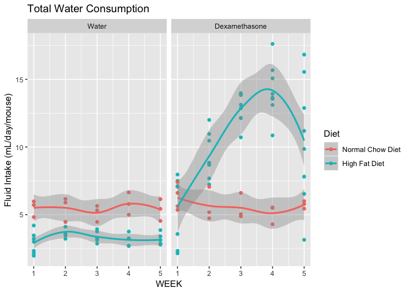

# Purpose

# Experimental Details


Dexamethasone was dissolved in water at a concentration of 3.78 ug/mL and animals were given *ad libitum* access.  Water bottle volumes were determined weekly.

# Raw Data

The input file contains tracked water and dexamethasone amounts per week.  The data includes the staring and ending volumes each week and a calculation of animals per week.


These data can be found in **/Users/davebrid/Documents/GitHub/CushingAcromegalyStudy/scripts/scripts-obesity** in a file named **no file found**.  This script was most recently updated on **Mon Mar 12 12:46:00 2018**.

# Analysis

## Weekly Analysis

<!-- --><!-- -->

## Average Analysis


Table: Average dexamethasone intake per group, averaged accross the experiment

Diet               Treatment        Intake.mean   Intake.se    n
-----------------  --------------  ------------  ----------  ---
Normal Chow Diet   Water                    0.0        0.00    3
Normal Chow Diet   Dexamethasone           21.1        1.02    3
High Fat Diet      Water                    0.0        0.00    3
High Fat Diet      Dexamethasone           44.1        2.60    5

<!-- -->

# Normalization to Body Weight


Loaded body summary composition data from ../../data/processed/Summarized Body Composition Data.csv.  Divided the average weekly intakes by the average weekly body weights.


## Normalized Intake - Weekly Analysis

<!-- -->

## Normalized Intake - Averaged Analysis


Table: Average dexamethasone intake per group normalized by body weight, averaged accross the experiment

Diet               Treatment        Agg.Intake.mean   Agg.Intake.se
-----------------  --------------  ----------------  --------------
Normal Chow Diet   Dexamethasone              0.785           0.062
Normal Chow Diet   Water                      0.000           0.000
High Fat Diet      Dexamethasone              0.958           0.083
High Fat Diet      Water                      0.000           0.000

<!-- -->

# Interpretation

The HFD animals had **2.09** fold more fluid intake than the NCD animals over the course of the experiment.  

Once normalized to body weight, the HFD animals had **22.009%** higher dexamethasone intake.

# Session Information


```r
sessionInfo()
```

```
## R version 3.4.2 (2017-09-28)
## Platform: x86_64-apple-darwin15.6.0 (64-bit)
## Running under: macOS High Sierra 10.13.3
## 
## Matrix products: default
## BLAS: /Library/Frameworks/R.framework/Versions/3.4/Resources/lib/libRblas.0.dylib
## LAPACK: /Library/Frameworks/R.framework/Versions/3.4/Resources/lib/libRlapack.dylib
## 
## locale:
## [1] en_US.UTF-8/en_US.UTF-8/en_US.UTF-8/C/en_US.UTF-8/en_US.UTF-8
## 
## attached base packages:
## [1] stats     graphics  grDevices utils     datasets  methods   base     
## 
## other attached packages:
## [1] ggplot2_2.2.1 bindrcpp_0.2  forcats_0.2.0 readr_1.1.1   dplyr_0.7.4  
## [6] tidyr_0.7.2   knitr_1.17   
## 
## loaded via a namespace (and not attached):
##  [1] Rcpp_0.12.14     bindr_0.1        magrittr_1.5     hms_0.4.0       
##  [5] munsell_0.4.3    colorspace_1.3-2 R6_2.2.2         rlang_0.1.4     
##  [9] highr_0.6        plyr_1.8.4       stringr_1.2.0    tools_3.4.2     
## [13] grid_3.4.2       gtable_0.2.0     htmltools_0.3.6  lazyeval_0.2.1  
## [17] yaml_2.1.15      rprojroot_1.2    digest_0.6.12    assertthat_0.2.0
## [21] tibble_1.3.4     reshape2_1.4.2   purrr_0.2.4      glue_1.2.0      
## [25] evaluate_0.10.1  rmarkdown_1.8    labeling_0.3     stringi_1.1.6   
## [29] compiler_3.4.2   scales_0.5.0     backports_1.1.1  pkgconfig_2.0.1
```
